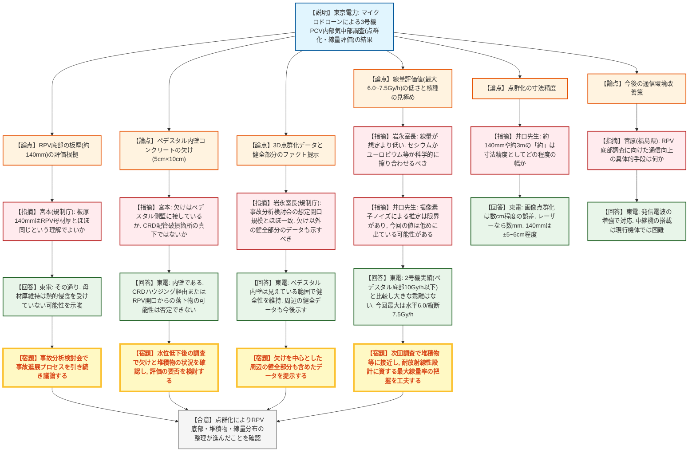
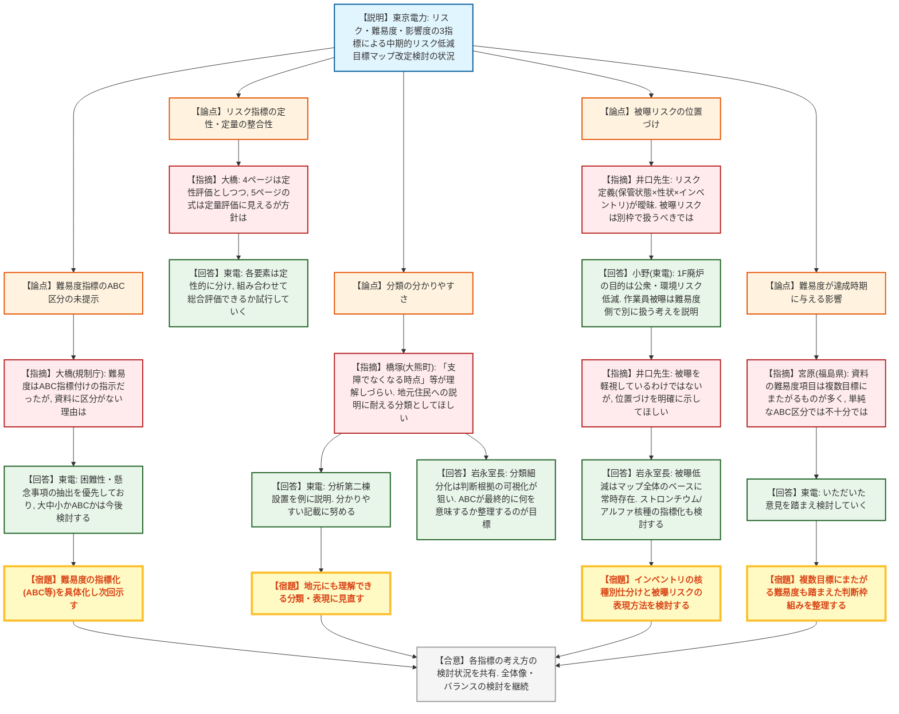
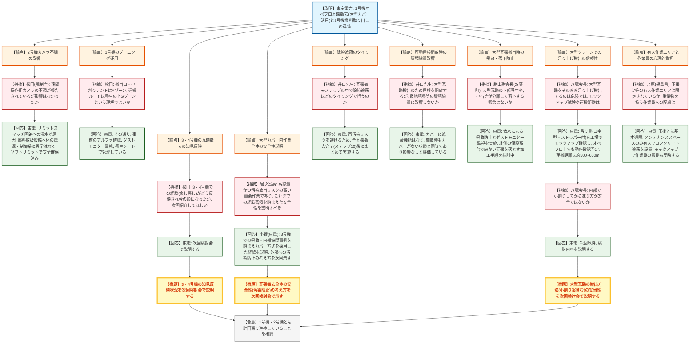
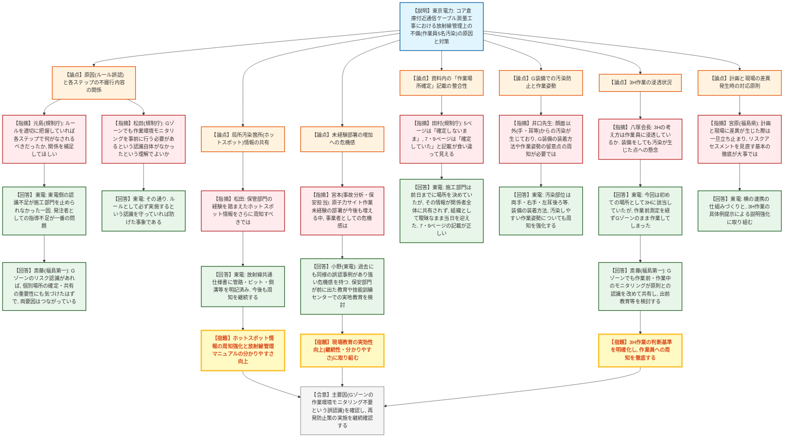
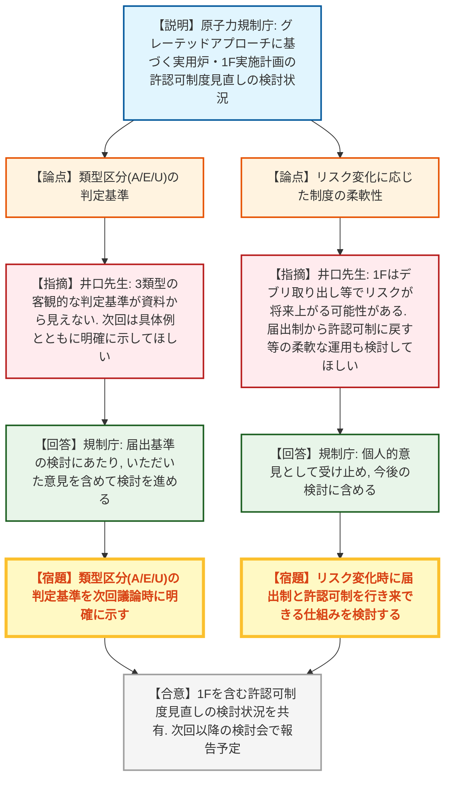

# 第123回特定原子力施設監視・評価検討会（令和8年9月11日）
> 出典 : https://youtube.com/live/0zVarq2Py24?si=n41hqv9eMTQ-WOn4

## 会合の概要
* **3号機PCV内部の初のマイクロドローン気中部調査で新知見**: 映像の点群化(SfM)により、RPV底部に最大約3mの楕円形開口と、母材厚とほぼ同じ約140mmの板状構造物を確認。事故分析検討会の想定とほぼ一致した一方、規制庁からは健全部分のファクトも示すことと、線量(最大7.5Gy/h)の低さについて核種を含めた科学的な見極めを強く求められた。
* **中期的リスク低減目標マップの改定検討が本格化**: 東電が示した「保管状態×性状×インベントリ」のリスク指標や難易度・影響度指標の考え方に対し、規制庁・外部有識者・地元委員から、定義の明確化、被曝リスクの位置づけ、地元住民にも分かりやすい表現とすることなど、多くの注文が相次いだ。
* **1号機オペフロの大型瓦礫撤去に安全上の懸念が集中**: 大型クレーンでの直接吊り上げ搬出に対し、双葉町・大熊町の委員から強い懸念が示され、モックアップ試験の状況や小割り搬出案を含めた妥当性を次回説明することとなった。2号機は615体中63体の燃料取り出しが完了し、順調に進捗。
* **放射線管理の不備事案でGゾーン運用の甘さが露呈**: コア倉庫付近の通信ケーブル測量工事で作業員5名が汚染。「Gゾーンでは作業環境モニタリング不要」という現場の誤認識が主因と判明し、教育体制の刷新やホットスポット情報の周知強化等の再発防止策が示された。
* **1Fの許認可制度についても届出制導入の検討が開始**: 実用炉の見直し(グレーテッドアプローチ)に合わせ、実施計画の一部について届出制を創設する方向で検討が進んでいることが報告された。

---

## 議題ごとの詳細整理

### 【議題1】3号機PCV内部気中部調査（マイクロドローン調査）について

* **議論の背景と論点:**
  水位低下により超小型マイクロドローンが使用可能となったことを受け、2026年3月に実施した3号機格納容器(PCV)内部の気中部調査の結果(映像からの点群化、線量率推定)が報告された。ペデスタル底部の堆積物・原子炉圧力容器(RPV)底部の状況の整理、コンクリート壁面の欠けの発見、線量分布の解釈が論点となった。

* **質疑応答（詳細）:**
  * 【説明者側】新井（東京電力）
    レーザーを搭載できない機体のため映像を用いたSfM(Structure from Motion)による点群化を実施。ペデスタル内部およびRPV底部の一部の点群化に成功し、RPV底部と見られる板状構造物の厚さを約140mm、底部の開口を最大約3mと評価した。ドローンはペデスタル底部から約9.4mの高さまで上昇し、RPV内部へ約40cm進入して撮影した。
  * 【説明者側】新井（東京電力）
    線量評価はカメラ映像素子に生じるノイズ(白点)の数を線量計実測値で校正し比例計算する手法。ペデスタル外部は約0.5～最大6.0Gy/h、ペデスタル内部(水面上)は1.0～5.5Gy/h、RPV底部との境界付近で最大7.5Gy/hと推定。東側に線源がある可能性や、RPV底部付着物自体が線源である可能性を指摘した。また、点群化データの再確認によりペデスタル内壁コンクリートに5cm×10cmの欠けを1箇所確認した。
  * 【規制側】宮本（規制庁・事故分析/保安担当）
    RPV底部と見られる構造物の厚さ約140mmは、RPV母材の厚さとほぼ同じという理解でよいか。母材厚が維持されているのであれば熱的な侵食を受けていない可能性がある。
  * 【説明者側】東京電力
    その通りであり、事故進展プロセスの詳細は事故分析検討会で引き続き議論する。
  * 【規制側】宮本
    参考資料6ページの欠けはペデスタル側壁に接しているか。CRD配管の多数破損箇所の真下付近に当たるとみられるが、CRDハウジングを伝った落下物か、RPV開口部からの堆積物の直接落下かは現時点で否定できないのではないか。水位低下後の調査で欠けと堆積物の状況を確認し、評価の要否を検討してほしい。
  * 【説明者側】東京電力
    ご指摘の点を承知した。今後の調査で確認する。
  * 【規制側】岩永室長（規制庁）
    3次元点群化により重要な情報が得られた。事故分析検討会で想定していた開口の規模とほぼ一致しており、東電との共通認識が持てたと考える。過小評価せず受け止めてほしい。一方、コンクリートの欠けについて、局所的な欠け以外の健全な部分がどうなっているか資料からは分からない。欠けを中心とした周辺の健全なデータも合わせて示すべき。また、線量(5～6Gy/h程度)が想定より低く感じる。セシウムによるガンマ線かユーロピウム等かを見極め、線量と状況を科学的に擦り合わせてほしい。
  * 【説明者側】新井（東京電力）
    ペデスタル内壁は見えている範囲で健全性が維持されており、局所的な欠けと理解している。今後、周辺の健全な部分のデータも合わせて示す。
  * 【オブザーバー】小金谷（規制庁）
    今後の低水位調査で、これまで水没していたペデスタル壁面も見えるようになるという理解でよいか。
  * 【説明者側】飯塚（東京電力）
    その通り。水面が下がった部分について、今後ドローンで確認していく。
  * 【外部有識者】井口先生
    点群化による寸法(約140mm、約3m等)の「約」は、精度としてどの程度の幅と考えればよいか。
  * 【説明者側】東京電力
    画像による点群化はレーザーに比べ精度が粗く、数cm程度の誤差と考えている。140mmであれば±5～6cm程度のオーダー。
  * 【外部有識者】井口先生
    線量率の推定値が全体的に低いように感じる。カメラ撮像素子のノイズによる推定手法は、ハレーション等が発生すると測定できないという制約があり、今回示された値は低めのものしか捉えられていない可能性がある。今後、対象物に接近させて線量がどこまで上がるかを見極め、対放射線性のある機器の設計に資するデータを取得してほしい。
  * 【説明者側】東京電力
    2号機の過去調査実績(ペデスタル外部は数十Gy/h、ペデスタル底部は10Gy/h以下)と比較して大きく矛盾する値ではないと考えている。今回測定した中での最大値は水平面で6.0Gy/h、縦断面で7.5Gy/h。情報の確からしさを高めるため、次回調査で工夫したい。
  * 【オブザーバー】宮原（福島県）
    今後のRPV底部方向の調査に向けた通信環境向上について、具体的にどのような手段を考えているか。
  * 【説明者側】新井（東京電力）
    基本的には発信電波を強くする方向で検討している。ドローン2台によるランデブー中継も一案としてあるが、現行の超小型機体に中継機を搭載するのは重量的に難しいため、電波増強を軸に検討している。

* **結論と宿題事項（アクションアイテム）:**
  * **決定事項:** 点群化と線量評価により、RPV底部の開口・堆積物・線量分布について一定の整理が進んだことを確認した。ペデスタル内壁コンクリートの新たな欠け(5cm×10cm、1箇所)も確認された。
  * **宿題事項:**
    1. コンクリートの欠けについて、周辺の健全な部分も含めたデータを示すこと。
    2. PCV内部の状況(付着物・堆積物等)と線量分布をよく擦り合わせて評価すること。
    3. 今後の内部調査では、線量が高いと思われる箇所に接近するなどし、最大でどの程度の線量となるかを把握すること。

---

### 【議題2】中期的リスクの低減目標マップの改定に係る検討について

* **議論の背景と論点:**
  前回会合で規制庁から示された、リスクマップ改定に向けた検討事項（目標設定の妥当性・達成基準、リスク・難易度・影響度の指標付け）への回答として、東電の検討状況が報告された。指標の定義の明確さ、被曝リスクの位置づけ、地元への説明のしやすさが主な論点となった。

* **質疑応答（詳細）:**
  * 【説明者側】白石（東京電力）
    短期的目標の目標設定の妥当性は、実現すべき姿(2033年度)の達成に向けて必要となる理由を記載し、着手時点か完了時点かで達成基準を整理する。リスク指標は「保管状態×性状(形態)×インベントリ量」で定性的に評価し、インベントリはセシウム137を主指標として使用済燃料との比較で大中小に分類する。ストロンチウム90・アルファ核種は難易度側での指標化を検討する。難易度は設計検討段階・工事作業段階ごとに技術的困難さ・懸念事項を抽出する段階。影響度は全廃炉工事への影響(指標1)と実現すべき姿の達成への影響(指標2)に仕分けする。
  * 【規制側】大橋（規制庁）
    前回、難易度についてはABCの指標付けを依頼したが、今回の資料にはABC表記が見当たらない。どのような考え方で整理したのか。
  * 【説明者側】白石（東京電力）
    各短期的目標ごとの技術的困難性・懸念事項が多岐にわたるため、まず抽出を行っている段階。大中小かABCかといった指標の付け方は今後検討する。
  * 【規制側】大橋
    リスク指標について、4ページでは定性的な評価としつつ、5ページの「保管状態×性状×インベントリ」という記載は定量的な評価にも読める。どのような方針で進めるのか。
  * 【説明者側】白石（東京電力）
    各要素は定性的に区分したもので、それらを組み合わせて総合的なリスク評価ができるかを今後試行していく。
  * 【外部有識者】橋塚（大熊町）
    分類の仕方が分かりにくい。特に「短期的目標が実現すべき姿に対して支障でなくなる時点」という表現の意味が理解できない。ABCや大中小といった表現では、地元の町民への説明時に理解してもらえるか懸念がある。
  * 【説明者側】東京電力
    分析第二棟の設置(燃料デブリ分析施設)を例に、次のステップに進むための支障が解消される時点を「達成」とする考え方を説明した。分かりやすい記載に努める。
  * 【規制側】岩永室長
    分類を細かくしたのは、これまで判断の根拠や背景が見えにくかったことを解消するため。ABCの分類結果が最終的に何を意味するのかを整理することが目標であり、引き続き検討していく。
  * 【外部有識者】井口先生
    「保管状態×性状×インベントリ」というリスクの定義がどのような対象を指すのか不明確なまま議論が進んでいるように感じる。定義をまず明確にしてほしい。また、被曝リスク(特にストロンチウム90・アルファ核種による内部被曝)は1F作業の中でも重要視される放射線管理の目標であり、リスク指標とは別枠で扱う必要があるのではないか。5ページのインベントリ区分で、大(10分の1～100分の1)と小(1000分の1)の間に抜けがあるのではないか。
  * 【説明者側】白石（東京電力）
    保管状態×性状×インベントリの適用範囲を含め、今後しっかり検討し具体化した上で規制庁とも相談したい。インベントリ区分の考え方も、より丁寧に記載する。
  * 【説明者側】小野（東京電力）
    1Fの廃炉の目的は公衆・環境へのリスクを下げることであり、これを追求する過程で作業員に被曝や作業環境の負荷をかけることになる。両者は相反する側面があるため、リスク指標とは分けて、難易度側で作業員被曝の観点を細分化して取り込む可能性を社内で検討している。
  * 【外部有識者】井口先生
    被曝を無視すべきという意見ではなく、指標のどこに位置づけるかを明確にしてほしいという趣旨。難易度側に被曝という概念を含めるのであれば、それも明確に示してほしい。
  * 【規制側】岩永室長
    作業員の被曝リスク低減は、リスクマップ全体の外枠に常にベースとして存在している。ストロンチウムやアルファ核種はセシウムと被曝経路が異なるため、指標化の重要性は認識しており、表現方法を検討していく。
  * 【オブザーバー】宮原（福島県）
    達成時期に最も関わるのは難易度と考える。東電資料(5・7ページ)に示された項目はいずれも難易度が高く、一つの短期的目標が複数の難易度項目にまたがるケースもある。単純なABC区分だけでなく、より踏み込んだ判断の考え方を整理してほしい。
  * 【説明者側】東京電力
    いただいた意見を踏まえて検討していく。
  * 【規制側】岩永室長
    2033年の実現すべき姿からバックキャストして今年やるべきことを考える中で、特に深刻な「C」評価が出てきた際に、最新技術に頼るか既存技術で時間をかけるかの判断材料としてこのマップを活用したい。

* **結論と宿題事項（アクションアイテム）:**
  * **決定事項:** リスク・難易度・影響度の各指標の考え方に関する検討状況が共有された。
  * **宿題事項:**
    1. リスクの定義(保管状態×性状×インベントリの適用対象、被曝リスクの位置づけ)を明確にすること。
    2. 難易度のABC(または大中小)への指標化を具体化すること。
    3. 地元住民等にも理解できる分かりやすい表現とすること。
    4. 複数の短期的目標にまたがる難易度も踏まえた判断の枠組みを整理すること。
    5. 検討結果を次回以降の検討会で示すこと。

---

### 【議題3】プール燃料取り出しの進捗について

* **議論の背景と論点:**
  本年6月以降実施している1号機・2号機の使用済燃料プールからの燃料取り出しについて、開始から約3か月が経過した進捗が報告された。特に1号機オペフロの大型瓦礫撤去における安全対策の妥当性が主な論点となった。

* **質疑応答（詳細）:**
  * 【説明者側】黒崎（東京電力）
    1号機は大型カバー・付帯設備(換気設備、ダスト放射線モニター)を設置し、瓦礫撤去用クレーンにより瓦礫撤去(ステップ2)を開始。小型瓦礫は運搬容器に収納し大型カバー北側から、大型瓦礫(鉄骨・天井クレーン・燃料交換機)は可動屋根を開放しクローラークレーンで直接搬出し、いずれも小割りテントで小割りの上、固体廃棄物貯蔵庫へ運搬する。大型カバーとフィルター排気によりダスト飛散を抑制し、これまで稼働屋根外部・換気設備出口とも有意な濃度変化はない。アルファ核種は事前の代表箇所での拭き取り測定で未検出。2号機は6月2日から燃料取り出しを開始し、615体を7体ずつ計89回で取り出す計画。9月9日時点で63体(新燃料28体含む)が完了。ワイヤー修復燃料1体は吊り上げ試験(8月18日)で問題ないことを確認済み。共用プールの空き容量不足に対応するため、10月より燃料を乾式キャスクへ移送し高台の仮保管設備へ搬出する計画で、乾式キャスクを30基分増設予定。
  * 【規制側】松田（規制庁）
    2号機で遠隔操作用カメラが一時的に映らなくなる事象があったと聞くが、その状況と影響を確認したい。
  * 【説明者側】黒崎（東京電力）
    キャスクをプール内に入れる際確認用のカメラで、昇降装置のリミットスイッチ回路への浸水により地絡・漏電が発生したとみている。燃料取扱設備本体の電源・制御系には異常なく、手前のソフトリミットにより安全な作業は継続可能。当該部分を切り離して作業を進めている。
  * 【規制側】松田
    1号機のアルファ核種確認は、作業前に代表的な箇所を墨跡で確認し、検出されなかった上で搬出作業を進めているという理解でよいか。ゾーニングについて、搬出口・荷捌きエリア・小割りテントはYゾーン、運搬ルートは養生の上Gゾーン管理という理解でよいか。
  * 【説明者側】黒崎（東京電力）
    その通り。搬出時はダストモニターで飛散がないことを確認した上で搬出し、運搬容器の蓋・養生シートで汚染拡大を防止している。アルファ核種が確認された場合は大型カバー内部と小割りテント両方のゾーニングを見直す想定である。
  * 【規制側】松田
    3号機・4号機での瓦礫撤去の経験(良かった点・悪かった点)がどう反映されて今の計画になっているか、次回検討会で紹介してほしい。
  * 【説明者側】東京電力
    承知した。次回説明する。
  * 【規制側】岩永室長
    大型カバー内で行われている瓦礫の搬出・中割り・小割りの一連の作業は、高線量でありアルファ核種による汚染放出リスクにもさらされている、1Fの廃炉における重要な作業である。3・4号機、2号機での経験の蓄積を踏まえ、放射性物質が境界外に漏れないことをどう担保しているか、しっかり説明してほしい。
  * 【説明者側】小野（東京電力）
    3号機では当初瓦礫を全て撤去してからカバーを設置する計画だったが、ダスト飛散や内部被曝の事例があったことを踏まえ、先にカバーを設置しその中でダスト管理をしながら撤去する方式に変更した経緯がある。外部への汚染防止の考え方を次回改めて示す。ベッセルをカバーから出す際にサーベイを行う運用への見直しも今後検討し得る。
  * 【外部有識者】井口先生
    瓦礫撤去計画(ステップ1～10)の中で、除染・遮蔽の実施タイミングはどのように考えているか。
  * 【説明者側】東京電力
    瓦礫を撤去しながら除染・遮蔽を行うと搬出時に瓦礫が落下し再汚染するリスクがあるため、瓦礫撤去が全て完了する(ステップ10)まで待ってから除染・遮蔽を実施する計画である。
  * 【外部有識者】井口先生
    大型瓦礫を搬出する際に可動屋根を開放するが、それにより敷地の外側環境(サイト境界付近等)の線量に影響しないか。
  * 【説明者側】東京電力
    作業は遠隔操作のため線量よりもダスト管理の方が重要と考えている。カバー自体に遮蔽機能は考慮されておらず、開放時もカバーがない状態と同等であり、環境線量への影響はないと評価している。
  * 【外部有識者】勝山副会長（双葉町）
    大型瓦礫をクレーンで搬出する際、下部養生はどのようになっているか。手のひらサイズの小石等が分離して落下することはないか。
  * 【説明者側】松本（東京電力）
    散水により表面付着物の飛散を抑制し、ダストモニターで異常が見られれば作業を中断する。撤去が進んで比較的きれいになった北側に仮設の高台を設け、そこで細かい瓦礫を落とす加工手順を今後詳細に検討している。
  * 【外部有識者】八塚会長
    大型クレーンで瓦礫をそのまま吊り上げ、カバーを開放して搬出することはリスクが高いのではないか。モックアップ試験や実証の実績はあるか。小割りテントまでの運搬距離はどの程度か。
  * 【説明者側】松本（東京電力）
    散水・ダストモニター監視に加え、コ字型の吊り具(先端にずれ落ち防止のストッパー付き)を工場でモックアップ確認し、オペフロ上での南北移動時にも動作を確認する計画。運搬距離は約500～600mで、蓋と養生シートによる飛散防止を徹底する。
  * 【外部有識者】八塚会長
    大型のまま搬出せず、内部で小割りしてから軽い状態で運ぶ方が安全ではないか。
  * 【説明者側】黒崎（東京電力）
    本日の資料では詳細を示せていない部分があるため、いただいたコメントも踏まえ次回以降説明する。
  * 【オブザーバー】宮原（福島県）
    大型カバー内の玉掛け等の有人作業エリアは限定されているか。重量物を扱う作業は作業員の心理的負担も大きいと思われるが、配慮はあるか。
  * 【説明者側】黒崎（東京電力）
    玉掛けは基本的に遠隔操作で行うが、装置の取り替え等はメンテナンススペース(北側シャフト付近)でのみ有人で行い、直接線の影響をコンクリート遮蔽で緩和している。遠隔玉掛け装置の準備も進めており、モックアップは作業員の意見も聞きながら実施する。

* **結論と宿題事項（アクションアイテム）:**
  * **決定事項:** 1号機・2号機とも現場環境と安全に配慮しつつ計画通り進捗していることを確認した。2号機のカメラ不調は燃料取扱設備本体への影響がないことを確認した。
  * **宿題事項:**
    1. 3号機・4号機の瓦礫撤去の知見の反映状況を次回検討会で説明すること。
    2. 大型瓦礫の撤去方法(小割り搬出案を含む)の妥当性について、次回検討会で説明すること。
    3. 除染・遮蔽を含む瓦礫撤去全体の汚染拡大防止の考え方を次回示すこと。

---

### 【議題4】放射線管理の実施状況について（コア倉庫付近通信ケーブル測量工事における放射線管理上の不備）

* **議論の背景と論点:**
  6月4日、1F構内グリーンゾーン(Gゾーン)のコア倉庫付近通信ケーブル測量工事で作業員5名の汚染が確認され、事後の確認で当該エリアの作業環境モニタリングが未実施であったことが判明した。その原因と対策について報告された。

* **質疑応答（詳細）:**
  * 【説明者側】高原（東京電力）
    発生概要として、コア倉庫からプロセス主建屋間の通信ケーブル敷設に向けたルート調査中、管路内のケーブル通線可能箇所を探す作業で汚染が発生。作業員5名は顔面汚染や内部取り込みはなく、除染確認の上で退出した。原因は主に、Gゾーンでは過去に汚染経験がなかったことから「作業環境モニタリングは不要」という誤った認識を主管グループが持っていたこと(主要因)、実際の作業場所(管路内)の確定情報が最初のケーブルルート概要図・放射線管理部門に反映・共有されなかったこと(副次要因)、当該作業を「3H(初めて・変化・久しぶり)作業」として重点管理作業に位置づけられなかったこと(副次要因)の3点。
  * 【説明者側】小宮山（東京電力）
    対策として、放射線管理部門が所員全員へ直接教育を行う方式への変更、パートナー企業への出前教育、デジタルサイネージでの継続的な注意喚起、放射線管理マニュアルの改訂、構内全域のGゾーンでの汚染測定の実施を進める。
  * 【規制側】元島（規制庁）
    ルール誤認が原因という説明だが、ルールを適切に把握していれば各ステップで何がなされているべきだったのか、原因と対策の関係を補足してほしい。
  * 【説明者側】高原（東京電力）
    東京電力側がGゾーンのリスクを認識していれば、施工部門が作業を進めようとした際に止めることができたはずであり、発注者としての指導不足が一番の問題と考えている。
  * 【説明者側】斎藤（福島第一）
    Gゾーンにも汚染の恐れがあるという認識があれば、個別の作業場所を詳細に確定・共有しようという意識にもつながる。両方の要因はつながっている。
  * 【規制側】松田（規制庁）
    Gゾーンであっても汚染の可能性があれば作業環境モニタリングを実施すべきという認識自体が、そもそもなかったということでよいか。
  * 【説明者側】高原（東京電力）
    その通り。Gゾーンでは環境モニタリングは不要という誤認識があった。ルールとして必ず実施するという規定を守っていれば防げた事象である。
  * 【規制側】松田
    保管部門の経験から、ホットスポット的に汚染が堆積しやすい場所の情報をさらに共有し、注意喚起を強化してはどうか。放射線管理マニュアルについても、読み手にもっとシンプルに理解できる記載にしてほしい。
  * 【説明者側】小宮山（東京電力）
    放射線共通仕様書に、管路・ピット・側溝等の汚染残存の可能性がある箇所を具体的に明記し、周知している。マニュアルも今後わかりやすく改定していく。
  * 【規制側】宮本
    検査制度改定により事業者のパフォーマンスを評価する考え方に変わっている。原子力サイトでの作業経験が少ない部署が今後も増えると想定されるが、事業者としての危機感を確認したい。
  * 【説明者側】小野（東京電力）
    数年前にも類似のクリーンエリア誤認による身体汚染事例があり、教育を重ねてきたにもかかわらず今回のグループでは十分に引き継がれていなかった。大きな反省点である。保安部門がより前に出て直接働きかける取り組みや、双葉町に設ける技能訓練センターでの実地教育を通じ、作業員が要点を押さえられる教育を継続していきたい。
  * 【規制側】田村（規制庁）
    資料5ページでは「作業場所を確定しないまま作業を進めた」とあるが、7ページ・9ページでは「作業場所を確定していた」とあり、記載が食い違っているように見える。どちらが正しいか。
  * 【説明者側】斎藤（福島第一）
    施工部門は前日までに管路箇所を作業場所として決めていた。ただしその情報が放射線管理部門を含む関係者全体に共有されなかったため、組織としては作業場所が曖昧なまま当日を迎えてしまった。7ページ・9ページの記載が正しい。
  * 【外部有識者】井口先生
    G装備は基本的に顔以外は露出しないはずだが、実際には顔面汚染はなく両手・耳等に汚染が生じている。G装備の正しい装着方法や作業姿勢の留意点を事前に周知しておくべきではないか。
  * 【説明者側】小宮山（東京電力）
    汚染部位は両手、右手、左耳の後ろ等であった。G装備・Y装備の装着方法、汚染しやすい作業姿勢についても教育の中で周知していく。
  * 【外部有識者】勝山副会長
    汚染発覚から除染完了まで約4時間を要しているが、その理由は何か。作業予定表に事前モニタリングや危険箇所の明示はあるか。
  * 【説明者側】小宮山（東京電力）
    現場から除染室への移動、5名分の部位確認・複数回の拭き取り作業に時間を要した。
  * 【説明者側】高原（東京電力）
    作業予定表には、作業場所の確定や作業環境モニタリング実施の日付等をエビデンスとして記載する欄を設けている。
  * 【外部有識者】八塚会長
    Gゾーンでの装備内容と、3Hの考え方は作業員に浸透しているか。装備をしていても表面汚染が生じたことを踏まえ、より積極的な周知を行うべきではないか。
  * 【説明者側】小宮山（東京電力）
    G装備は二重のゴム手袋・靴下、DS2マスク、保護眼鏡等。今回の作業は「初めての場所」として3Hに該当していたが、作業前測定(汚染・雰囲気線量の確認)を経ずにGゾーンのままで作業してしまった。
  * 【説明者側】斎藤（福島第一）
    Gゾーンであっても作業前・作業中のモニタリングを原則行うというルールが浸透しきれていなかったことは大きな反省。企業への出前教育等の直接対話の機会を増やしていく。
  * 【オブザーバー】佐藤（福島調整官事務所）
    現場の意見として、保安検査の中でしっかりと調べた上で、何らかの記録が残る形で結論を出してほしい。
  * 【オブザーバー】宮原（福島県）
    計画と実際の作業場所に差異が生じた場合、一旦立ち止まってリスクアセスメントを見直した上で再度現場に入るという基本の徹底が重要ではないか。
  * 【説明者側】高原（東京電力）
    経験のある他グループが未経験の部署をしっかりフォローする横の連携の仕組みが不足していたと再認識した。今後仕組みを作っていく。3H作業の対象範囲・考え方についても具体例を示しわかりやすく整理する。

* **結論と宿題事項（アクションアイテム）:**
  * **決定事項:** 今回の事案の主要因は、主管グループにおける「Gゾーンでは作業環境モニタリングは不要」という誤った認識であったことを確認した。教育体制の刷新や仕組みの見直しによる対策が示された。
  * **宿題事項:**
    1. 区域マップにホットスポット等の局所汚染の恐れがある箇所の情報を加え、周知すること。
    2. 放射線管理マニュアルをより理解しやすい記載とすること。
    3. 再発防止対策の実効性を保安検査で継続的に確認すること(地元の意見も踏まえて対応すること)。
    4. 計画と現場作業に差異が生じた際は一旦立ち止まり確認するという基本を徹底すること。

---

### 【議題5】その他（実用発電用原子炉等の許認可制度等に関する見直しの方向性）

* **議論の背景と論点:**
  原子力規制庁が検討を進めている実用発電用原子炉の許認可制度見直し（グレーテッドアプローチの適用徹底）と、特定原子力施設(1F)の実施計画についても同様の見直しを検討する方針が、東京電力からの要望事項とあわせて報告された。

* **質疑応答（詳細）:**
  * 【説明者側】中澤（規制庁）
    IRRS報告書の勧告等を踏まえ、規制リソースを安全上の重要性に応じて適切に配分する観点から、許認可対象をA(従来通りの許認可・基準適合性審査)、E(事前届出＋事後検査)、U(氏名変更等、事後届出のみ)の3類型に見直す方針で検討している。1Fを含む炉規法対象施設全体についても見直しを検討中。1Fの実施計画は現行、変更の都度認可が必要(これまで300件以上の実績)であり、東京電力からは、管理区域の変更、法令上の職務変更を伴わない組織統合・名称変更、ALPS処理水貯蔵タンクの基数削減、セキュリティ組織名称の変更等について届出制度の創設を求める要望を受けている。
  * 【外部有識者】井口先生
    グレーテッドアプローチにより規制資源・事業者資源を重要案件に集中させる方向性は進めてほしい。一方、資料に示されたA・E・Uの3類型について、具体的にどのような客観的判断基準で切り分けるのかが読み取れない。次回議論する際は具体例とともに判定基準を明確に示してほしい。また、届出制を導入する場合、事業者側の自己検証(自律的な姿勢維持)体制が必要になる。特に1Fは今後デブリ取り出し等でリスクが上がる局面もあるため、将来的にリスクが高まった場合には届出制から許認可制に戻すといった柔軟な運用も念頭に置いて検討してほしい(個人的な意見として)。
  * 【規制側】中澤（規制庁）
    届出の基準等を今後検討する中で、いただいたご意見も含めて検討を進めていく。

* **結論と宿題事項（アクションアイテム）:**
  * **決定事項:** 1Fを含む許認可制度見直しの検討状況が共有された。
  * **宿題事項:**
    1. 類型区分(A/E/U)の客観的な判定基準を次回議論時に明確に示すこと。
    2. リスクが変化した場合に届出制と許認可制の間を柔軟に行き来できる仕組みを検討すること。
    3. 検討状況を次回以降の検討会で報告すること。

---

## 論理構造の可視化（Mermaid）

### 【議題1】3号機PCV内部気中部調査（マイクロドローン調査）

### 【議題2】中期的リスクの低減目標マップの改定に係る検討

### 【議題3】プール燃料取り出しの進捗

### 【議題4】放射線管理の実施状況（コア倉庫付近通信ケーブル測量工事の不備）

### 【議題5】その他（実用発電用原子炉等の許認可制度等に関する見直し）

