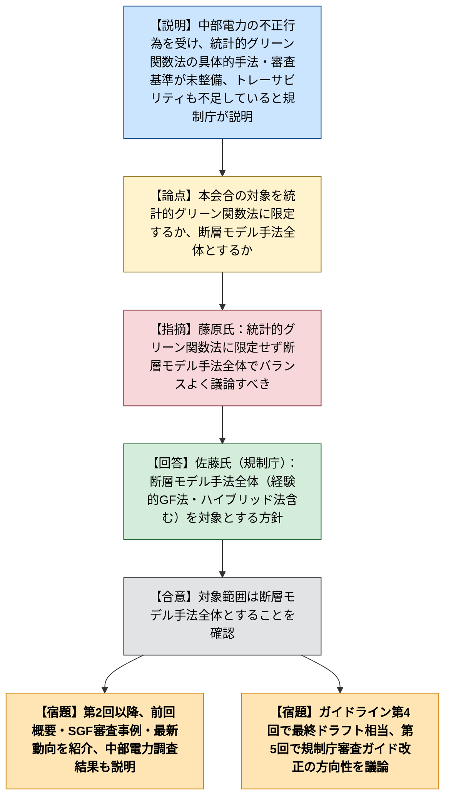
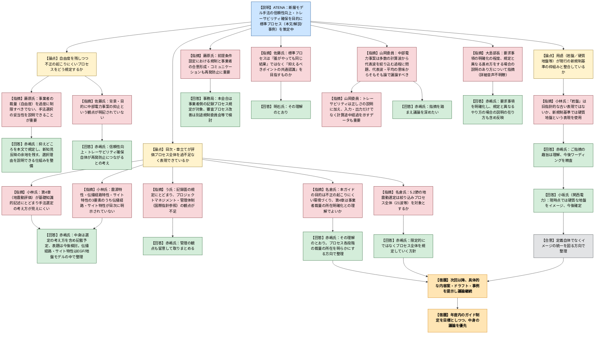

# 第1回ATENAによる地震動評価に係るガイドラインへの対応に関する意見交換会合（令和8年9月14日）
> 出典 : https://youtube.com/live/cDYDtm_I16A?si=X9omDc7E5EMczX8K

## 会合の概要

- 中部電力の浜岡原子力発電所3号機・4号機に係る基準地震動策定（統計的グリーン関数法）の不正事案を契機に、原子力規制庁とATENA（原子力エネルギー協議会）が、断層モデルを用いた手法による地震動評価プロセスの明確化とトレーサビリティ確保について意見交換する新設の会合の第1回。
- 規制庁からは、意見交換会合設置の背景（統計的グリーン関数法の具体的手法を定めたガイドが不在であったこと、基準地震動等の策定に係るトレーサビリティ確保の必要性）と、第5回程度までを見据えた進め方が示された。対象は統計的グリーン関数法に限定せず、経験的グリーン関数法・理論的手法・ハイブリッド法を含む断層モデル手法全体とする方針が確認された。
- ATENAからは、策定中の「断層モデルを用いた手法による地震動評価に係る標準プロセス」（本文・解説・事例の3階層構成）の目的・骨子が説明され、事業者の裁量を残しつつ、判断の考え方と経過を記録として残せる仕組みを目指す方針が示された。
- 委員からは、目次構成（特に第4章の書きぶり）、震源・伝播経路・サイト特性の位置づけ、記録の管理体制（プロジェクトマネジメント面）、旧指針由来とみられる「岩盤」という表現の妥当性など、具体的かつ多岐にわたる指摘が相次いだ。ATENA側は総じて指摘を受け止め、今後の検討で反映する姿勢を示したが、この回では内容の確定的な結論には至っていない。
- 山岡委員からは、中部電力事案は多数の計算波（500波程度）から代表波を絞り込む過程に問題があった可能性が指摘され、「代表波」「平均」の意味を含むそもそも論から議論すべきとの提起があり、次回以降の議論の方向性として位置づけられた。

## 議題ごとの詳細整理

### 議題1：意見交換会合について

**議論の背景と論点**

中部電力の不正行為（統計的グリーン関数法による基準地震動策定に関する事案）を受け、規制庁は令和8年5月27日および7月29日の原子力規制委員会に、検査状況・制度面の対応検討状況（資料1-1）、地震動評価プロセスの明確化に関する検討の進め方（資料1-2）を報告済みであり、本会合はその一環として設置された。論点は、（1）統計的グリーン関数法に係る具体的手法のガイドが存在せず審査でも妥当性を確認していなかった点、（2）基準地震動・基準津波の策定過程を後から検証できる記録（トレーサビリティ）が不足している点、（3）虚偽記載に対する罰則規定が現行の原子炉等規制法にない点、の3点に整理された。会合の対象範囲を統計的グリーン関数法のみに限定するか、断層モデル手法全体とするかが冒頭の論点となった。

**質疑応答（詳細）**

- **藤原氏（外部有識者、防災科学技術研究所）**: 統計的グリーン関数法のみに絞った議論ではなく、断層モデルを用いた評価手法全体に対してバランスよく議論を進めるべきだと述べた。
- **佐藤氏（原子力規制庁 地震津波審査部門）**: 藤原氏の指摘に同意し、統計的グリーン関数法に限らず経験的グリーン関数法やハイブリッド法も含めた断層モデル手法全体を対象に会合を進める方針であり、規制委員会への報告でもその方向性を確認済みであると回答した。

**結論と宿題事項（アクションアイテム）**

- 本会合の対象は統計的グリーン関数法に限定せず、経験的グリーン関数法・理論的手法・ハイブリッド法を含む断層モデル手法全体とすることが確認された。
- 第2回以降、前回会合概要の説明、統計的グリーン関数法を用いた審査・進捗管理事例、断層モデル手法の最新動向の紹介を行う予定。ATENAのガイドラインは第4回で最終ドラフト相当を想定し、議論終了後の第5回で規制庁の審査ガイド改正の方向性を議論する大まかなスケジュールが共有された。
- 中部電力の不正行為に関する調査委員会の調査結果が9月14日朝に中部電力ホームページで公表されたことが報告され、その内容（不正行為の事実関係等のうち本会合に関係する部分）は第2回で説明されることとなった。

### 議題2：ATENAによる地震動評価に係るガイドラインの作成方針について

**議論の背景と論点**

ATENAは、中部電力の浜岡原子力発電所に係る基準地震動策定の不適切事案（統計的グリーン関数法に関するもの）を踏まえ、断層モデルによる地震動評価の信頼性向上とトレーサビリティ確保を目的に、標準プロセスをガイドラインとして取りまとめる作業を進めている。ガイドラインは「本文（標準プロセス・記録方法を規定）」「解説（理論・文献的背景と実務上の留意点）」「事例（評価事例集）」の3階層構成とし、本文は序文・基準地震動策定の流れ・震源のモデル化・地震動評価（統計的／経験的グリーン関数法、理論的手法、ハイブリッド法）・地震動評価策定プロセスの記録の各章で構成される案が示された。論点は、（1）自由度を残しつつ不正の起こりにくいプロセスをどう規定するか、（2）目次・章立てが評価プロセス全体を過不足なく表現できているか、（3）用語（岩盤／硬質地盤等）が現行の新規制基準の枠組みと整合しているか、の3点に集約された。

**質疑応答（詳細）**

- **佐藤氏（原子力規制庁）**: ガイドで用いる「プロセス」と「トレーサビリティ」という言葉の整理が目次上で混同されているように見えると指摘し、両者の関係を明確にするよう求めた。
- **赤嶋氏（ATENA）**: プロセスは評価の手順・流れそのものを規定するものであり、トレーサビリティはそのプロセスの各節目で何を記録として残すかを定めることで確保されるものだと説明し、目次表現が分かりにくい点は反省し、今後の検討で留意すると回答した。
- **藤原氏（外部有識者）**: 断層モデル手法はこれまで事業者に一定の裁量が認められてきた経緯があり、それは新たな知見を安全性向上に反映するための自由度でもあるため、ガイドで過度に手法を固定化すべきではないと述べた。あわせて、どの手法を何のために選択したのかを客観的に説明できることが重要であり、目的に照らした手法選択の妥当性を常に意識すべきだと指摘した。
- **赤嶋氏（ATENA）**: 自由度を損なわないよう、大事な点（抑えどころ）を本文で規定しつつ、広く新知見を取り入れる考え方を明記する方針であり、何のためにどの手法を選んだかを説明できる仕組みを事例も含めて整備していくと回答した。
- **佐藤氏（原子力規制庁）**: 規制側としても事業者の評価手法をガチガチに固定することは望んでおらず、一定の自由度を残しつつ、不正の抑止につながる要点を規定することが重要との認識を示した。あわせて、ガイド1ページ目の「背景と目的」に中部電力事案の抑止という観点が明記されていない点、および「記録の時期」が具体的に何を指すのかを確認した。
- **赤嶋氏（ATENA）**: 明記はしていないが、信頼性向上とトレーサビリティ確保を図ること自体が事案の再発防止につながるとの考えであると説明し、「時期」とは評価プロセスの各節目（タイミング）で記録を残すことを意味すると回答した。
- **佐藤氏（原子力規制庁）**: 記録をいつまで保存するかという保存期間の観点も、今後の議論に含める余地があるのではないかとコメントした。
- **小林氏（原子力規制庁）**: （1）日本電気協会の技術指針JEAG4601との関係・連携の見通し、（2）ガイド制定が将来的な申請書・審査資料の充実化にどうつながるか、（3）目次案第4章（地震動評価）が他章に比べて手法の基礎知識的な記述にとどまり、手法選定の考え方や妥当性確認の視点が薄いのではないか、（4）震源特性・伝播経路特性・サイト特性という地震動評価の基本3要素のうち伝播経路特性・サイト特性が目次で明示されていない点、の4点を質問した。
- **高尾氏／赤嶋氏（ATENA）**: JEAG4601は統計的・経験的グリーン関数法に触れているが具体的手順は明確化されておらず、そこがATENAガイドとのすみ分けになると説明。JEAGとの連携は今後電気協会と協議していく段階であり、現時点で決まった枠組みはないと回答した。第4章の表題は分かりにくい面があったと認め、中身（手法選定の考え方）はしっかり記載する予定であり、表題の付け方は引き続き検討すると回答。伝播経路特性・サイト特性は経験的グリーン関数法での記録選定や地盤モデルの中で扱われる想定であり、ガイドの留意点としてまとめていくと回答した。
- **小林氏（原子力規制庁）**: 6ページの記載例にある「岩盤における確からしい地震動」という表現について、新規制基準では平成18年の旧指針改定以降「硬質地盤」という表現を用いており、「岩盤」は昭和56年頃の旧指針的な古い表現ではないかと指摘した。
- **赤嶋氏（ATENA）**: 言葉の細部までまだ精査していない段階だが指摘の趣旨は理解しており、今後ワーディングを含めて練り上げると回答した。
- **名倉氏（司会、原子力規制庁）**: 「岩盤」の定義イメージが地震基盤を指すのか開放基盤表面を指すのか確認した。
- **小坂氏（関西電力、ATENA地震動建築ワーキング主査）**: 現時点で明確な定義には至っていないが、どちらかといえば硬質な地盤をイメージしていると補足し、今後の議論で確定させたいと回答した。
- **名倉氏（司会、原子力規制庁）**: 開放基盤表面を特定する趣旨ではないとした上で、サイト特性の扱いとプロセスのどの段階で選定手法の妥当性を説明するかが関係するため、定義ではなくイメージの統一を図るよう求めた。あわせて、本会合・ガイドライン作成の目的が中部電力事案を踏まえた「不正の起こりにくい環境づくり」にあるとの理解でよいか確認し、目次案第4章が各手法のプロセスにおける事業者の裁量の所在を明らかにする狙いを持つものかを質した。さらに、6ページの地震動選定（5.2節）について、多数の計算波から絞り込むプロセス全体（21波等の選定過程）をガイドの対象とする考えかを確認した。
- **赤嶋氏（ATENA）**: いずれも名倉氏の理解のとおりであるとし、プロセスの各段階でどこに裁量が生じ得るかを明らかにする観点で整理を進めること、5.2節についても限定的にではなくプロセス全体を対象に規定していく方針であることを回答した。
- **原子力規制庁担当者（う氏）**: 目次案の記載が記録の作成・保管という「記録」面にとどまっている印象があり、IAEAのSSG等の国際指針も参照しながら、地震動策定プロジェクトのマネジメント・管理体制の強化についても盛り込むべきだと指摘した。
- **赤嶋氏（ATENA）**: 記録を残すだけでなくどう管理していくかも重要な観点であるとし、留意して取りまとめると回答した。
- **藤原氏（外部有識者）**: 震源モデル化など計算に入る前の前提条件設定について、規制側と事業者側が十分に合意・コミュニケーションを取れているかが再発防止の観点で重要であり、テクニカルな計算手順の妥当性だけでなく、評価対象そのものに対する共通理解の形成プロセスも必要ではないかと私見を述べた。
- **事務局（規制庁）**: 藤原氏の指摘は審査プロセスにおける事業者とのコミュニケーションやプロセス改善に関わる論点であり、本会合が直接扱う事業者側の評価プロセス・記録の規定とは対象が異なるとした上で、必要に応じて規制庁・規制委員会側の検討事項として共有していく考えを示した。
- **佐藤氏（原子力規制庁）**: 標準プロセスが目指す姿として、手法選択の自由度を残す前提のもと、「誰がやっても同じ結果になる」ことを目指すものではなく、事業者間で共有すべき「抑えるべきポイント」を明確にするものという理解でよいか確認した。
- **明石氏（ATENA）**: その理解のとおりであり、画一的な結果を求めるものではなく、抑えどころについて事業者間で共通認識を持てるようにすることを目指していると回答した。
- **山岡委員（原子力規制委員会）**: 実際に地震動を作成している実務者の意見を今後の議論に積極的に取り入れる重要性を述べた。その上で、中部電力事案では多数（500波程度）の計算波から代表波（50波程度）を絞り込む過程に問題があったとみられ、多数の波を計算して平均を取ればよいのではないかという私見を示しつつ、「代表波」や「平均」の意味するところというそもそも論から議論する必要があると提起した。また、トレーサビリティは事業者が結果の正しさを説明できることに加え、審査側が適切性を判断できるよう、入力・出力だけでなく計算途中の経過を示すデータも重要になり得ると指摘した。
- **赤嶋氏（ATENA）**: 事業者側の考えだけでなく指摘を踏まえながら議論を深めたいと回答した。
- **大島部長（原子力規制庁）**: 発言の詳細箇所は文字起こし上明瞭に確認できなかったが、後続の赤嶋氏の回答内容から、ガイドにおける要求事項の明確化の程度、および規定と異なる進め方を取る場合に事業者がどのような説明を行うべきかという点について指摘があったものと推察される。
- **赤嶋氏（ATENA）**: 要求事項を明確にすることに取り組むとした上で、ガイドとしてどこまで定めるかは今後の議論とし、規定と異なるやり方をする場合にどのような説明をすべきかを含めて、大島部長の指摘が分かる形でガイドに反映していくと回答した。

**結論と宿題事項（アクションアイテム）**

- 今回は作成方針（目的・骨子）の説明にとどまり、ガイドラインの具体的な内容についての確定的な結論には至っていない。次回以降、具体的な内容案・事例を示しながら議論を継続する。
- ATENAの宿題事項として、（1）「プロセス」と「トレーサビリティ」の関係を目次上で分かりやすく整理すること、（2）目次第4章の表題・構成を手法選定の考え方が伝わる形に見直すこと、（3）震源特性・伝播経路特性・サイト特性の位置づけを明確化すること、（4）「岩盤」等の用語を現行の新規制基準の枠組みと整合する表現に精査すること、（5）記録のプロジェクトマネジメント面（保存期間・管理体制、国際指針の参照）を盛り込むこと、（6）地震動選定（5.2節）について絞り込みプロセス全体を対象に具体化すること、が挙げられた。
- 会合の目的は中部電力事案を踏まえた「不正の起こりにくい環境づくり」であるとの理解が確認され、目次第4章は各評価手法のプロセスにおける事業者の裁量の所在を明らかにする狙いを持つとの位置づけが共有された。
- 標準プロセスは画一的な結果を求めるものではなく、事業者間で共有すべき「抑えるべきポイント」を明確化するものと位置づけられた。
- ATENAは年度内のガイド制定を目標としつつ、スケジュールよりも中身の議論を優先する方針を確認した。

## 論理構造の可視化（Mermaid）

### 議題1：意見交換会合について

### 議題2：ATENAによる地震動評価に係るガイドラインの作成方針について

