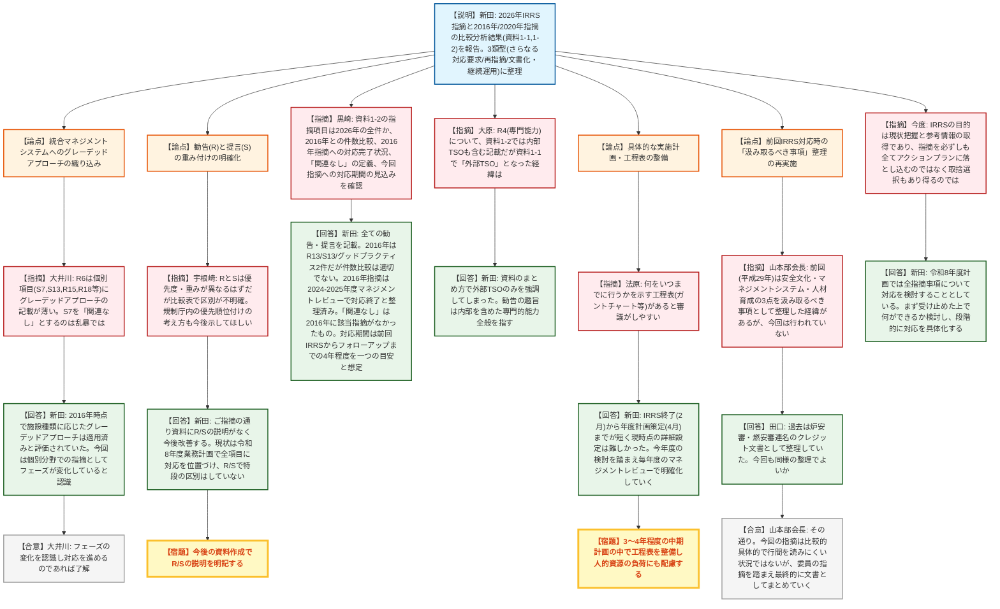
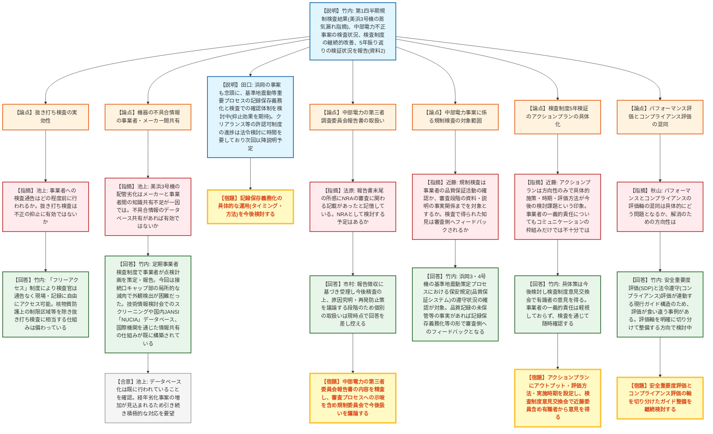
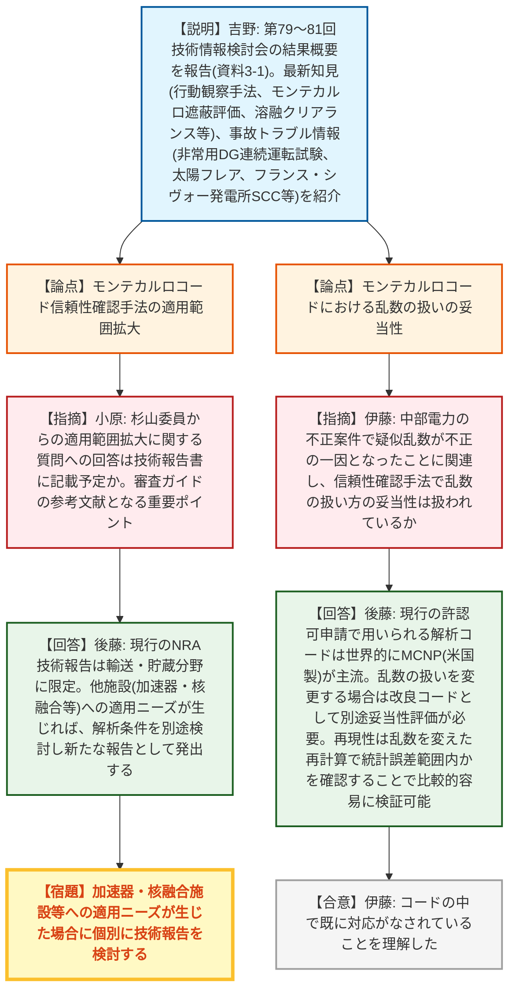
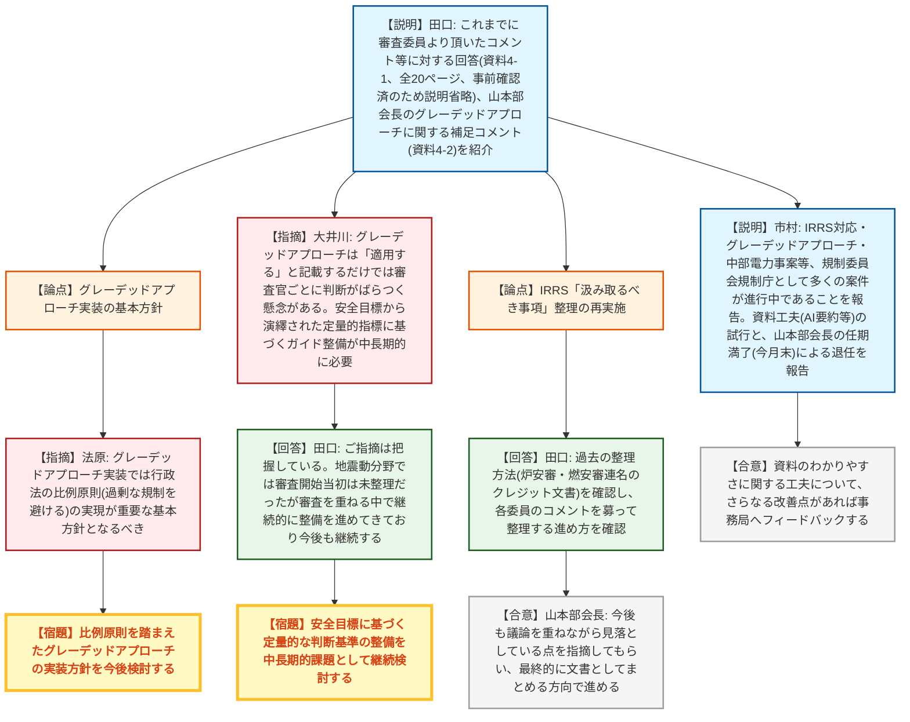

# 第22回原子炉安全基本部会・第16回核燃料安全基本部会（令和8年9月16日）
> 出典 : https://youtube.com/live/V3v8Z6pKZ9o?si=-2cysu5bkkZXtnp_

## 会合の概要
* **IRRS2026年指摘事項の過去指摘との比較分析を報告、対応の進め方に活発な議論**
  IRRS（IAEA総合規制評価サービス）2026年ミッションの指摘事項について、2016年及び2020年フォローアップミッションの過去指摘との比較分析結果が報告された。統合マネジメントシステムへのグレーデッドアプローチの織り込み方、勧告（Recommendation）と提言（Suggestion）の重み付けの明確化、対応の優先順位付けや工程表の整備、前回同様の「汲み取るべき事項」の整理の要否など、今後の対応の進め方をめぐり委員から多くの意見が出された。
* **中部電力の基準地震動不正操作事案、第三者調査委員会報告書が提出**
  中部電力による基準地震動策定に係る不正操作事案について、9月14日に事業者から第三者調査委員会の調査報告書が報告徴収命令に基づき提出されたことが報告された。規制庁は規制検査を通じて品質保証システムの遵守状況等の事実関係を確認していく方針であり、報告書の内容は今後精査した上で規制委員会で議論される。
* **美浜発電所3号機の蒸気漏れ事案を含む規制検査の実施状況を報告**
  5月に美浜発電所3号機で発生した高圧タービンケーシング接続口の減肉による蒸気漏れ（原子炉自動停止）を含む今年度第1四半期の検査結果が報告され、抜き打ち検査に相当する「フリーアクセス」制度の運用や、機器不具合情報のデータベース共有の仕組み等について質疑が行われた。
* **技術情報検討会（第79〜81回）の結果を報告**
  モンテカルロコードによる遮蔽評価の信頼性確認手法、フランス・シヴォー発電所の応力腐食割れに関する継続調査、溶融クリアランスに関する海外事業調査等、直近3回の技術情報検討会の結果概要が報告された。
* **山本部会長が任期満了により退任**
  事務局より、今回の議事進行を務めた山本部会長が今月末の任期満了をもって退任することが報告され、これまでの炉安審・燃安審の会長としての議論の取りまとめに対し謝意が示された。

---

## 議題ごとの詳細整理

### 【議題1】IRRS（IAEAの総合規制評価サービス）ミッションにおける指摘事項への対応状況

* **議論の背景と論点:**
  前回会合で、2026年IRRSミッションの指摘事項と、前回（2016年）IRRS及び2020年フォローアップミッションの指摘事項との比較分析が必要との意見が出されたことを受け、政策立案参事官の新田氏より比較分析結果（資料1-1、1-2）が説明された。2026年に得られた全ての勧告・提言について、関連する2016年時点の指摘の有無を整理した表（資料1-2）をもとに、完全に同一の課題の再指摘はなかったものの、関連する指摘を(1)さらなる対応措置を求めるもの（人材確保と流動性R3、外部TSOの専門能力R4、規則・ガイドの見直しS17、緊急時作業員の防護S18）、(2)過去に対応完了とされたが異なる観点から再指摘されたもの（無通告検査R15、セキュリティとのインターフェースR24）、(3)導入済み制度の文書化及び継続的運用への移行を求めるもの（統合マネジメントシステムR6、リーダーシップ及び安全文化に係る提言、検査計画R15、執行方針の文書化R17等）の3類型に整理して説明した。

* **質疑応答（詳細）:**
  * 【大井川委員】2026年報告書のエグゼクティブサマリーではグレーデッドアプローチの適用が強く求められているが、統合マネジメントシステムに関するR6の記載ではその点があまり読み取れない一方、S7・S13・R15・R18等の個別項目でグレーデッドアプローチの適用が指摘されている。特にS7を「関連なし」と整理しているが、2016年当時から統合マネジメントシステムへの織り込みが求められていた論点が今回個別に表面化したものであり、「関連なし」とするのは乱暴ではないかと指摘した。
  * 【新田（政策立案参事官）】2016年当時、審査分野でのグレーデッドアプローチ適用を求める勧告・提言はなく、施設の種類・要件に応じた対応がなされているとの評価だったためS7は「関連なし」とした。R6（マネジメントシステム）についても2026年IRRSではグレーデッドアプローチの取り込みを求める追加指摘はなかった。統合マネジメントシステムという前提的な論点から、個別分野での具体的な適用を求める指摘へとフェーズが変化してきていると受け止めていると回答した。
  * 【大井川委員】フェーズの変化を認識した上で対応を進めていくということであれば了解する旨を述べた。
  * 【宇根崎委員（京都大学）】グレーデッドアプローチの点は先の質疑応答で了解した上で、資料の構成として、指摘事項を「ミッション指摘事項」として一括りにしており、勧告（Recommendation）と提言（Suggestion）の違いが公開資料上で明確でない点を指摘した。Rは安全基準に完全に合致していないため最優先で対応すべきもの、Sはより良い実践のために推奨されるものであり本質的に重みが異なるため、比較表でその違いを明確にすべきであり、あわせてIRRSミッション時の担当者の意見を踏まえた優先順位・規制調整の付け方も今後の資料作成・説明の際に明確にしてほしいと要望した。
  * 【新田】ご指摘の通り資料1-1、1-2にはRとSの説明がなく、今後資料を作成する際にはしっかり説明するようにしたいと回答した。RとSの違いについては、現状では原子力規制委員会として区別なく全ての指摘に対応する方針であり、令和8年度の年度業務計画において各勧告・提言ごとに対応内容を示し取り組みを進めているが、Sの中には規制委員会単独では対応できず政府として対応すべきものも含まれると説明。8年度の検討結果を踏まえて翌年度以降も対応を継続し、毎年度のマネジメントレビューの中で対応状況を確認していく方針を述べた。
  * 【黒崎委員】資料1-2に記載のS-1からR-24までの項目が2026年指摘の全てかを確認。新田氏は全ての勧告・提言を記載しており、記載内容は概要として要約している旨回答。続けて黒崎委員は2016年時点の指摘件数を質問し、新田氏は2016年はレコメンデーション13、サジェスチョン13、グッドプラクティス2であったが、IRRSからは件数での比較を意図したものではないと繰り返し説明を受けており、単純な件数比較は適切でないとの認識を述べた。さらに黒崎委員は2016年指摘のその後の対応状況を質問し、新田氏は2020年フォローアップミッションでほぼ完了と評価され、マネジメントシステムの体制整備に関する継続項目についても2024〜2025年度のマネジメントレビューの中で対応終了と整理されていると回答した。また「関連なし」の定義（2016年に該当する指摘がなかったもの）、及び今回の指摘への対応に要する期間の見通し（現時点で明確な期限設定は困難だが、前回IRRSからフォローアップミッションまでの4年間を一つの目安として想定）についても質疑があった。
  * 【大原委員】R4（専門能力）について、資料1-2の記述では勧告は内部TSOも含む形で書かれているように見えるが、資料1-1では「外部TSO」という表現になっている経緯を質問した。新田氏は、2026年のR4の中でJAEA・QSTの専門能力を含む点を強調しすぎた資料の作り方の問題であり、勧告の趣旨は外部TSOだけでなく内部を含めた専門的能力全般を指すものであると回答した。
  * 【法原委員】実施計画について、何をどこまでいつの期間で行うかを示す工程表のようなものがあると審議しやすいとの意見を述べ、今年度の検討結果を踏まえ、年度計画・中期計画の段階で3〜4年程度を目安に、規制庁内の関係部門の業務負荷や人的資源の最適化にも配慮したガントチャート的な計画の整備を提案した。新田氏は、IRRSミッション終了（2月）から令和8年度業務計画の策定（4月）までの期間が短く、その段階での詳細な期限設定は困難であったこと、今年度の検討・調査を進める中で毎年度のマネジメントレビューを通じて何をいつまでに実施するかが明確になっていく見込みであることを説明。あわせて、IRRS対応は規制庁の業務の一部であり、他の業務との兼ね合いの中での整理もマネジメント上重要な論点であると付言した。
  * 【山本部会長】前回（平成29年）のIRRS対応の際、安全文化の醸成・マネジメントシステム・人材育成の3点を軸に「汲み取るべき事項」を整理して議論した経緯があり、今回はそうした整理が行われていない点について、今後対応してほしいと要望した。また資料4-1に記載の自身のコメントは「汲み取るべき事項」という観点から提出したものであり、今後の検討はその見方を踏まえてほしいと述べた。
  * 【今度委員】IRRSを受ける目的は、NRAの業務をありのまま見てもらい、指摘を日々の運営の参考にすることにあると理解しているとした上で、その理解に立てば、勧告を必ずしも全てアクションプランに落とし込むのではなく、必要と判断したものを選んで対応する姿もあり得るのではないかとの見方を示した。一方で委員側からはアクションプランへの落とし込みを前提とした発言も見られ、NRAとして取捨選択する方針なのか、一旦全て受け止める方針なのか、認識を確認したいと質問した。新田氏は、令和8年度の年度業務計画において今回の指摘事項全てについて対応を検討することとしており、まずは受け止めて何ができるかを検討し、具体的な対応は今年度以降の検討を踏まえて段階的に進めていく形であり、項目によっては対応が進みにくいものが生じる可能性も否定できないと回答した。

* **結論と宿題事項（アクションアイテム）:**
  * 本件へのさらなるコメント・質問は1週間程度をめどに事務局へ寄せること。
  * 今後の資料作成において、勧告（R）と提言（S）の違い・重みの説明を明記する（宇根崎委員指摘への対応）。
  * 前回IRRS対応時と同様、各委員のコメントを募った上での「汲み取るべき事項」の整理を今後行う方向で調整する（山本部会長・田口氏で確認）。
  * 実施計画について、3〜4年程度を目安とした工程表（ガントチャート等）の整備を中期計画段階で検討する（法原委員指摘）。

---

### 【議題2】原子力規制検査の実施状況

* **議論の背景と論点:**
  検査監督総括課の竹内氏より資料2に基づき説明が行われた。今年度第1四半期の規制検査結果として、5月に美浜発電所3号機で高圧タービンのケーシング接続口キャップ部が製造時から徐々に減肉し検出できていなかったことに起因する蒸気漏れ（原子炉自動停止）が指摘事項として報告された。また中部電力の不正行為に関する検査状況のシリーズとして、3月31日の報告徴収命令への一部報告（統計的グリーン関数法に関する不正、方法①105件・方法②3件等、7月1日の規制委員会報告）、及び基準地震動の不正操作に関する証拠の後付け操作が判明した件について、9月14日に中部電力から第三者調査委員会による特別調査報告書が提出され規制委員会に報告された旨が説明された。あわせて検査制度の継続的改善（グレーデッドアプローチのさらなる適用、パフォーマンスインディケーターの見直し、横断領域検査の導入検討、リスク情報の活用）や、検査制度発足5年の振り返り・検証（7つのキーファクターの抽出、パフォーマンス評価とコンプライアンス評価の混同という課題等）についても報告された。

* **質疑応答（詳細）:**
  * 【池上委員】(1) 事業者への検査通告は数週間前・数日前等どの程度のタイムスパンで行われるのか、不正の隠蔽防止には抜き打ち検査が有効ではないかと質問した。竹内氏は、原子力規制検査の特徴の一つである「フリーアクセス」制度により、検査官は事業者への事前通告なく現場に自由にアクセスし質問・記録確認を行うことができ（核物質防護上の制限区域等は別途手続きが必要）、実質的に抜き打ち検査に相当する仕組みが備わっていると回答した。
  * 【池上委員】(2) 美浜3号機の配管劣化事案について、メーカー側と事業者（ユーザー）側の知識共有が十分でないケースが多いのではないかとした上で、こうした技術的な不具合情報をデータベース化し、事業者・メーカー・規制側が常時アクセスできる仕組みがあれば有効ではないかと提案した。竹内氏は、国内では定期事業者検査制度により事業者が点検頻度等の計画を策定し規制委員会に報告する仕組みがあること、今回の事案は接続口キャップ部の局所的な減肉で外観からの検出が難しかったこと（インフォメーションノーティスを発出済み）を説明。また海外知見は技術情報検討会でスクリーニングを行い、国内ではJANSI（日本原子力技術協会）が公開する「NUCIA」データベースに全施設の不具合情報が収集され事業者が展開の要否を判断する仕組みが、海外とも国際機関を通じた情報共有の仕組みが構築済みであると回答した。池上委員は経年劣化による機材の不具合が今後増加すると見込まれるため、引き続き積極的な対応を要望した。
  * 【田口（規制企画課長）】補足として、浜岡の事案も念頭に、基準地震動のような重要なプロセスについて事業者に記録保存を義務づけ、その状況を検査でいつでも確認できるようにする対策を検討中であり、抑止効果を期待していると説明した。また許認可制度（クリアランス等）の進捗は法令上の検討に時間を要しており、進捗は次回以降説明する予定と述べた。
  * 【法原委員】今週月曜日に中部電力から提出された特別調査報告書について、報告書末尾の所感部分にNRAの審査に関わる記載があったと記憶しているとした上で、この点についてNRAとして検討する予定があるかを質問した。市村氏は、当該報告書は報告聴取として受理しており、これから内容を精査した上で原因究明・再発防止対策を議論していく段階であるため、個別の取扱いについて現時点での回答は差し控えたいと回答。竹内氏も、規制の相手方は中部電力であり、今後検査を継続する中で委員会において扱いが議論されるものと承知していると補足した。
  * 【近藤委員】(1) 中部電力事案に関する規制検査の範囲について、事業者の品質保証活動の確認が対象か、審査段階での資料・説明内容等の事実関係までが対象かを質問。あわせて検査を通じて得られた審査プロセスに関する知見が、審査側の振り返り・改善にフィードバックされることも視野に入れているか質問した。竹内氏は、1月14日に規制検査で事実関係を確認する方針が決定されており、対象は浜岡原子力発電所3・4号機の原子炉設置変更許可申請に係る基準地震動策定プロセスにおける保安規定（品質保証システム）の遵守状況の確認であると説明。品質記録の未保管等の事実が判明した場合には、記録保管の義務づけ等の形で審査側へのフィードバックがかかっていると回答した。田口氏は、竹内氏の説明は現在の浜岡事案の検査対応であるとした上で、今後の対策としては基準地震動のような重要プロセスの資料の記録保存義務化と、その状況をいつでも検査で確認できる体制の整備を不正の抑止策として検討中であり、具体的な確認のタイミング・方法は今後検討すると補足した。
  * 【近藤委員】(2) 検査制度5年の振り返り・検証について、示されたアクションプランの構想は方向性（相場観の醸成、継続的な改善等）はわかるが、具体的な施策・実施時期は今後の検討という印象を受けたとし、今後アウトプット・評価方法・実施時期を設定した形で検討することで次回の検証が適切に行えるのではないかと述べた。また事業者の一義的責任について、課題として認識されているにもかかわらずアクションプランでは事業者とのコミュニケーションの枠組みで扱われており、QMSやCAP・マネジメント等コミュニケーションの取り組みだけでは解決できない可能性があるため、より幅広い視点での検討を要望した。竹内氏は、アクションプランの詳細（資料138ページ）にはある程度方向性を記載しているが具体策はこれから検討し、近く開催予定の検査制度意見交換会で近藤委員を含む有識者から意見を得たいと回答。事業者の一義的責任については、今回特段大きな問題として扱ってはいないが、事業者自らが安全に責任を持つという考え方を軽視するものではなく、検査を通じて随時確認していきたいと述べた。
  * 【秋山委員】アクションプランの構想のうち、パフォーマンスベースの検査に関連して、「パフォーマンスとコンプライアンスの混同」とは具体的にどのような場面で問題になるのか、また解消のためにどのようなアクションが考えられるかを質問した。竹内氏は、検査の指摘には安全重要度評価（SDP、炉心損傷頻度等への影響度で評価）とコンプライアンス評価（法令遵守）の2つの評価軸があるが、現行ガイドでは安全上のインパクトとコンプライアンス上の影響が連動する構造になっているため、安全重要度が低いものは法令上問題があっても指摘にならなかったり、その逆のケースが生じたりするなど評価軸が混同している事例があると説明。それぞれの評価軸を明確に切り分けて整備していく方向で検討していると回答した。

* **結論と宿題事項（アクションアイテム）:**
  * 追加の意見・質問は1週間程度をめどに事務局へ寄せること。
  * 基準地震動等の重要プロセスに係る記録保存の義務化及び検査での確認体制の具体的な運用（タイミング・方法）を継続検討する。
  * 中部電力の第三者調査委員会報告書の内容（審査プロセスへの言及を含む）を精査し、今後規制委員会で扱いを議論する。
  * 検査制度5年検証のアクションプランについて、アウトプット・評価方法・実施時期を設定した形に具体化し、検査制度意見交換会で近藤委員を含む有識者から意見を聴取する。
  * 安全重要度評価（パフォーマンス）とコンプライアンス評価の評価軸を明確に切り分けたガイド整備を継続検討する。

---

### 【議題3】国内外で発生した事故・トラブル及び海外の規制動向に係る情報の収集・分析を踏まえた対応

* **議論の背景と論点:**
  技術基盤課長の吉野氏より資料3-1に基づき、5月・7月に開催された第79回・第80回・第81回技術情報検討会の結果概要が報告された。第79回では、東京電力柏崎刈羽で発生した重要度評価「赤」の核物質防護事案への追加検査で得られた「応答的規制の考え方に基づく行動観察手法」（安全文化・組織行動の変化を4段階で評価し規制関与度を調整する手法）、及び「モンテカルロコードによる遮蔽評価の信頼性確認手法」（従来の解析手法では貯蔵キャスクの一部条件で中性子線量率を過小評価するおそれが判明したことを受け、2020〜2023年度の安全研究で整理、既に審査実務で活用中でスクリーニングアウト）の2件の最新知見のほか、非常用ディーゼル発電機の24時間連続運転試験（令和7年度は22台実施、柏崎6号機C系がガバナ不具合による一過性事象で試験後に自動停止したが、長期連続運転自体が原因となった事象はなく現行の保守管理は妥当と評価）、太陽フレアが原子力施設に与える影響（2026年1月に宇宙天気警報が初めて発信されたが安全上の問題は発生せず）の事故トラブル情報が報告された。第80回（非公開）では、フランス・シヴォー（Civaux）発電所のPWR炉心冷却系配管の応力腐食割れに関する継続調査結果が報告され、関西電力大飯発電所3号炉の加圧器スプレイライン配管溶接部のSCCはフランス事例との類似性がないと判断されたこと等から、国内プラントへの反映事項なしとして二次スクリーニングアウトされた。第81回では、規制庁による溶融クリアランス（スウェーデン・ドイツ・米国の事業調査及び高周波誘導炉の性能調査）に関するNRA技術ノートが紹介され、福井県で検討されている溶融事業における認可確認・検査の判断参考情報として活用する方針が示された。また一次スクリーニング対象91件は全てスクリーニングアウトとなったこと、関西電力高浜発電所4号炉の制御棒駆動装置ケーブル半田接続部の不具合による原子炉自動停止事案（杉山委員より原因の分解調査での確認徹底の指示あり）等の個別案件が報告された。

* **質疑応答（詳細）:**
  * 【小原委員】第79回技術情報検討会のモンテカルロコード信頼性確認手法に関し、杉山委員からの質問（審査ガイドの参考文献にもなり得る適用範囲拡大の可能性）への回答について、今後技術報告書への記載を予定しているかを質問した。システム安全研究部門の後藤氏は、現行のNRA技術報告はあくまで輸送・貯蔵分野への適用を対象としたものであり、加速器や核融合施設等の他分野への適用について記載したものではないと説明。対象のモンテカルロコード自体は他施設にも適用可能と考えているが、実際に適用する場合には解析条件やデータの拡充等の検討が必要であり、将来そうしたニーズが生じた場合には改めて別の報告として発出することになると回答した。
  * 【伊藤委員（東京大学）】本題からはやや外れるがとした上で、中部電力の不正案件で疑似乱数が不正の一因となったことに関連し、モンテカルロコードによる遮蔽評価の信頼性確認手法において、乱数の扱い方の妥当性についても扱われているかを質問した。後藤氏は、現在許認可申請で提出されている解析コードは世界的にMCNP(米国製)が主流であり、その乱数の扱い方を変更する場合はMCNPを改良した別のコードとして扱われ、事業者がそうした変更を行いたい場合には妥当性評価の対象になると回答した。吉野氏からも、伊藤委員の質問は再現性・統計誤差に関するものと理解した上で、乱数を変えて再計算した結果が統計誤差の範囲内に収まっているかを確認することで比較的容易に検証できる旨が補足された。

* **結論と宿題事項（アクションアイテム）:**
  * 追加の意見は事務局へ寄せること。
  * モンテカルロコード信頼性確認手法の加速器・核融合施設等への適用は、必要が生じた時点で解析条件を個別に検討し、新たな技術報告として整理する。
  * 高浜発電所4号炉の制御棒駆動装置ケーブル半田接続部の不具合について、11月からの定期検査での分解調査により半田剥離が原因であったかを確実に確認する（杉山委員からの指示）。
  * 電動弁駆動部の端子保護カバーに関する事業者の対応の妥当性について、電気協会規格への反映状況を含め継続確認する。

---

### 【議題4】その他

* **議論の背景と論点:**
  規制企画課長の田口氏より、前回会合後に委員から寄せられた追加の質問・意見への事務局回答（資料4-1、全20ページ、内容は事前に委員へ確認済みのため場での説明は省略）が紹介された。あわせて、山本部会長が前回発言したグレーデッドアプローチに関するコメントの補足資料（資料4-2）が説明され、グレーデッドアプローチは規制緩和ではなくむしろ安全性の向上につながり得るものであること、欧米での運用をそのまま導入するのではなく、規制機関の裁量や行政・規制の方法が異なる日本の法体系に適合する形での調整が必要であることが述べられた。

* **質疑応答（詳細）:**
  * 【法原委員】資料4-2に関連し、グレーデッドアプローチを実装する際には、法の一般原則である比例原則（「雀を撃つのに大砲を使わない」ということ）をいかに実現するかが基本になるべきであり、その点に十分留意しながら実装の方向性を検討してほしいと述べた。
  * 【大井川委員】グレーデッドアプローチについて、審査する側から見ると「適用すること」とだけ書かれていても実際にどうすればよいか判断しづらく、審査官によって考えがばらつきかねないため、定量的に適用できるガイドの整備が必要であるとした上で、安全目標から演繹的に導かれる指標（メジャー）に基づいて判断できるようにすることを、中長期的な取り組みとして進めていく必要が強くあると述べた。田口氏は、ご指摘は把握しているとした上で、例えば地震動の分野では新規制基準審査を開始した当初はタイプごとのグレーデッドアプローチの考え方が整理されていなかったが、審査を進めながら整備する努力を続けてきており、それは継続的に続けなければならないことだと認識していると回答した。
  * 【田口】山本部会長の発言（議題1）を受け、前回のIRRS対応（平成29年頃）時の「汲み取るべき事項」の整理について過去のやり方を確認したところ、最終的には炉安審・燃安審連名のクレジットとして一枚紙の文書を取りまとめており、各委員からのコメントを募って事務局が整理を支援していたことが確認できたとし、今回も同様の進め方でよいか山本部会長に確認した。山本部会長は、その通りであり前回のコメントもそのつもりで提出したと回答。2016年当時は規制委員会が発足して間もない段階で指摘が広範にわたり、字面だけでなく行間を読んで指摘の趣旨を把握する必要があったのに対し、今回のIRRS指摘はグレーデッドアプローチ関連を含め比較的具体的な内容になっており、前回ほど行間を読みにくい状況ではないとの認識を示した。その上で、今後も議論を重ねながら委員や事務局が見落としている点があれば指摘を受け、最終的に前回同様、成果物として文書にまとめていきたいと述べた。
  * 【市村（事務局）】本日も活発な議論への謝意を述べた上で、IRRS対応、グレーデッドアプローチの適用、中部電力事案及びこれに関連する規制制度見直し等、規制委員会・規制庁として多くの案件が同時並行で進行中であり、外部の目を大切にしながら定期的な会合での議論を今後も継続していきたいと述べた。また前回会合での「大部な資料を送られても見きれない」との指摘を踏まえ、AIを活用した資料要約の作成など資料の工夫を今回試行したことを紹介し、さらに改善すべき点があれば指摘してほしいと要望した。最後に、本日の議事進行を務めた山本部会長が今月末の任期満了をもって退任することを報告し、炉安審・燃安審の会長として議論をリードし取りまとめてきたことへの感謝を述べた。

* **結論と宿題事項（アクションアイテム）:**
  * 議題全体を通じた追加発言は9月25日頃を目安に事務局へ寄せること。
  * 前回同様、各委員のコメントを募った上での「汲み取るべき事項」の整理を進める方向で事務局が具体的な進め方を検討する。
  * グレーデッドアプローチについて、比例原則を踏まえた実装方針、及び安全目標から演繹される定量的な判断基準の整備を中長期的な課題として継続検討する。
  * 資料のわかりやすさに関する工夫（AI要約等）について、さらなる改善点があれば事務局へフィードバックする。

---

## 論理構造の可視化（Mermaid）

### 1. IRRSミッションにおける指摘事項への対応状況

### 2. 原子力規制検査の実施状況

### 3. 国内外で発生した事故・トラブル及び海外の規制動向に係る情報の収集・分析を踏まえた対応

### 4. その他（グレーデッドアプローチ・IRRS「汲み取るべき事項」等）

