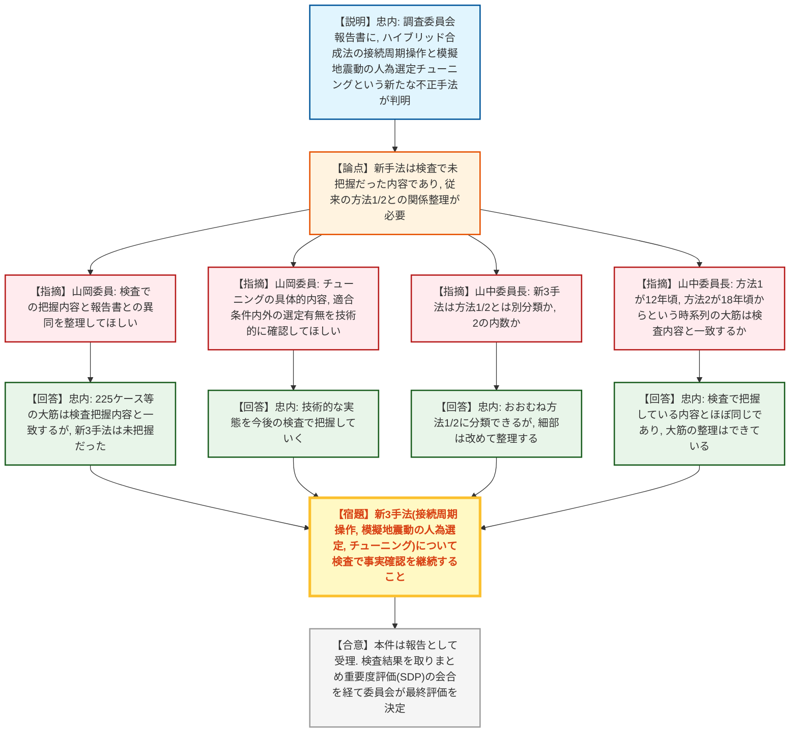
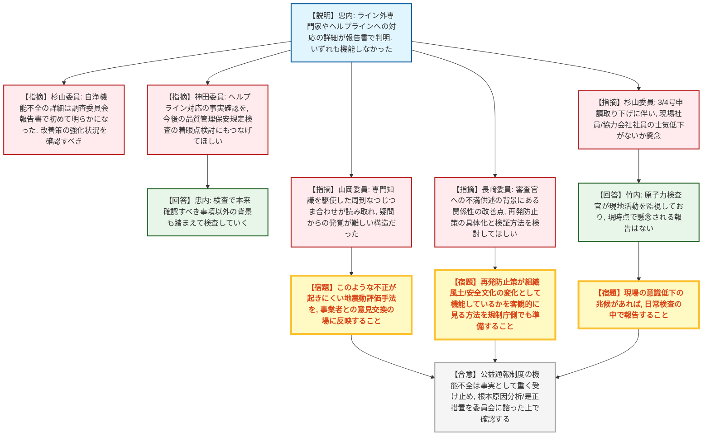
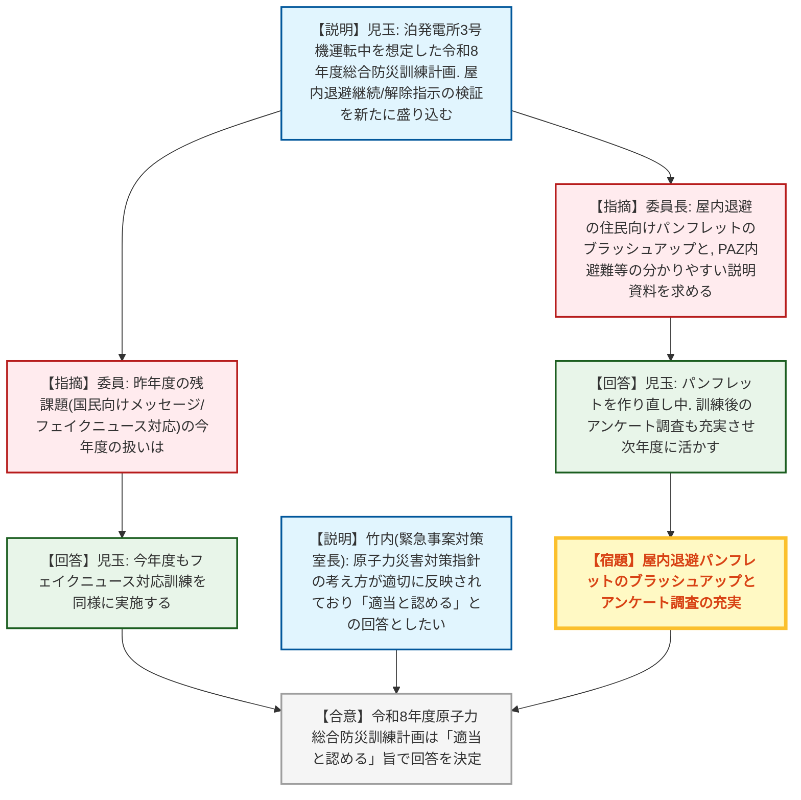
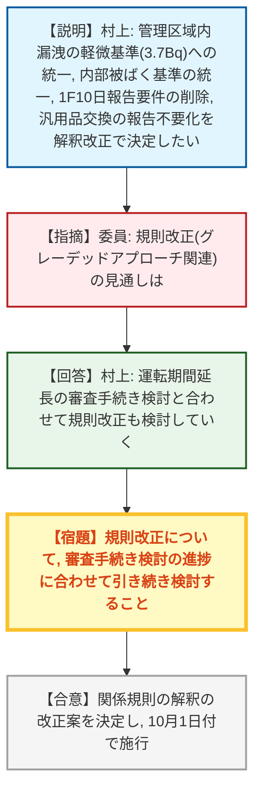
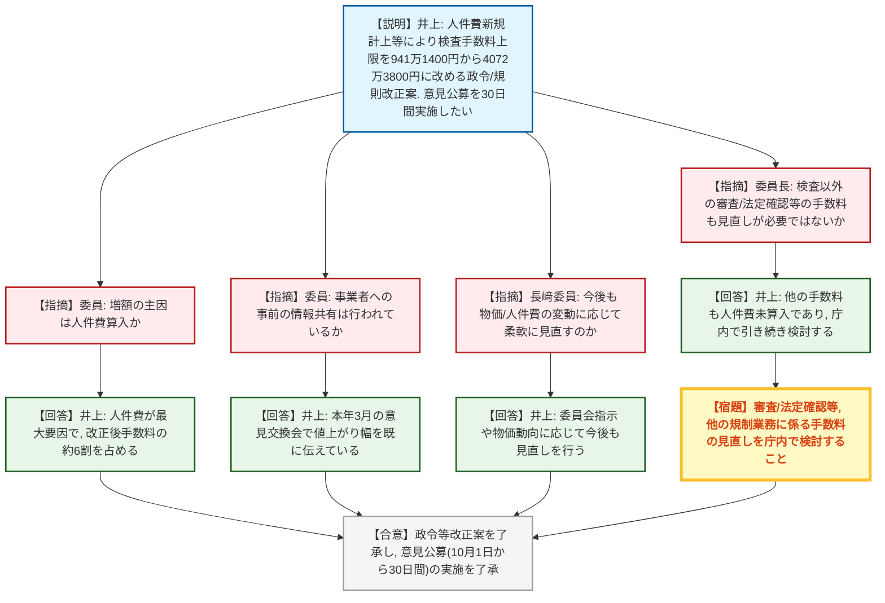

# 第32回原子力規制委員会（令和8年9月17日）
> 出典 : https://youtube.com/live/YlTN4uJmT0c?si=Rc7fNRLHXSqTGslp

## 会合の概要
* **中部電力・浜岡3/4号炉の新規制基準適合性審査申請が取り下げに**
  中部電力の地震動評価不正事案に関する調査委員会報告書(1〜4項)を受理。報告書提出後の面談で、中部電力は浜岡原子力発電所3号炉・4号炉の設置変更許可等の申請を取り下げる旨を説明した。
* **地震動評価不正の手口に新たな3つの手法が判明、規制庁が未把握だった内容**
  ハイブリッド合成法の接続周期を意図的にずらして基準地震動(Ss)を厳しくしないよう操作する手法、応答スペクトルに適合する模擬地震動を人為的に選定・チューニングする手法など、規制庁がこれまでの検査で把握していなかった不正の手口が報告書で新たに明らかになった。
* **社内自浄機能(ライン外専門家・ヘルプライン)の機能不全の詳細が判明**
  中部電力社内のライン外専門家への相談や内部通報制度(ヘルプライン)、規制庁への公益通報が用意されていたにもかかわらず、いずれも実効的に機能しなかった経緯が調査委員会報告書で詳細に明らかになり、委員から強い懸念が示された。
* **令和8年度原子力総合防災訓練計画(泊発電所を対象)を適当と認め、意見決定**
  北海道電力泊発電所3号機の再稼働・運転中を想定した訓練計画について、原子力災害対策指針の考え方が適切に反映されているとして、内閣総理大臣への回答(適当と認める)を決定した。屋内退避の指示に係る検証が今回新たに盛り込まれた。
* **原子力規制検査の手数料を大幅増額する政令・規則改正案を了承、意見公募へ**
  人件費・物件費・旅費の見直しにより検査手数料の上限額を941万1,400円から4,072万3,800円に改める政令案・規則案を了承。人件費の新規計上が増額の主因(改正後手数料の約6割を占める)で、10月1日から30日間の意見公募を実施する。

---

## 議題ごとの詳細整理

### 【議題1】中部電力株式会社の不正行為に係る対応状況(報告)

* **議論の背景と論点:**
  中部電力の地震動評価不正事案について、令和8年1月14日付の炉規法第67条第1項に基づく報告聴取命令では、①事実関係及び経緯、②直接原因・根本原因、③第三者委員会(調査委員会)による調査結果、④同様事案の調査結果、⑤それらを踏まえた是正措置、の5項目の報告を求めていた。3月31日に①の一部が報告済みであったところ、今回9月14日、残りの求め事項のうち①〜④について、調査委員会の報告書(開示版)を受理した(⑤是正措置は今回の対象外で別途求める)。報告書には、地震動評価の策定に関し認定された不正の事実関係、社内外からの指摘とこれに対する中部電力の対応、原因分析、が記載されており、規制庁はこれを踏まえた今後の検査の進め方について報告した。

* **質疑応答（詳細）:**
  * 【説明者側】忠内厳大（浜岡検査チーム副チーム長）
    今回の報告書には、ハイブリッド合成法の接続周期をずらして波数積分法側の評価結果を反映しにくくし、厳しい基準地震動(Ss)を生じさせないようにした手法や、応答スペクトルに適合する模擬地震動を正弦波の重ね合わせで多数作成したうえで人為的に一つを選定する、あるいは特定時刻の加速度値を「チューニング」と称して繰り返し調整する手法が新たに記載されており、これらは規制庁がこれまでの検査で把握していなかった内容である。ヘルプライン通報への対応についても、報告書で詳細が明らかになったため今後の検査で事実確認を進める。なお、委託先(解析・作図等の受託業者)が代表波の選定に直接関与していたことは確認されていない。
  * 【指摘】山岡耕春委員
    これまで11回ほど実施してきた検査での規制庁の把握状況と、今回の報告書の内容とで、整合している部分・検査で未把握だった部分を整理してほしい。
  * 【回答】忠内厳大（浜岡検査チーム副チーム長）
    断層モデルを用いたいわゆる225ケースへの精査や意思決定の内容などは、調査委員会の調査結果と検査での把握内容がおおむね一致しており大きな差はない。一方、今回新たに判明した3つの手法については規制庁として把握していなかった内容であり、今後の検査でしっかり確認する。
  * 【指摘】山岡耕春委員
    報告書には技術的に読み取りにくい記述がある。例えば「チューニング」で具体的に何をしたのか、模擬地震動を適合条件内で選んだのか条件外から選んだのかなど、技術的観点から踏み込んで確認してほしい。
  * 【回答】忠内厳大（浜岡検査チーム副チーム長）
    技術的な内容についても、今後の検査の中でしっかりと実態を把握し対応していく。
  * 【指摘】山岡耕春委員
    報告書からは、審査チームが適宜疑問点を確認していたのに対し、中部電力が専門知識を駆使して周到につじつま合わせを行っていたことが読み取れる。専門家としての能力の使い方を誤っており、そうした対応をさせられた従業員が気の毒であるとともに、このように周到に取り繕われると疑問から不正の発覚に至ることが難しくなると感じた。このような状況が起きにくい地震動評価手法を、現在進めている事業者との意見交換の場に反映してほしい。
  * 【指摘】山岡耕春委員
    報告書は原因分析を「独自の正当化理論」と表現しているが、地球科学者の視点では、本来向き合うべき自然現象に対する評価態度自体に問題があったと考える。理論的に分かる部分は理論で、経験的な部分は統計で、それでも分からない部分は余裕を持って安全側に評価するのが本来の姿であるべきところ、規制委員会への言い訳や取り繕いに終始していた点は、電力会社としての公共性を踏まえ改めてほしい。
  * 【指摘】杉山智之委員
    調査委員会報告書からは、ライン外専門家やヘルプラインという自浄機能が用意されていたにもかかわらず十分に機能しなかった経緯の詳細が判明しており、これは中部電力の調査チーム単独では踏み込めなかった部分だと思う。今後、中部電力から改善策が示された際に、これらの仕組みがどう強化されるかを確認していく必要がある。
  * 【指摘】杉山智之委員
    浜岡3・4号炉の申請取り下げに伴い、使用済燃料の保安活動・核物質防護・保障措置や1・2号炉の廃止措置など現場の業務は継続する。中部電力社員・協力会社社員の士気低下を懸念しており、現場の意識低下の兆候があれば報告してほしいと検査チームに依頼する。
  * 【回答】竹内淳（浜岡検査チーム長）
    1月14日以降、原子力検査官が現地活動を監視しており、現時点で懸念される問題の報告はないが、廃棄物関連の一部見直しなども念頭に置きつつ活動している。
  * 【指摘】長﨑晋也委員
    報告書には、独自の正当化理論の背景として審査官の知見への不満・不納得を示す供述がある。事業者が技術的根拠に自信を持っているなら公開の審査会議の場で堂々と議論すべきであり、勝手な理屈に逃げ込んだのは許されない。ただし、逃げ込みたくなるような関係性があったのだとすれば、その点は改善の余地がないか検討してほしい。
  * 【指摘】長﨑晋也委員
    報告書が示す再発防止策の方向性は抽象的な提案にとどまる。今後、中部電力が具体的なアクションに落とし込み、組織風土・安全文化がどう変わるかを検査で見届けることになるが、その変化を客観的にどう確認するか、規制庁側でも準備を進めておいてほしい。
  * 【指摘】長﨑晋也委員
    審査官への不満の供述は、実質的に責任転嫁にしか聞こえず、審査官に対して失礼な内容である。一方でこうした認識があったこと自体は事実であり、これを契機に審査官・検査官の力量・知見の向上に一層取り組んでほしい。
  * 【回答】竹内淳（浜岡検査チーム長）
    今回の中部電力の姿勢・態度について規制庁内できちんと共有し、今後の対応を検討する。是正措置・根本原因分析については報告聴取命令で別途求めており、規制委員会に諮った上で確認していく。
  * 【指摘】神田玲子委員
    今回の事実確認は本事案の深刻度評価に関わるだけでなく、今後の品質管理に関する保安規定検査で使える着眼点の検討にもつなげてほしい。組織の閉鎖性が問題だったのであれば、それを現場から確認できる着眼点がないか検討してもらえると、規制側の改善にもつながる。
  * 【回答】忠内厳大（浜岡検査チーム副チーム長）
    QMS上のコンプライアンスの着眼点に加え、本来確認すべき事項以外の背景も踏まえて検査をしっかり実施していく。
  * 【指摘】山中伸介委員長
    従来「方法①」「方法②」に分類していた不正の手口に対し、今回新たに3種類の手法が判明したが、これは①②とは別分類として扱うのか、②の内数として扱うのか。
  * 【回答】忠内厳大（浜岡検査チーム副チーム長）
    今回報告された手法は、おおむねこれまでの①②に分類できると考えているが、細かい分類や追加のバックデータ作成についても改めて整理し、状況を確認していく。
  * 【指摘】山中伸介委員長
    地震動評価に関する不正は、通常の技術者では行わない行為であることが明らかで、専門家としての技術者倫理の喪失以外の何ものでもない。データ不正の上、規制庁に露見しないよう隠蔽までしており、2018年頃から「方法②」が繰り返されるようになったとする時系列の大筋は、これまでの検査結果とおおむね一致していると理解してよいか。また、公益通報制度が全く機能していなかったことは非常に驚きであり、委託先の関与については悪意・不正が確認されていない点も含め今後の検査で最終確認してほしい。
  * 【回答】忠内厳大（浜岡検査チーム副チーム長）
    時系列の大筋は、方法①がおおむね12年頃から、方法②が18年頃からという点も含め、検査での把握内容とほぼ同じ内容が報告書に記載されており、整理はおおむねできていると認識している。
  * 【回答】山中伸介委員長
    引き続き事実確認をしっかり行った上で報告を受け、委員会として措置を判断していきたいので、しっかりとした検査をお願いしたい。
  * 【回答】竹内淳（浜岡検査チーム長）
    委員長の方針のとおり、事実確認を検査の中で引き続き進め、対応方針は検査結果を取りまとめた上で改めて委員会に諮りたい。
  * 【指摘】委員（発言者名不詳）
    中部電力は11日付で調査委員会の報告書を受け取り、個人名等を伏せる編集をして14日に規制庁へ提出したとのことだが、記載内容について中部電力社として合意・納得した上での提出なのか、それとも納得はしていないがとりあえず提出したものなのか、位置づけを確認したい。
  * 【回答】竹内淳（浜岡検査チーム長）
    中部電力は調査開始時点で、事実関係の把握を調査委員会に委ねる姿勢を示しており、提出された報告書は中部電力としての報告書と捉えて差し支えない。

* **結論と宿題事項（アクションアイテム）:**
  * **決定事項:** 本件は報告として受理し、審議を終了した。
  * **宿題事項:**
    1. 新たに判明した3つの不正手法(ハイブリッド合成法の接続周期操作、模擬地震動の人為的選定・チューニング、ヘルプライン対応の詳細)について、今後の検査で事実確認を進めること。
    2. 技術的内容(チューニングの具体的手法、模擬地震動の適合条件内外の選定有無等)を技術的観点から踏み込んで確認すること。
    3. 中部電力現場・協力会社社員の士気低下の兆候を、日常検査の中で注視・報告すること。
    4. 根本原因分析・是正措置(報告聴取命令で別途要求)について、提出され次第、委員会に諮った上で確認すること。
    5. 検査結果を取りまとめ、重要度評価(SDP)に関する会合で暫定評価を行った上で、委員会にて最終的な評価結果を決定する。

---

### 【議題2】「令和8年度原子力総合防災訓練計画」に対する原子力規制委員会の意見(決定)

* **議論の背景と論点:**
  原災法に基づき、内閣総理大臣から令和8年度原子力総合防災訓練計画について規制委員会の意見聴取があった。今回の訓練対象は北海道電力泊発電所(3号機が再稼働・運転中の想定)で、北海道南西沖地震により3号機が施設敷地緊急事態・全面緊急事態に至るシナリオを想定。屋内退避の継続・解除指示の検証が、原災指針改正後初めて正式に盛り込まれる訓練となる点が論点となった。

* **質疑応答（詳細）:**
  * 【説明者側】児玉智（内閣府参事官）
    重点項目は、①国・専門家のオフサイトセンター等への迅速な派遣、②官邸・緊急時対応センター(ERC)・オフサイトセンター等における意思決定、③PAZ内避難・UPZ内屋内退避の実施等。泊発電所のPAZ(約5km圏)は2町1村・約2,300人、UPZ(約30km圏)は10町3村・約6,600人。昨年度(令和7年度)訓練の反省を踏まえ、自然災害情報システムとの連携強化、現地訓練時間の延長とシナリオ充実、屋内退避継続・解除指示の検証を盛り込んだ。
  * 【指摘】委員（発言者名不詳）
    今回の想定は泊1・2・3号機のうち3号機のみが再稼働・運転中という理解でよいか。
  * 【回答】児玉智（内閣府参事官）
    その理解のとおり。
  * 【指摘】委員（発言者名不詳）
    屋内退避の考え方が正式に取り入れられた原災指針関連文書以降、初めての総合防災訓練であり、屋内退避のアクションを意識した訓練となる点は新しい試みだと感じる。
  * 【指摘】委員（発言者名不詳）
    昨年度の検証課題3つのうち、要員参集・自然災害対応との連携は今年度も引き続き課題とされているが、残る1つ(国民向けメッセージ、フェイクニュース対応)については今年度どう扱う予定か。
  * 【回答】児玉智（内閣府参事官）
    今年度もフェイクニュース等の誤情報への対応訓練を同様に組み込む予定である。
  * 【指摘】山中伸介委員長
    昨年度作成した屋内退避の意義等に関する住民向けパンフレットを今年度もブラッシュアップし、PAZ内予防的避難や、屋内退避継続不能時の避難所移動等について、住民に十分理解いただける資料を作成してほしい。
  * 【回答】児玉智（内閣府参事官）
    内閣府において屋内退避の啓発パンフレットを一部作り直しており、新たな知見を反映する予定。訓練後のPDCA(反省と改善)として、住民・自治体向けアンケート調査も充実させ、次年度以降の訓練に活かしたい。
  * 【説明者側】竹内淳（緊急事案対策室長）
    規制庁として訓練計画の内容を確認した結果、原子力災害対策指針に示す訓練の考え方が適切に反映されていると認められることから、「適当と認める」旨の回答としたい。

* **結論と宿題事項（アクションアイテム）:**
  * **決定事項:** 令和8年度原子力総合防災訓練計画について、内閣総理大臣への回答を「適当と認める」とする内容で決定した。
  * **宿題事項:**
    1. 屋内退避の意義等に関する住民向けパンフレットを、今年度の知見を反映してブラッシュアップすること。
    2. 訓練後の住民・自治体向けアンケート調査を充実させ、次年度以降の訓練改善に反映すること。

---

### 【議題3】核燃料物質及び原子炉の規制に関する法律第62条の3の規定に基づく事故故障等の報告の改善のための関係規則の解釈の改正案(決定)

* **議論の背景と論点:**
  令和7年8月20日の規制委員会で了承された報告制度改善の方向性を踏まえ、規則改正を伴う論点(安全性に関係しない故障報告要件の削除、火災限定要件の見直し、危機交渉等の2段階報告のグレーデッドアプローチ的見直し)と、規則改正を伴わない解釈改正の2系統を検討。規則改正の方は、IRRSミッションの指摘や運転期間延長に係る審査基準改正案との整合確認のため引き続き検討中とし、今回は解釈改正のみを決定する議題として提示された。

* **質疑応答（詳細）:**
  * 【説明者側】村上玄（検査評価室長）
    管理区域内における放射性物質漏洩の報告基準を3.7Bqに統一(試験炉・核燃料使用施設・RIが対象、RIは対象外の項目あり)し、内部被ばくの恐れがある場合の基準も他施設に合わせた記載に統一する。福島第一(1F)関連では10日以内報告要件を削除し、汎用品交換等で済む機器故障は報告不要であることも明確化する。本改正は解釈の変更であり、原則としてパブリックコメントを行わず10月1日付で施行したい。
  * 【指摘】委員（発言者名不詳）
    今回の解釈改正は適正と考えるが、引き続き検討中の規則改正の見通しが分かれば教えてほしい。
  * 【回答】村上玄（検査評価室長）
    運転期間延長に係る審査手続きの検討が進んでおり、その時期に合わせて規則改正の検討も進めていきたい。
  * 【指摘】委員（発言者名不詳）
    軽微基準を具体的な数値で示すことで判断に迷わなくなり、グレーデッドアプローチの考え方も反映されたことで、より適切な方向への変更になったと思う。

* **結論と宿題事項（アクションアイテム）:**
  * **決定事項:** 別紙のとおり、関係規則の解釈の改正案を決定し、10月1日付で施行することとした。
  * **宿題事項:** 規則改正を伴う論点(グレーデッドアプローチに関する部分等)については、運転期間延長に係る審査手続きの検討と合わせて引き続き検討する。

---

### 【議題4】原子力規制検査の手数料改正のための核原料物質、核燃料物質及び原子炉の規制に関する法律施行令及び原子力規制検査等に関する規則の改正案並びに意見公募の実施(了承)

* **議論の背景と論点:**
  令和7年12月の規制委員会で示された、物価・人件費高騰を踏まえた手数料見直し指示を受け、人件費(新規計上)・物件費・旅費(いずれも最新単価に更新)を反映した政令・規則の改正案を検討。政令上の検査手数料の上限額を941万1,400円から4,072万3,800円に改める内容で、規制委員会の了承と意見公募の実施可否が論点となった。

* **質疑応答（詳細）:**
  * 【説明者側】井上大志（検査監督総括課係長）
    見直しでは人件費・物件費・旅費の単価を最新化し、政令上の上限額を4,072万3,800円に改める。規則案では各施設の手数料額を改定する。了承が得られれば、行政手続法に基づく意見公募を翌日から30日間実施し、施行日は令和9年4月1日を予定する。
  * 【指摘】委員（発言者名不詳）
    今回の見直しで金額が大きく上がるのは、主に人件費を算入したことが最大の要因という理解でよいか。
  * 【回答】井上大志（検査監督総括課係長）
    手数料の種類により差はあるが、人件費による増加が最も大きく、改正後の手数料のおおよそ6割程度を人件費が占める。
  * 【指摘】委員（発言者名不詳）
    改正後の手数料について、事業者への事前の情報共有は行われているか。
  * 【回答】井上大志（検査監督総括課係長）
    本年3月に実施した事業者との検査制度に関する意見交換会で、おおよその値上がり幅は既に伝えており、今後の意見公募で寄せられる意見には丁寧に対応する。
  * 【指摘】長﨑晋也委員
    今回は令和8年度時点の単価で決定するが、年度ごとの物価・人件費の変動に応じて、将来的にも柔軟に見直しを繰り返していく考えでよいか。
  * 【回答】井上大志（検査監督総括課係長）
    委員会の指示や物価高騰の状況等に応じて、今後も見直しを行っていく考えである。
  * 【指摘】山中伸介委員長
    今回は原子力規制検査に係る手数料の人件費を組み込んだが、規制業務全体では他にも見直すべき手数料があるのではないか。
  * 【回答】井上大志（検査監督総括課係長）
    審査に係るものや検査の中の法定確認に関するものなど、他の手数料についても人件費が未算入であり見直しが必要と認識しており、庁内で引き続き検討していく。

* **結論と宿題事項（アクションアイテム）:**
  * **決定事項:** 別紙1・別紙2のとおり、原子力規制検査に係る手数料の額を見直す政令等の改正案を了承し、あわせて意見公募(10月1日から30日間)の実施を了承した。
  * **宿題事項:** 審査・法定確認等、他の規制業務に係る手数料についても、人件費算入を含めた見直しを庁内で引き続き検討すること。

---

### 【議題5】山中委員長の出張報告(報告)

* **議論の背景と論点:**
  山中伸介委員長が9月13日から17日にかけてオーストリア(ウィーン)に出張し、IAEA第70回総会及び国際原子力規制者会議(INRA)に出席した際の報告。

* **質疑応答（詳細）:**
  * 【説明者側】山中伸介委員長
    IAEA第70回総会の期間中にフランス・米国・英国とそれぞれ2国間会談を実施し、協力関係に関する議論を行った。また、米国主催の国際原子力規制者会議(INRA)にも出席し、最近の規制トピックについて議論した。
  * 質問・コメントは特になし。

* **結論と宿題事項（アクションアイテム）:**
  * **決定事項:** 出張報告を受理し、審議を終了した。
  * **宿題事項:** 特になし。

---

## 論理構造の可視化（Mermaid）

### 議題1-A：地震動評価不正の新たな手口と今後の検査方針

### 議題1-B：社内自浄機能の機能不全と組織風土・現場への影響

### 議題2：令和8年度原子力総合防災訓練計画（泊発電所）

### 議題3：事故故障等の報告の改善のための関係規則の解釈改正

### 議題4：原子力規制検査の手数料改正

