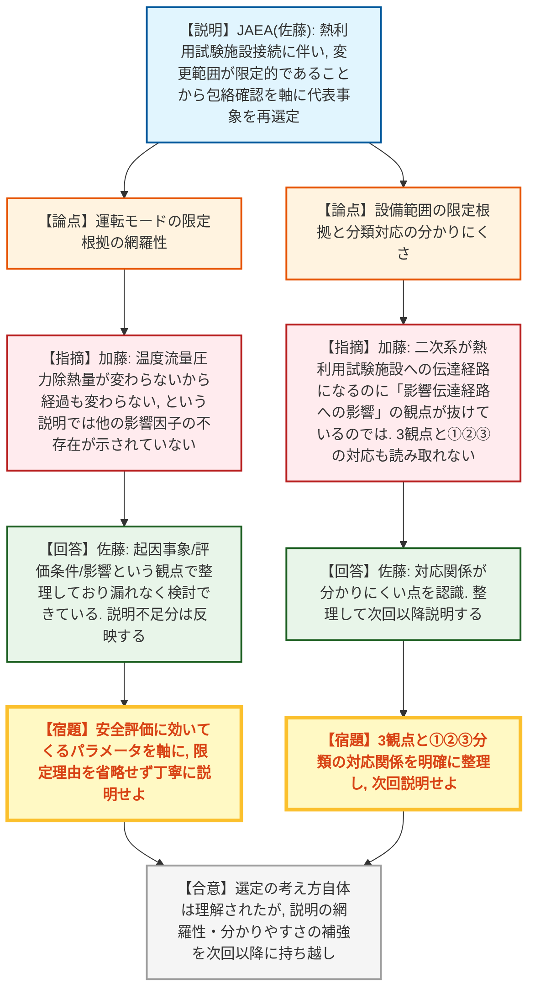
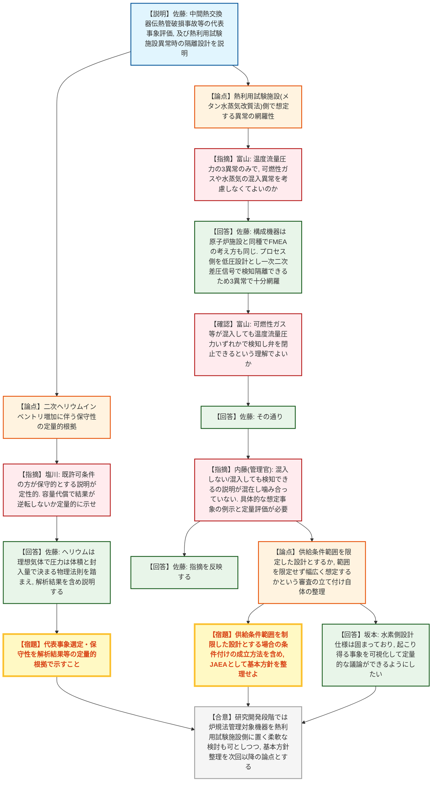
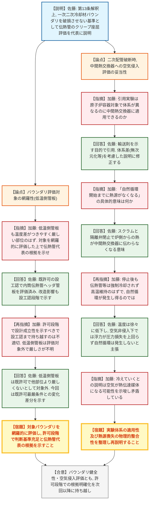
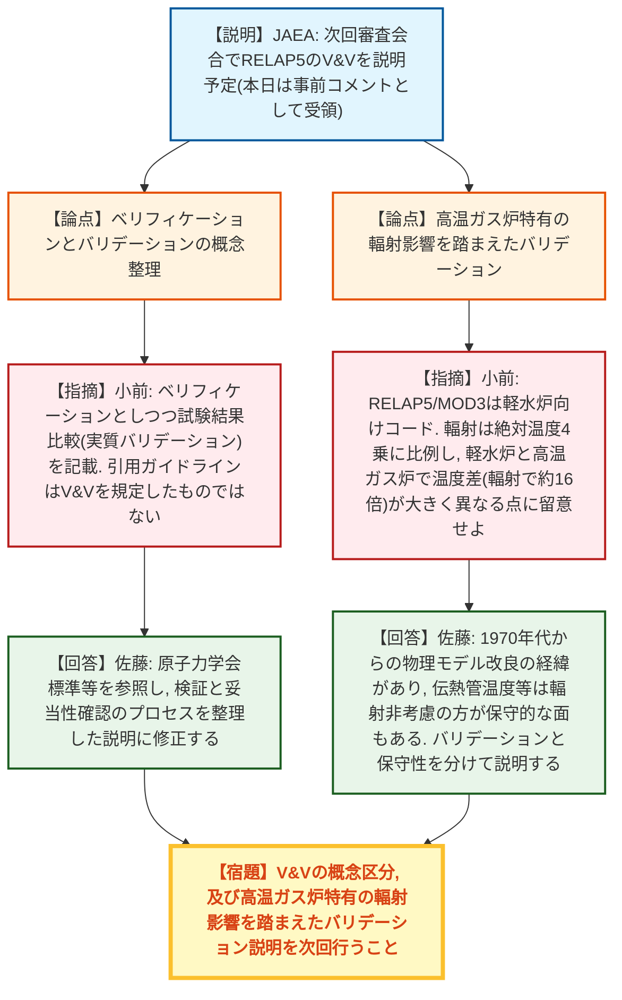
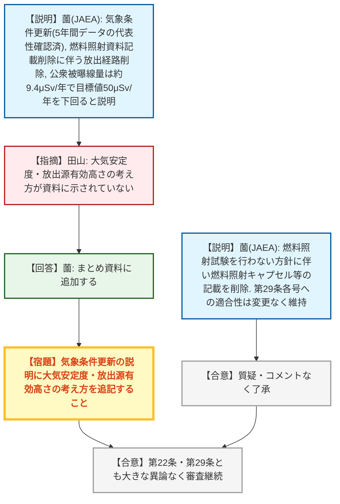

# 第595回核燃料施設等の新規制基準適合性に係る審査会合（令和8年9月18日）
> 出典 : https://youtube.com/live/r-PYtaqxQ5w?si=dxV1Mq196YheWQXd

## 会合の概要
* **HTTR二次系大改造に伴う代表事象再選定の手法・網羅性を規制側が厳しく追及**
  日本原子力研究開発機構（JAEA）は、HTTR（高温工学試験研究炉）の二次系を原子炉建屋外に引き回して熱利用試験施設に接続する大規模改造に伴い、運転時の異常な過渡変化（AOO）・設計基準事故（DBA）の代表事象を再選定し、新たに中間熱交換器伝熱管破損事故を追加した。規制庁（加藤）は、検討の最初に運転モード・設備範囲を限定してから事象選定を行う手法について、限定の根拠が定性的にとどまっており抜け漏れの有無を判断できないとして、パラメータの網羅性を丁寧に説明するよう強く求めた。
* **一次・二次冷却材バウンダリの健全性評価の網羅性に疑義**
  第13条が求める「一次・二次冷却材バウンダリを破損させないこと」との判断基準に関し、規制庁（加藤）は、事業者が伝熱管のみをクリープ座屈の評価代表としている点について、温度差が生じやすい低温側管板を含めた対象バウンダリ全体を網羅的に評価した上で、許可段階（設工認待ちではなく）で設計成立性を示すべきと繰り返し指摘した。
* **二次ヘリウム配管破断時の空気侵入評価の論理に矛盾を指摘**
  二重管破断後に中間熱交換器へ空気が侵入しないとする説明について、引用実験が体系の異なる原子炉容器を対象としたものである点、及び「原子炉停止により熱源がなくなる」としながら同時に伝熱管等が高温を維持するとの説明が矛盾している点が規制庁（加藤）から指摘され、事業者は再整理を約束した。
* **熱利用試験施設側の異常想定を巡り議論が噛み合わず、審査の進め方自体の整理を要請**
  水素製造（メタン水蒸気改質法）を行う熱利用試験施設側で起こりうる異常について、規制庁（富山）の質問に対する事業者の回答が要領を得ず、管理官（内藤）が介入して「供給条件の範囲を限定した設計とするか、範囲を限定せず幅広く事象を想定するか」という審査の立て付け自体をJAEA側で整理するよう求める場面があった。
* **第22条・第29条は大きな異論なく進行、RELAP5のV&V説明に事前コメント**
  放射性廃棄物（第22条）・実験設備等（第29条）は燃料照射試験関連記載の削除に伴う変更が中心で、気象条件更新の説明不足（田山）を除き概ね了承ムードで進行した。次回説明予定のRELAP5コードの検証・妥当性確認（V&V）については、規制庁（小前）から高温ガス炉特有の輻射影響を踏まえた説明とするよう事前コメントがあった。

---

## 議題ごとの詳細整理

### 【議題1】日本原子力研究開発機構 大洗原子力工学研究所（北地区）HTTR（高温工学試験研究炉）の熱利用試験施設接続に係る設置変更許可申請について

* **議論の背景と論点:**
  本件は令和7年3月27日付申請（同年9月26日補正）で、前回令和8年7月22日会合の続き。HTTRの二次系を原子炉建屋外に引き回して熱利用試験施設に接続する改造に伴い、事業者は資料1（第13条：運転時の異常な過渡変化及び設計基準事故の拡大の防止）、資料2（第22条：放射性廃棄物の廃棄施設）、資料3（第29条：実験設備等）の3資料で説明を行った。主な論点は、(1) 代表事象再選定手法の網羅性、(2) 新たに代表事象となった中間熱交換器伝熱管破損事故に関する一次・二次冷却材バウンダリの健全性評価、(3) 熱利用試験施設側の異常想定の具体性、(4) 解析コードRELAP5のV&Vの妥当性、であった。

* **質疑応答（詳細）:**

  **＜資料1（第13条）: 代表事象選定手法の網羅性＞**
    * 【説明者側】佐藤（JAEA）
      熱利用試験施設接続に伴う新設・改造の範囲が限定的であることから、まず変更に伴う影響が既許可の安全評価に包絡されるか否かを確認し、包絡されない事象のみを詳細検討の対象とする手法（図2-2）を採用したと説明。運転モードは、温度・流量・圧力・除熱量が既許可から変わらない熱利用試験運転以外は検討対象から除外したと説明した。
    * 【規制側】加藤（規制庁）
      変更後の系統構成を踏まえた代表事象決定のため、事象選定が網羅的に行われていることを確認する必要がある。11ページの運転モード選定説明は「これらのパラメータが変わらないから安全評価経過が変わらない」という記載にとどまり、他に影響因子が存在しないことが示されていない。運転モード・設備機器を最初に限定せず全てを対象とする手法もある中で限定するなら、安全評価に効いてくるパラメータを軸に、省略せず丁寧に説明すべきと指摘した。
    * 【説明者側】佐藤（JAEA）
      判断基準・判断項目は「起因事象の影響」「評価条件（構造物の形状・寸法等）の影響」という観点で整理しており、この選定方法で漏れなく検討できていると考える。ただし説明が不足している点はコメントとして反映すると回答した。
    * 【規制側】加藤（規制庁）
      設備範囲の限定についても同様に、検討対象を「起因事象への影響」等の3つの観点に限定しているように見えるが、今回二次系が熱利用試験施設への伝達経路となる点を踏まえると「影響伝達経路への影響」の観点が抜けているのではないか。示された3つの観点とその後の分類①②③との対応関係も読み取りにくいため、言葉を尽くして説明するよう求めた。
    * 【説明者側】佐藤（JAEA）
      説明の順序と対応関係がわかりにくい点を認識しており、関係を整理した上で次回以降説明すると回答した。

  **＜資料1（第13条）: 二次ヘリウムインベントリ増加に伴う保守性の定量的根拠＞**
    * 【規制側】塩川（規制庁）
      二次ヘリウム配管の延伸によりインベントリ（容量）が既許可の運転モードより熱利用試験運転の方が多くなる中、本日の説明は既許可条件を中心とした代表事象選定・保守性の説明（表2-6、表2-7等）にとどまっている。インベントリが少ない既許可条件の方が保守的であるとする説明が定性的な段階にあり、二次ヘリウム容量が評価条件になり得るのか不明瞭なため、代表事象選定・保守性について実際の解析結果等の定量的根拠を示し、容量の代償によって結果が逆転しないことを説明してほしいと求めた。
    * 【説明者側】佐藤（JAEA）
      ヘリウムは理想気体であり、圧力は体積と封入量によって物理的に決まる関係を踏まえて説明を補足し、解析結果を含めて検討・説明すると回答した。

  **＜資料1（第13条）: 熱利用試験施設側の異常想定の網羅性＞**
    * 【規制側】富山（規制庁）
      以前のヒアリングでは、原子炉施設へ貫流する二次ヘリウムの温度・流量・圧力の3事象のみを熱利用試験施設側の異常として考慮すると説明を受けたが、熱利用試験施設はメタン水蒸気改質法による水素製造を行うと聞いており、メタンや水素等の可燃性ガス・水蒸気の混入異常を考慮しなくてよいのか懸念を示した。
    * 【説明者側】佐藤（JAEA）
      水蒸気改質法を構成する機器はバルブ・熱交換器・ポンプ・循環器・タンク等であり原子炉施設と種類は変わらず、FMEAの考え方も同様。プロセスガスと接する側は圧力を低く設計しており、バウンダリが破損しても二次ヘリウム側からプロセスガス側へ流れる設計のため、一次・二次ヘリウム差圧信号によって原子炉施設側で異常を検出し隔離できる。したがって3事象で十分網羅していると考えると回答した。
    * 【規制側】富山（規制庁）
      可燃性ガス等が万一混入しても温度・流量・圧力いずれかの異常として検知され、弁が閉止される設計になっているという理解でよいか確認し、事業者は肯定した。
    * 【規制側】内藤（管理官）
      直前のやり取りについて、「混入しない」という説明と「混入しても検知できる」という説明が混在しており議論が噛み合っていないと指摘。熱利用試験施設側で具体的に何が起こり得るかの例示がないまま「何かあればパラメータに反映される」とする説明では議論しにくいとし、起こりうる事象を具体的に列記した上で定量評価を示すべきと述べた。さらに、供給側の設計条件（範囲）を前提とした基本設計とするか、範囲を限定せず何でも起こりうる前提で検討するかという審査の立て付け自体をJAEA側で整理すべきであり、試験研究炉としてデータ取得目的であることを踏まえれば供給条件範囲を制限した設計という整理も可能なはずで、その場合は許可としてどう条件付けを成立させるかを含め検討するよう求めた。
    * 【説明者側】坂本（JAEA）
      従来ブラックボックスという前提でどこまで説明すべきか悩んでいたが、今回の指摘により説明の方向性が明確になったとした上で、水素側の設計仕様は既に固まっているため、その条件下で起こり得る事象を可視化して示すことで、より定量的な議論ができるようにしたいと回答した。
    * 【規制側】内藤（管理官）
      炉規法の管理外という将来の社会実装を見据えた切り分けは有効だが、研究開発段階の現時点でそれに縛られすぎる必要はなく、炉規法管理対象の機器を熱利用試験施設側に置くケースがあってもよいと述べ、柔軟な検討を促した。

  **＜資料1（第13条）: 中間熱交換器の一次・二次冷却材バウンダリの健全性評価＞**
    * 【規制側】加藤（規制庁）
      試験炉設置許可基準規則第13条の解釈（二次冷却材にヘリウムを用いる場合）は、一次冷却材と二次冷却材のバウンダリを破損させないことを設計基準事故時の判断基準として明記しており、HTTRでは中間熱交換器の伝熱管や管板が該当する。今回の二次系配管改造に伴い二次冷却材の温度・圧力・流量の変動が想定される中、資料8ページの注釈ではバウンダリを破損させない基準として「伝熱管がクリープ座屈しないこと」のみを示しているが、一次側の高温ヘリウムと二次側の低温ヘリウムが接する低温側管板も温度差がつきやすく厳しい部位となり得るため、対象バウンダリを網羅的に評価した上で伝熱管を代表とした根拠を説明するよう求めた。
    * 【説明者側】佐藤（JAEA）
      既許可のHTTR設計及び工事計画（設工認）において、内筒・伝熱管・ヘッダ・管板を対象にクリープひずみ・クリープ座屈の評価を行い成立性を確認済みであり、今回の改造による影響も設工認段階で温度差・変動幅等を含めて示すとした上で、現時点で最も厳しい部位として伝熱管を代表に説明資料へ記載していると回答した。
    * 【規制側】加藤（規制庁）
      13条の要求として許可段階でバウンダリ破損防止の設計成立性を示すべきであり、設工認段階に持ち越すのは適切でないと再指摘。低温側管板は既許可の評価対象から外れており、どの程度厳しいか判断できないため、今回の改造で配管破断や意図しない低温・高温ヘリウムの戻りが想定される中で最初に損傷を受けるのは低温側管板と考えられるとし、対象バウンダリを網羅的に評価した上で判断基準を満足することを許可段階で示すよう求めた。
    * 【説明者側】佐藤（JAEA）
      低温側管板は既許可の評価対象選定段階で他部位より厳しくないとして対象から外したと認識しているとした上で、今回の指摘を許可段階でも設計成立性を示すようコメントと理解し、既許可で最も厳しい評価条件との変化差分（温度差・変化率等）を示し、既許可より影響が小さいことを示すと回答した。
    * 【規制側】加藤（規制庁）
      対応を求めるとともに、伝熱管を代表とすることの根拠についても改めて示すよう要請した。

  **＜資料1（第13条）: 二次ヘリウム配管破断時の空気侵入評価＞**
    * 【規制側】加藤（規制庁）
      二次ヘリウム冷却設備の二重管破断後、分子拡散による空気混合が支配的で、中間熱交換器まで空気を輸送する自然循環現象は生じないとする説明（174ページ）について、引用文献が原子炉容器を対象とした実験結果である点を挙げ、体系が異なる中間熱交換器に実験結果がそのまま適用できるのか質問した。
    * 【説明者側】佐藤（JAEA）
      実験体系はもともと配管系を用いた事故解析のためのものであり、プロセスとして成立する輸送則を示す目的で引用した。実験体系とIHX（中間熱交換器）体系の違いを考慮し無次元化する等して説明すべきとヒアリングでもコメントを受けており、資料を修正すると回答した。
    * 【規制側】加藤（規制庁）
      対応を求めた上で、「自然循環開始までに中間熱交換器の熱源がなくなるため空気侵入の恐れがない」とする説明について、「熱源がなくなる」の具体的な意味を質問した。
    * 【説明者側】佐藤（JAEA）
      配管破断を想定した場合、安全保護系によるスクラム及びバルブ閉止に伴い制御棒が挿入され、原子炉側からの熱が中間熱交換器に伝わらなくなるという意味であると説明した。
    * 【規制側】加藤（規制庁）
      原子炉が停止しても伝熱管等各部は強制冷却されず高温を維持し続けるのではないか、その場合は自然循環が発生し得ると考えられると再指摘した。
    * 【説明者側】佐藤（JAEA）
      温度は徐々に低下していくこと、及び空気が侵入しない限り温度・密度差による浮力が系統内の圧力損失を上回らず自然循環が発生しないという事業者の主張を整理して説明すると回答した。
    * 【規制側】加藤（規制庁）
      「温度が冷えていく」という説明は、周囲の空気が熱伝達の媒体となって冷える可能性を示唆しており矛盾しているように見えるとし、整理した上でしっかり説明するよう求めた。

  **＜資料1（第13条）: RELAP5コードのV&V（検証・妥当性確認）＞**
    * 【規制側】小前（規制庁）
      次回審査会合で説明予定のRELAP5のV&Vについて事前コメントとして、JAEAの資料はベリフィケーションとしつつ、実際の試験結果との比較をもって「検証された」とする等、実質的にバリデーションを行っているように見える箇所があると指摘。引用されている原子力安全推進協会の「解析業務の品質向上ガイドライン」は解析ミスを防ぐための仕組みづくりに関するものであり、解析コード自体のV&Vを規定したものではないため、ベリフィケーション（理論解・数学解との一致確認）とバリデーション（実際の試験結果との一致確認）の違いに留意して整理し説明するよう求めた。
    * 【説明者側】佐藤（JAEA）
      原子力学会標準等が示すシミュレーションの妥当性評価手法を参照し、検証と妥当性確認のプロセスを整理した説明に修正すると回答した。
    * 【規制側】小前（規制庁）
      バリデーションで用いるRELAP5/MOD3は軽水炉の安全評価のために開発されたプラント熱流体解析コードであり、伝熱機構（伝導・対流・輻射）のうち輻射は絶対温度の4乗に比例するため、軽水炉と高温ガス炉では温度差（絶対温度で約2倍、輻射では約16倍）が大きく異なる点に留意してバリデーションを説明するよう求めた。
    * 【説明者側】佐藤（JAEA）
      輻射の影響については、1970年代当時のメーカーによる物理モデル改良の経緯があり、伝熱管や構造物の温度に関しては輻射を考慮しない方がむしろ保守的な評価になる面もあるとした上で、バリデーションと保守性の観点を分けてコードの使用方法を説明すると回答した。

  **＜資料2（第22条）: 放射性廃棄物の廃棄施設＞**
    * 【説明者側】薗（JAEA）
      安全解析に用いる気象条件を2018〜2022年の5年間平均に更新するにあたり、念のため2012〜2022年の11年間で異常年検定を行い、直近5年間（規格外データ9件）が過去6年間（同10件）と比べて特段多くないことから、5年間のデータが長期の気象状態を代表していることを確認した。また、燃料照射資料の記載削除に伴い気体廃棄物の放出経路（照射試験に伴う廃棄）を削除したが、HTTRで照射試験の実績・設備設置実績がないため実際の放出量に変化はないこと、平常時公衆被曝線量の評価方法をより保守的な合算方法に変更した上で評価した結果、大洗北地区の実効線量は合計約9.4μSv/年となり、線量目標値50μSv/年を十分下回ることを説明した。
    * 【規制側】田山（規制庁）
      気象条件の更新に関する説明の中で、放出に影響する大気安定度や放出源の有効高さについての考え方が資料に示されていないとして、追記を求めた。
    * 【説明者側】薗（JAEA）
      まとめ資料には記載がないが、追加すると回答した。

  **＜資料3（第29条）: 実験設備等＞**
    * 【説明者側】薗（JAEA）
      HTTRにおいて今後、照射キャプセルを用いた燃料照射試験を行わない方針としたことを受け、核燃料物質使用変更許可申請書及び原子炉施設設置変更許可申請書から燃料照射試験に係る記載（炉内設備の燃料照射キャプセル、炉外設備の燃料照射キャプセル・炉外装置等）を削除する内容を説明した。当該実験設備は将来設置予定であり現在は未設置、照射試験実績もないことから、第29条第1号〜第5号（異常・損傷時の原子炉安全性維持、反応度投入防止、放射線漏洩防止、中央制御室での監視、中央制御室との連絡）への適合性はいずれも変更なく維持されると説明した。
      質疑・コメントはなかった。

* **結論と宿題事項（アクションアイテム）:**
  * **決定事項:** 資料1・2・3とも本日提示された変更方針・記載削除の考え方自体に大きな異論はなく、次回以降の審査会合で詳細な補足説明を行うことで審査を継続する。
  * **宿題事項:**
    1. 事象選定における運転モード・設備範囲の限定手法について、安全評価に効いてくるパラメータの網羅性を含め、省略せず丁寧な説明を補足すること（加藤）。
    2. 二次ヘリウムインベントリ増加に伴う代表事象選定・安全評価の保守性を、定性的説明ではなく解析結果等の定量的根拠で示すこと（塩川）。
    3. 熱利用試験施設側で想定される異常事象を具体的に列記し定量評価を示すとともに、供給条件の範囲を限定した設計とするか否かという基本的な考え方をJAEAとして整理すること（富山・内藤管理官）。
    4. 中間熱交換器の一次・二次冷却材バウンダリ（伝熱管・低温側管板等）について、対象を網羅的に評価した上で、許可段階における設計成立性の根拠及び伝熱管を代表部位とする理由を示すこと（加藤）。
    5. 二次ヘリウム配管破断時の空気侵入評価について、実験体系と中間熱交換器体系の違い（無次元化等）を考慮した説明、及び「熱源喪失」の物理的な整合性を整理して再説明すること（加藤）。
    6. RELAP5コードのV&Vについて、ガイドラインとV&Vの概念的な違い、及び高温ガス炉特有の輻射影響を踏まえたバリデーションの説明を行うこと（小前）。
    7. 気象条件更新の説明に、大気安定度・放出源有効高さの考え方を追記すること（田山）。
    8. 次回審査会合では、被曝評価のやり直し（気象条件更新分）、RELAP5のV&V詳細（資料6）、熱利用試験施設側の異常に対する対策（プロセス量の多重性等）を説明予定。

---

## 論理構造の可視化（Mermaid）

### 【議題1-A】代表事象選定手法（運転モード・設備範囲の限定）の網羅性

### 【議題1-B】二次ヘリウムインベントリ増加時の保守性と熱利用試験施設側の異常想定

### 【議題1-C】一次・二次冷却材バウンダリの健全性評価と二次配管破断時の空気侵入評価

### 【議題1-D】RELAP5コードの検証・妥当性確認（V&V）

### 【議題1-E】第22条（放射性廃棄物の廃棄施設）・第29条（実験設備等）

