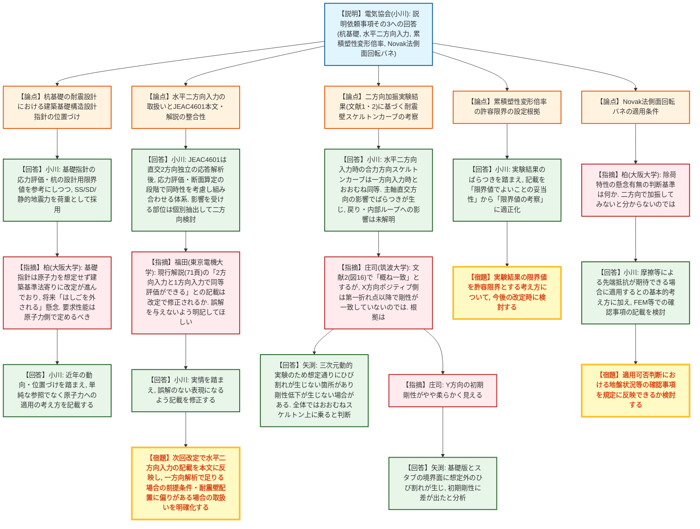
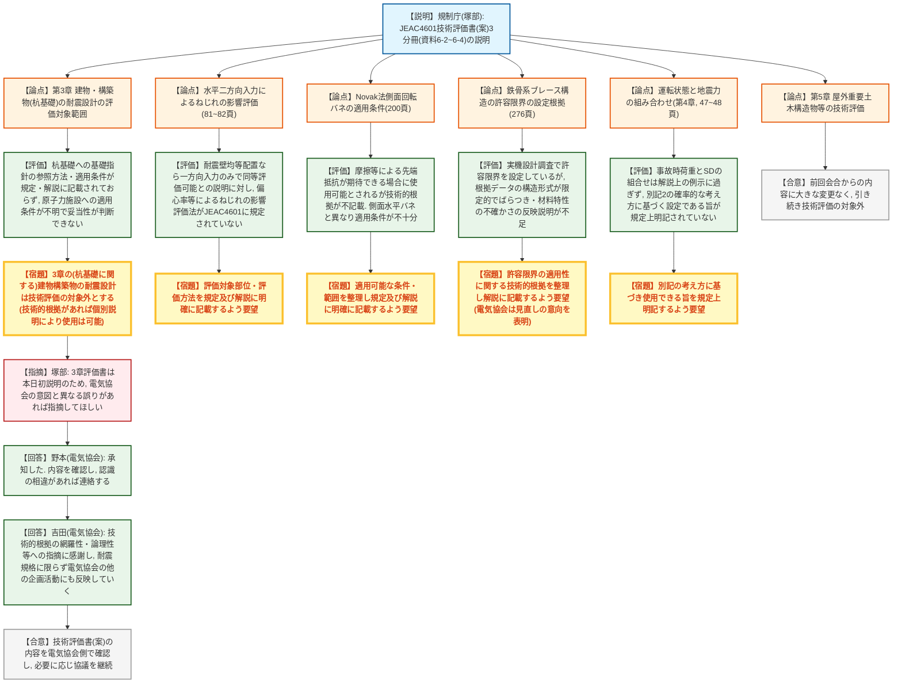
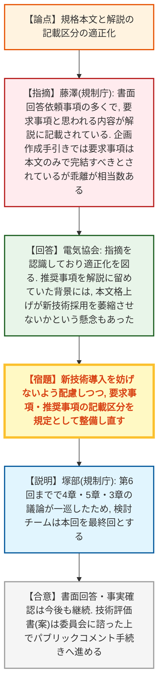

# 第6回耐震設計に係る日本電気協会の規格の技術評価に関する検討チーム（令和8年9月18日）
> 出典 : https://youtube.com/live/mIIIRemTI-4?si=4hZXp4OCtDAxP1HE

## 会合の概要
* **杭基礎の耐震設計における建築基礎構造設計指針の扱い**: 杭基礎の設計に日本建築学会「建築基礎構造設計指針」を参照する際の原子力施設への適用条件が、JEAC4601の規定・解説のいずれにも明確化されていないことが確認され、規制庁は当該部分（第3章 建物・構築物のうち杭基礎に関する耐震設計）を技術評価の対象外とする評価を示した。ただし対象外であっても、技術的根拠があれば個別の説明により使用は妨げられない。
* **水平二方向入力の取扱い**: 電気協会は、JEAC4601の解説が直交2方向で独立に応答解析を行うとしている趣旨は、水平二方向・鉛直方向の地震力の組み合わせを不要とするものではなく、応力評価・断面算定の段階で同時性を考慮して組み合わせる体系であると説明した。一方、規制庁の技術評価書（案）では、耐震壁の偏心等によるねじれの影響が無視できない場合の評価部位・評価方法がJEAC4601に規定されていないとの評価が示され、外部専門家からも実運用上の判断基準について疑義が呈された。
* **実験データに基づく許容限界の設定根拠**: 累積塑性変形倍率の許容限界、Novak法側面回転バネの適用条件、鉄骨系ブレース構造の許容限界について、電気協会から次回改定での対応方針が示される一方、規制庁の技術評価書（案）では実験データのばらつきや適用条件の記載不足を理由に、技術的根拠の整理・充実を求める評価が複数付された。
* **運転状態と地震力の組み合わせ**: 事故時荷重と設計用地震力SDを組み合わせる記載について、実際には別記2に基づき事故発生確率・継続時間と地震動の超過確率を踏まえて設定すべきところ、現状の規定ではその考え方が明記されていないとの指摘がなされた。
* **検討チームの終了**: 規制庁は、これまでの会合で第3章・第4章・第5章の議論が一通り行われたとして、本会合（第6回）を検討チームの最終回とすることを表明した。書面ベースでの事実確認は継続し、技術評価書（案）は今後委員会に諮った上でパブリックコメント手続きに進む予定。あわせて、規格の要求事項が本文ではなく解説に記載されている箇所が多いとの指摘もなされ、電気協会は記載区分の適正化を約束した。

---

## 議題ごとの詳細整理

### 【議題1】説明依頼事項（その3）に対する日本電気協会からの回答（資料6-1）

* **議論の背景と論点:**
  前回会合で示された規制庁からの説明依頼事項（その3）に対し、電気協会が資料の記載を修正・追記した内容を説明した。主な論点は、①杭基礎の耐震設計における建築基礎構造設計指針の位置づけ、②JEAC4601本文・解説における水平二方向入力の取扱いの整合性、③二方向加振実験結果に基づく耐震壁スケルトンカーブ・累積塑性変形倍率の考察、④Novak法側面回転バネの適用条件、の4点。

* **質疑応答（詳細）:**
    * 【説明者側】小川（電気協会）
      杭基礎の耐震設計は建築基礎構造設計指針の応力評価・杭の設計用限界値を参考に行い、地震荷重はベタ基礎と同様にSS・SD・静的地震力を用いる。同指針は日本建築学会「建築荷重指針」の設計用地震動（応答スペクトルに適合する地震動、想定地震に基づく地震動）を参照する構成であり、JEAC4601のSS・SD策定（応答スペクトルに基づく地震動評価・断層モデルによる地震動評価）とおおむね対応していると説明した。
    * 【説明者側】小川（電気協会）
      JEAC4601の解説にある「直交する耐震壁の二方向に対しそれぞれ独立に応答解析を実施する」との記載は、建物の基本的な応答を構造主軸方向ごとに算定するための解析上の扱いを示したものであり、水平二方向・鉛直方向の地震力の組み合わせを不要とする趣旨ではない。応答解析で得られた各方向の地震力は、応力評価・断面算定の段階で同時性を考慮して組み合わせており、水平二方向入力の影響を受ける部位は個別に抽出して検討している。
    * 【指摘】福田（東京電機大学）
      現行の解説（71ページ付近）には、断面性状を考慮した場合でも2方向入力と1方向入力で同等な評価ができることが実験により確認されている、との記載が残っているが、これは次回改定で修正されるのか。後続の研究者・設計者がこれを読んだ際、2方向入力の影響が一切ないと誤解しないよう、しっかりと記載してほしい。
    * 【回答】小川（電気協会）
      各プラントの設計状況等の実情も踏まえ、誤解のない表現になるよう記載の適正化を図る。
    * 【指摘】柏（大阪大学）
      建築基礎構造設計指針は原子力施設をあまり想定しておらず、建築基準法上の実務を念頭に近年改定が進められている。こうした指針をそのまま参照し続けると、将来「はしごを外される」（指針改定により参照根拠が失われる）おそれがある。原子力施設の基礎構造に求める要求性能は原子力側で定め、外力やそれに対応するクライテリアを規格として明確に記載すべきではないか。
    * 【指摘】柏（大阪大学）
      水平二方向入力時の除荷特性は一般に判断が難しいが、「影響が懸念される場合」に多方向同時入力による解析等が必要になるとの説明について、その懸念の有無をどのような基準で判断するのか。二方向で実際に加振してみないと分からないのではないか。
    * 【回答】小川（電気協会）
      基礎指針については、近年の動向や位置づけを踏まえ、単に指針を参照するだけでなく、原子力施設への適用の考え方を明記していく。水平二方向の影響が懸念される部位（耐震壁の隅角部等）については、近年のプラント設計・審査実績を踏まえて調査した上で、今後の改定に反映していきたい。
    * 【指摘】庄司（筑波大学）
      文献2に基づく資料20ページの考察（図16）で、実験結果とJEAC4601のスケルトンカーブが第一折れ点を超えた非線形領域でもおおむね一致するとされているが、X方向のポジティブ側では第一折れ点以降の剛性が必ずしも一致していないように見える。どのデータに基づき「概ね一致」と判断したのか。
    * 【回答】矢渕（電気協会）
      ご指摘の通りX方向で第一折れ点以降にばらつきはあるが、動的な三次元入力実験のため、想定通りの位置でひび割れが生じず剛性低下が生じない箇所もあったと分析している。X負側やY方向を含めた全体としては、概ねスケルトン上に乗っていると判断している。
    * 【指摘】庄司（筑波大学）
      Y方向については、第一折れ点前の初期剛性がやや柔らかくなっているように見えるがどうか。
    * 【回答】矢渕（電気協会）
      その点は確かにその通りで、基礎版と耐震壁・スタブとの境界面に想定外のひび割れが生じたことが影響し、初期剛性に差が出たと分析している。
    * 【説明者側】小川（電気協会）
      累積塑性変形倍率の許容限界に関する記載について、設定した限界値に一定の誘導がある可能性があり、限界値採用の妥当性を定量的に説明したことにはなっていないとの前回指摘を踏まえ、見出しを「実験結果の限界値でよいことの妥当性」から「実験結果を踏まえた許容限界の考察」へ、表現を適正化した。

* **結論と宿題事項（アクションアイテム）:**
  * **決定事項:** JEAC4601における水平二方向・鉛直方向の地震力の組み合わせの考え方（直交2方向独立解析は組み合わせ省略を意味しない）は電気協会から説明され、規制側もその論理構成自体は了承した。
  * **宿題事項:**
    1. 現行解説にある「2方向入力と1方向入力で同等評価ができる」旨の記載について、誤解を招かない表現に見直す。
    2. 次回改定で、水平二方向・鉛直方向の検討を規格本文に盛り込むとともに、耐震壁配置に偏りがある場合の取扱いや、1方向入力での解析で足りる場合の前提条件を明確化する。
    3. 建築基礎構造設計指針を原子力施設に適用する際の要求性能・外力・クライテリアの位置づけを、電気協会側で整理して記載する。
    4. 累積塑性変形倍率の許容限界の設定根拠、Novak法側面回転バネ（地盤との摩擦等による先端抵抗が期待できる場合の適用）の適用条件について、FEM等での確認事項も含め次回改定で検討する。

---

### 【議題2】技術評価書（案）の説明（資料6-2～6-4）

* **議論の背景と論点:**
  規制庁（塚部企画官）より、これまでの検討チームでの議論を踏まえてまとめたJEAC4601技術評価書（案）3分冊（資料6-2：第1分冊＝第1～3章、資料6-3：第2分冊＝第4章 機器・配管系、資料6-4：第3分冊＝第5章 屋外重要土木構造物等）の内容が説明された。評価書は「規定の内容」「検討結果（電気協会回答は青字、規制庁評価は赤字）」の順で構成されている。第3章（建物・構築物）については本会合で初めて説明される内容であるため、電気協会に対し記載内容の確認が求められた。

* **質疑応答（詳細）:**
    * 【説明者側】塚部（規制庁）
      第3章に関し、検討チームでは建物・構築物が具体的に何を指すかを議論しており、その適用範囲を明確に規定することが望まれると評価した（49～56ページ）。
    * 【説明者側】塚部（規制庁）
      杭基礎の評価（71ページ）について、基礎指針をどのように参照するかが規定・解説のいずれにも記載されておらず、参照する条項も不明である。また同指針は原子力施設以外の一般建築も対象とする規格であり、原子力施設の耐震設計に適さない内容が含まれる可能性があるため、どのような条件で適用できるかという適用条件も不明であり、妥当性が判断できない。民間規格の技術評価は性能規定化された要求事項に対する容認可否の判断について行うものであり、これに該当しない場合は対象外とするが、対象外であっても技術的根拠があれば個別説明により使用することは妨げられない（実際の審査でもそのように運用されている）。この考え方に基づき、第3章の建物・構築物（杭基礎に関する部分を含む）の耐震設計は技術評価の対象外とする。
    * 【説明者側】塚部（規制庁）
      水平二方向入力によるねじれの影響評価（81～82ページ）について、電気協会は耐震壁等が均等に配置されている場合は一方向入力のみで同等な評価ができると説明しているが、偏心率等を確認してねじれ等による影響が無視できない場合の、建物・構築物全体に対する検討やねじれ振動による各部位への応力変動の評価に関する検討、偏心等の影響を考慮した評価法がJEAC4601には規定されていない。具体的な評価対象部位に関する説明を含め、規定・解説に明確に記載してほしい。
    * 【説明者側】塚部（規制庁）
      Novak法側面回転バネの適用範囲（200ページ）について、地下外壁と地盤間で摩擦等による先端抵抗が期待できる場合に使用できるとされているが、その技術的根拠が規定・解説に記載されていない。側面水平バネには適用条件がある程度記載されているのに対し、側面回転バネはどのような条件で適用できるかが十分に記載されていないため、適用可能な条件・範囲を整理し、規定及び解説に明確に記載してほしい。
    * 【説明者側】塚部（規制庁）
      鉄骨系ブレース構造の許容限界（276ページ）について、電気協会は実機設計の調査により適用可能な範囲を設定していると説明したが、根拠とする実機設計・実験データは構造形式等が限られており、実験結果のばらつきや材料特性等の不確かさをどのように許容限界の判断に反映したかの説明が不足している。許容限界の適用性に関する技術的根拠を整理し、解説に記載してほしい（この点については電気協会から本会合の冒頭で見直す旨の説明があった）。
    * 【説明者側】塚部（規制庁）
      資料6-3（第4章 機器・配管系）のうち、地震と組み合わせる運転状態（34～48ページ）について、運転状態Ⅳ（事故状態）では基準地震動SSを適用せず設計用地震動SDを用いるとされ、事故時荷重とSDを組み合わせる記載があるが、これは解説上の例示に過ぎない。実際には別記2に基づき、事故の発生確率・継続時間と地震動の超過確率を踏まえて組み合わせる地震動を設定すべきところ、無条件にSDを使用できるかのような規定になっており、この考え方を規定上明記してほしい。あわせて必要な読み替えを今回の技術評価に含める。
    * 【説明者側】塚部（規制庁）
      資料6-4（第5章 屋外重要土木構造物等）は前回会合で説明済みの内容から大きな変更がなく、引き続き技術評価の対象外とする。
    * 【説明者側】塚部（規制庁）
      技術評価書全体について、書面のやり取りを含めまだ反映しきれていない回答があるが、事実確認の結果を反映していく予定である。第3章の評価内容は本会合で初めて説明するものであるため、電気協会の意図と異なる誤りがあれば指摘してほしい。
    * 【回答】野本（電気協会）
      承知した。示された内容を確認し、電気協会の意図が正しく伝わっていない点があれば連絡する。
    * 【回答】吉田（電気協会）
      多くの専門家・規制庁の尽力による丁寧な技術評価に謝意を示すとともに、技術的根拠の網羅性、論理性、過去の実験結果・研究成果のデータの取扱い方等への指摘を真摯に受け止め、耐震規格の改定だけでなく電気協会の他の企画活動にも反省点を水平展開し、引き続き規制庁の意見を得ながら、より良い規格の整備に努めていく。

* **結論と宿題事項（アクションアイテム）:**
  * **決定事項:** 第3章（建物・構築物のうち杭基礎に関する耐震設計）及び第5章（屋外重要土木構造物等）は技術評価の対象外とすることが規制庁より示された。電気協会は評価書全体の内容を確認し、認識の相違があれば連絡する。
  * **宿題事項:**
    1. 建物・構築物の適用範囲（何を指すか）を規定として明確化する。
    2. 水平二方向入力によるねじれの影響を評価すべき部位・評価方法を規定及び解説に明確に記載する。
    3. Novak法側面回転バネの適用可能な条件・範囲を整理し、規定及び解説に明確に記載する。
    4. 鉄骨系ブレース構造の許容限界について、実験データのばらつき・材料特性の不確かさを踏まえた技術的根拠を整理し解説に記載する。
    5. 事故時荷重と設計用地震力SDの組み合わせについて、別記2の確率的な考え方に基づく設定である旨を規定上明記する。

---

### 【議題3】全体を通じた質疑応答と検討チームの総括（その他）

* **議論の背景と論点:**
  全議題終了後、規格全体の記載の在り方（本文と解説の記載区分の適正化）についての指摘と、検討チームの今後の進め方についての事務局からの総括が行われた。

* **質疑応答（詳細）:**
    * 【指摘】藤澤（規制庁）
      書面による回答依頼項目の多くで、解説に要求事項と思われる記載があり、本文へ移行してはどうかとの質問を出している。電気協会の企画作成手引きの付属書チェックリストでは、必ず実施すべき要求事項及び代替案のある推奨事項は企画本文のみで網羅し、参考や解説がなくても理解・履行できる記載とすべきとされているが、現状そうなっていない箇所が相当数あるため見直しを要望する。
    * 【回答】電気協会
      多数の項目で、要求事項・推奨事項が解説ではなく本文に記載されるべきとの指摘を受けていることは認識しており、適正化を図りたい。規格策定時、推奨事項を本文に一律で格上げすることで、新しい技術の採用を萎縮させるような誤ったメッセージを与えないかとの議論もあり、本文化を見送った経緯がある。ただし、規格の在り方として整理すべきとの指摘を踏まえ、新技術の導入が妨げられないよう配慮しながら、規格としてきちんと整備していく。
    * 【説明】塚部（規制庁）
      第6回まで検討チーム会合を開催し、第4章、第5章、第3章について一通り検討チームでの議論を行ったことから、検討チームとしては本回を最終回とする。ただし、書面回答部分や今後の事実確認については、引き続き書面ベースでやり取りを行う。最終的には技術評価書（案）を原子力規制委員会に諮り、パブリックコメントの手続きに進むため、引き続きの協力を依頼する。

* **結論と宿題事項（アクションアイテム）:**
  * **決定事項:** 検討チームは第6回（本会合）をもって最終回とする。技術評価書（案）は今後、委員会に諮った上でパブリックコメント手続きに進む。
  * **宿題事項:**
    1. 規格の要求事項・推奨事項が本文のみで完結する記載になるよう、新技術導入への影響に配慮しつつ記載区分を見直す。
    2. 書面回答・事実確認は検討チーム終了後も継続して行う。

---

## 論理構造の可視化（Mermaid）

### 【議題1】説明依頼事項（その3）に対する日本電気協会からの回答

### 【議題2】技術評価書（案）の説明

### 【議題3】全体を通じた質疑応答と検討チームの総括

