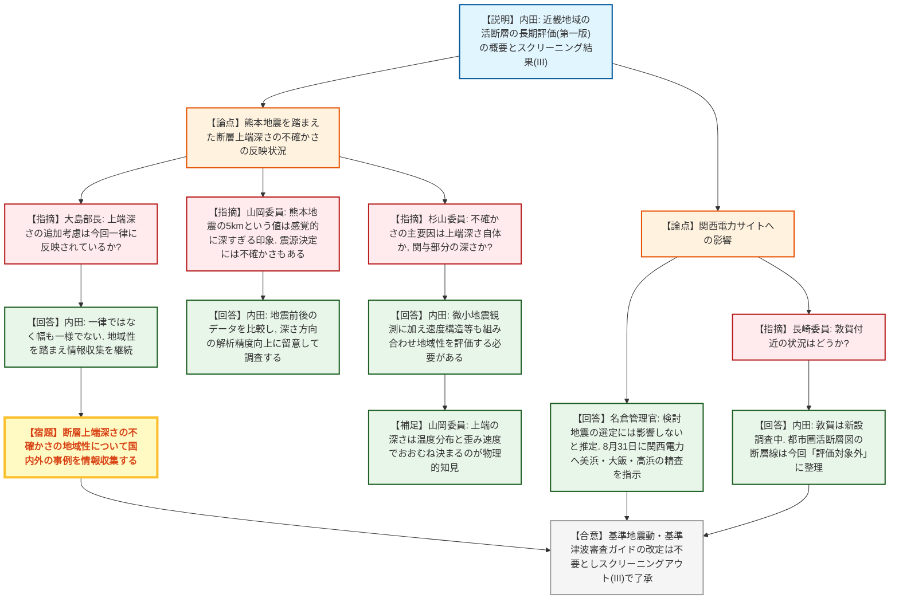
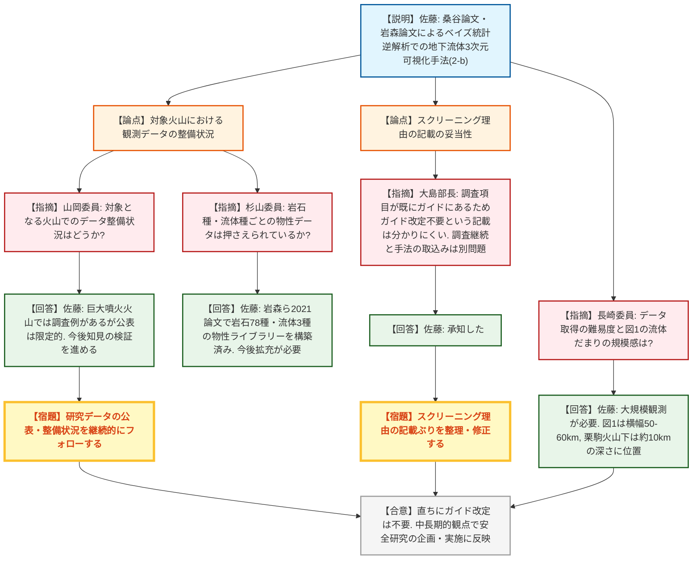
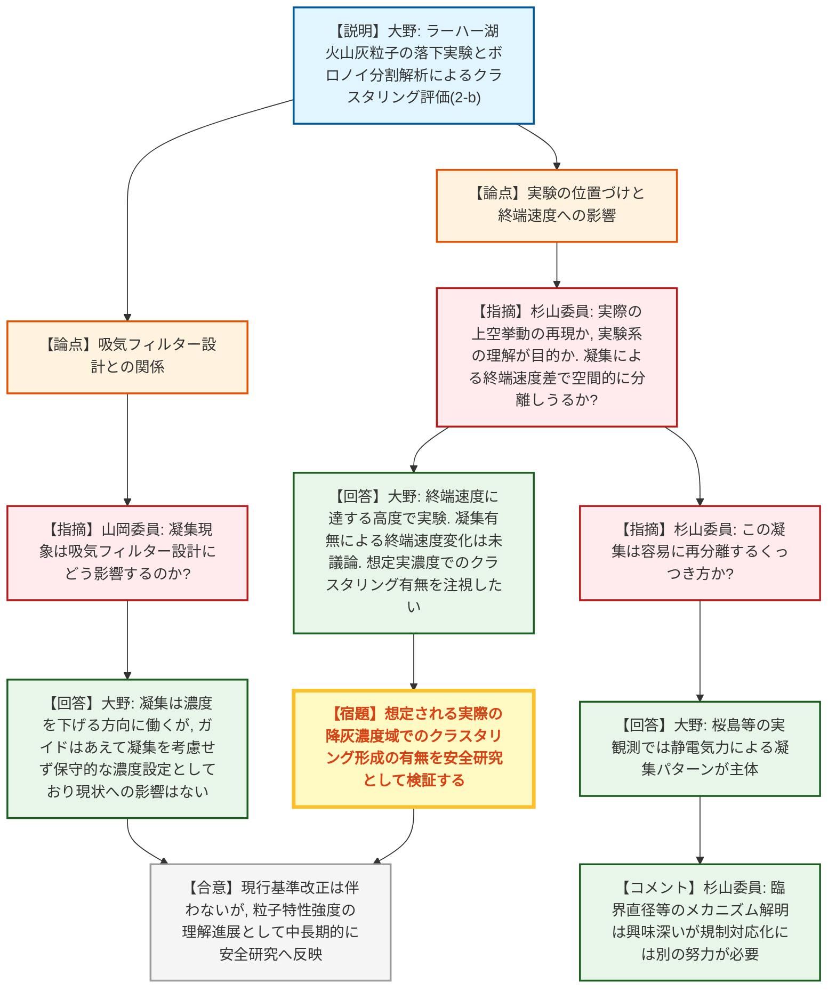
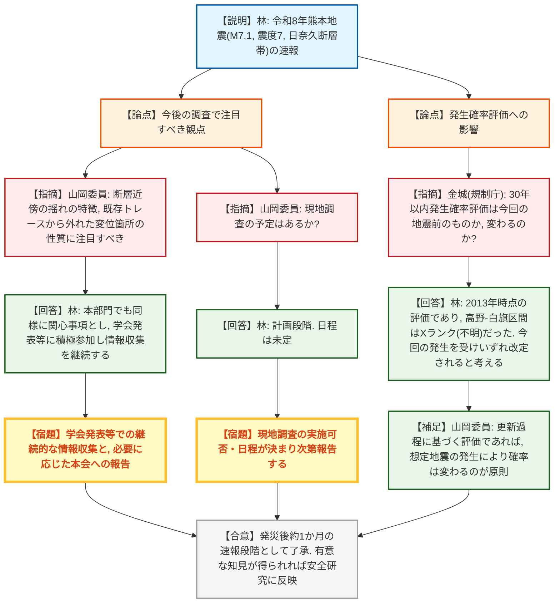
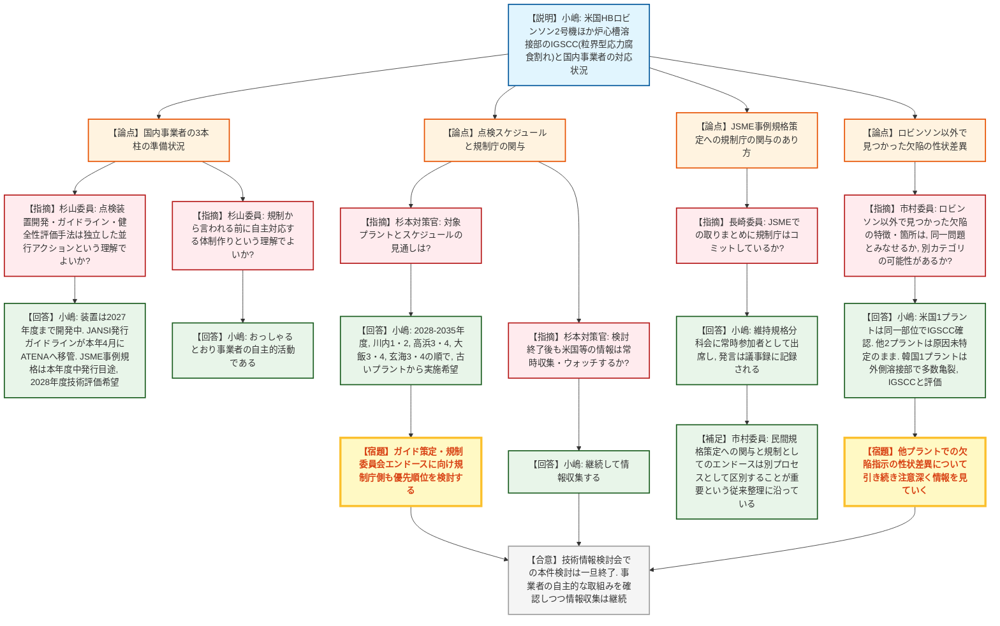

# 第82回技術情報検討会（令和8年9月24日）
> 出典 : https://youtube.com/live/cJRaOD8m4-o?si=f3U3JIb6cMEoV6fE

## 会合の概要

* **近畿地域の活断層の長期評価（第一版）が公表され、活断層帯の上端深さ（震源発生層下限）の不確かさが議論の中心となった。** 地震調査研究推進本部の公表を受け、規制庁・大島部長からは2016年熊本地震の知見を踏まえた断層面上端深さの評価が個別断層ごとにどこまで反映されているかが問われ、山岡委員・杉山委員からも学術的な不確かさの要因について踏み込んだ質疑があった。関西電力の美浜・大飯・高浜サイトへの影響については事業者に精査を指示済みであることが確認された。
* **地球内部の三次元可視化手法（地震波速度・電気伝導度の統合解析）とボロノイ分割解析による火山灰粒子クラスタリング評価という、2件の学術的な新知見が紹介され、いずれも直ちに規制ガイドの改定を要するものではないが中長期的な安全研究への反映対象とされた。** 大島部長からは、地球内部可視化手法のスクリーニング理由の記載ぶりが分かりにくいとの指摘があり、資料の一部訂正が持ち帰り事項となった。
* **令和8年7月28日発生のマグニチュード7.1・最大震度7の熊本地震について速報があり、日奈久断層帯における断層近傍での極めて強い地震動、約38kmに及ぶ地表変状、及び高速道路橋梁における断層変位を直接原因とする国内でも報告例の少ない被災形態が報告された。** 山岡委員からは、今後の学会発表等で断層近傍の揺れの特徴や、既存断層トレースから外れた変位箇所の性質に注目すべきとのコメントがあった。
* **米国PWR（HBロビンソン発電所2号機等）の炉心槽溶接部で発生した粒界型応力腐食割れ（IGSCC）への対応について、複数年にわたる情報収集の一区切りとして報告された。** 国内事業者が点検装置の開発、ATENA（アテナ）ガイドラインに基づく自主点検、JSME（日本機械学会）維持規格事例規格による健全性評価手法の検討を並行して自主的に進めていることが確認され、技術情報検討会での本件検討は一旦終了とされた一方、他プラントでの欠陥指示の性状差異について引き続き注意深く見ていく必要性が市村委員から指摘された。

---

## 議題ごとの詳細整理

### 【議題1】近畿地域の活断層の長期評価（第一版）
* **議論の背景と論点:**
  地震調査研究推進本部が令和8年8月に公表した近畿地域の活断層の地域評価（5地域目の地域評価）について、内田統括技術研究調査官（地震・津波研究部門）から説明。評価対象はM6.8以上・長さ10km以上の活断層で、近畿北西部・近畿三角帯・紀伊半島の3区域に区分され、改定された主要活断層20断層、新たに評価された主要活断層以外の活断層24断層が含まれる。同時公表された「活断層の長期評価手法暫定版報告書」の追補版において、2016年熊本地震の知見を踏まえ、震源断層の上端深さが推定断層面上端より5km程度深くなる可能性が指摘されており、この不確かさの取扱いが最大の論点となった。スクリーニング結果は「Ⅲ：スクリーニングアウト」（基準地震動・基準津波審査ガイド等の改定は不要）とされた。

* **質疑応答（詳細）:**
  * 【規制側】大島部長（規制部長）
    評価対象となった断層は主に関西電力所管のもので、既往の審査結果と大きな相違はないと理解している。熊本地震を踏まえた断層面上端深さの追加考慮について、今回の長期評価で一律に反映されているのか状況を確認したい。
  * 【説明者側】内田（地震・津波研究部門）
    個別断層の上端深さを見ても一律に深くなっているわけではなく、深くなる幅も一律5kmではない。熊本地震はあくまで契機であり、地域性を踏まえた情報収集を今後も続ける必要がある。
  * 【規制側】大島部長
    上端の幅や長さの不確かさは適合性審査の中で個別に丁寧に見ていくべき示唆であり、引き続きスクリーニングでの情報収集を注意深く進めてほしい。
  * 【委員】山岡委員
    物理的には想定震源より深い破壊面まで破壊が及ぶこと自体は不思議ではないが、震源決定には元々不確かさがあり、熊本地震の5kmという値は感覚的にやや深すぎる印象もある。今後の大きな地震の研究成果を見ながら注意していくべき事項である。
  * 【説明者側】内田
    実際の地震前後のデータを比較し、深さ方向の解析精度や手法上の工夫の余地を含め、留意して調査を進めたい。
  * 【委員】杉山委員
    不確かさが「把握している上端深さ自体」にあるのか、「その上端に対してどれだけ深い部分が地震に関与するか」にあるのか、主要因がどちらにあるか分かるか。
  * 【説明者側】内田
    微小地震の観測だけでは破壊面全体を捉えられない地域があり、地震観測結果だけでなくトモグラフィーや速度構造等も組み合わせて地域性を評価していく必要がある。ダイレクトな回答にはなっていないかもしれないが、そのように考えている。
  * 【委員】山岡委員（補足）
    深さは地下の温度分布と歪み速度でおおむね決まるというのが物理的な一般論。地震分布とキュリー点深度分布（地下の温度分布の推定手法）を組み合わせて地域の状況を評価するのが主なアプローチとなる。
  * 【説明者側】名倉管理官（地震・津波審査部門）
    敷地への影響については規制庁独自に調査を実施しており、今回改定・新規の断層いずれも検討地震の選定には影響しないと推定される。ただし報告書は細部にわたるため、8月31日に関西電力と面談し、影響が最も大きい美浜サイトに加え大飯・高浜発電所についても精査するよう指示した。
  * 【委員】長崎委員
    美浜・大飯・高浜は再評価が進んでいるとのことだが、敦賀付近の状況はどうか。
  * 【説明者側】内田
    敦賀では新設に向けた敷地調査が進められている認識。以前、国土地理院の都市圏活断層図で可能性としての断層線が示されていた箇所は、今回の長期評価では「評価対象としなかった構造」に含まれており、情報が十分でないためと理解している。

* **結論と宿題事項（アクションアイテム）:**
  * **決定事項:** 本情報は基準地震動・基準津波に関する審査ガイドの改定を要するものではなく、スクリーニングアウト（Ⅲ）とする整理で了承された。関西電力に対しては敷地への影響精査が既に指示済み。
  * **宿題事項:** 断層上端深さの不確かさの地域性について、国内外の事例を含め引き続き情報収集を行うこと。連動性評価の一般化に際しても地質構造等の地域性を考慮すること。

---

### 【議題2】地震波と電気伝導度の統合解析による地球内部の三次元可視化手法
* **議論の背景と論点:**
  佐藤副主任技術研究調査官（地震・津波研究部門）から、東京大学・岩森教授らのグループによる2本の論文（Journal of Geophysical Research: Solid EarthおよびCommunications Earth & Environment掲載）を情報元とする報告。火山影響評価ガイドでは地震波速度構造・電気伝導度（比抵抗の逆数）から地下のマグマ・水の分布を評価するが、両者を組み合わせても水とメルト（マグマの液体部分）の定量的な識別には不確実性が伴うのが現状の課題。当該情報は、ベイズ統計に基づく逆解析手法（桑谷論文）と、その手法を東北日本中央部の実データに適用した実証（岩森論文）から成り、岩手宮城内陸地震の震源直下に水に富む流体だまりと、地殻・マントル境界のマグマ層を三次元的・定量的に可視化することに初めて成功した事例とされる。スクリーニング結果は「2-b：中長期的な観点での検討を要するため安全研究の企画・実施に反映」。

* **質疑応答（詳細）:**
  * 【委員】山岡委員
    地下構造を知る手段は実質的に地震波と電磁気的情報の2つしかなく、現状の審査でも定量評価には至っていない。原子力の対象となる火山は数が限られるため、そうした対象火山におけるデータの整備状況が重要だと考えるが、状況はどうか。
  * 【説明者側】佐藤（地震・津波研究部門）
    カルデラ火山など巨大噴火を起こし得る火山では調査が行われ、安全研究としてもデータを保持しているが、大々的に公表されている状況ではない。今後、安全研究の企画・実施に反映する上で、これまでの成果を含め知見の検証を進めたい。
  * 【委員】山岡委員
    データが公表されることで研究が進む側面もあるため、世の中の研究状況を引き続きフォローしてほしい。
  * 【委員】杉山委員
    岩石種・流体種ごとのP波・S波速度や電気伝導度といった「物性データ」側は押さえられているのか。
  * 【説明者側】佐藤
    今回の2論文の前段となる岩森ら2021年論文で、岩石78種・流体3種の物性データをライブラリー化しており、これを用いたフォワードモデル解析を行っている。ただし実際の岩石は物性値が連続的に変化するため、今後ライブラリーの拡充が必要と考えている。
  * 【規制側】大島部長
    火山活動状況（地下の水・マグマの分布）の把握は審査上も議論の多い分野。火山本部によるモニタリング体制強化の枠組みは、必ずしも原子力施設の対象火山と一致しないため、審査部会等の助言を得ながら独自にデータ取得を進めていく。また、スクリーニング理由の記載について、「調査項目が既にガイドに挙げられているためガイド改定不要」という理由付けは分かりにくく、調査自体は継続して実施すべきものである一方、今回の可視化手法をどこまでガイドに取り込むかは別問題であるため、記載を整理してほしい。
  * 【説明者側】佐藤
    承知した。
  * 【委員】長崎委員
    これまで取得したことのないデータを取得すること自体の難易度、また図1に示された流体だまりのおおよその規模感を教えてほしい。
  * 【説明者側】佐藤
    データ取得には大規模なキャンペーン観測が必要であり相応の労力を要する。図1の横幅はおよそ50～60km程度の領域で、栗駒火山下のマグマは比較的深い約10kmの位置にあるが、巨大噴火を起こすようなマグマはより浅い数kmの位置に大規模なだまりを形成することが多く、この手法の解像度としては同程度のものが他の火山でも見えるのではないかと考えている。

* **結論と宿題事項（アクションアイテム）:**
  * **決定事項:** 直ちに火山影響評価ガイドの改定を要するものではないが、中長期的な観点で安全研究の企画・実施に反映する整理で概ね了承された。
  * **宿題事項:** スクリーニング理由の記載ぶり（ガイド改定不要の根拠説明）を大島部長の指摘を踏まえて適正化すること。対象火山におけるデータ整備・物性ライブラリーの拡充を含め、今後の研究動向を継続的にフォローすること。

---

### 【議題3】ボロノイ分割解析による火山灰粒子クラスタリングの定量的評価手法
* **議論の背景と論点:**
  大野技術研究調査官（地震・津波研究部門）から、Bulletin of Volcanology誌（本年1月公表、ミュンヘン大学アントニオ・カッポーニ氏ら）を情報元とする報告。火山影響評価ガイドでは降灰継続時間から気中降下火砕物濃度を平均的に推定する手法が採用されているが、火山灰粒子の空間的な不均一性（クラスタリング）は従来考慮されていない。当該情報は、ラーハー湖火山由来の実際の火山灰粒子を用いた人工落下実験をハイスピードカメラで撮影し、ボロノイ分割解析により定量評価した結果、粒径が小さいほど粒子群の空間分布の不均一性（クラスター形成）が顕著になることを示した。スクリーニング結果は「2-b：中長期的な観点での検討を要するため安全研究の企画・実施に反映」。

* **質疑応答（詳細）:**
  * 【委員】山岡委員
    火山灰が降下する中で凝集するという現象は理解できるが、これが吸気フィルターの設計とどのような関係・影響を持つのか、詳しく分からないので教えてほしい。
  * 【説明者側】大野（地震・津波研究部門）
    現状、VEI5～6級の噴火に伴う広域降灰現象の実観測例がないため、サイトの想定降灰量を継続時間で除して平均濃度を算出している。実際の火山（桜島等）の観測では、細かい粒子が単独ではなく粗い粒子をまとうように凝集して落下することが確認されており、凝集を考慮すると火山灰濃度はむしろ低下する方向に働く。ただし現行ガイドはあえて凝集効果を考慮しないことで保守的な濃度設定としているため、当該知見が現状の評価に影響することはないと考えている。
  * 【委員】杉山委員
    この実験は実際の上空での粒子挙動の再現を狙ったものか、それとも実験系そのものの現象理解が目的のものか。また、凝集の有無によって終端速度が変わり、空間的に粒子が分離する可能性まで扱っているのか。
  * 【説明者側】大野
    著者らは凝集そのものには着目しておらず、終端速度に達する高度での落下を再現したもの。凝集の有無による終端速度変化までは議論されていない。ハイスピードカメラのフレームレート・解像度の制約から細かい凝集挙動の観測には限界があり、また今回の実験濃度はサイトの想定濃度より高い。安全研究として、想定される実濃度下でこうしたクラスタリングが生じるかを注視していきたい。
  * 【委員】杉山委員（再質問）
    この実験での「凝集」は、一度くっつくとそのまま一体化するのか、それとも容易に再分離するようなくっつき方なのか。
  * 【説明者側】大野
    桜島等の実観測では、静電気力によって細かい粒子が集合するパターンが主体であり（大気水分を伴う凝集パターンとは別に整理される）、今回着目しているのは前者。
  * 【委員】杉山委員（コメント）
    臨界直径のようなものを境に凝集が急速に進むといったメカニズムには様々な要因が絡んでいそうで、現象理解として非常に興味深い。一方でこれを規制対応に直結させるにはまた別の努力が必要という印象を持った。
  * 【説明者側】大野
    背景となるパラメータは多岐にわたるため、想定される最大の環境下で同様の実験を行い、そのデータから解釈を深めていきたい。

* **結論と宿題事項（アクションアイテム）:**
  * **決定事項:** サイトで想定される実際の降灰環境とは異なる条件下の実験であり、当該情報のみで規制対応の要否を判断する技術的根拠は不足するため、現行基準類の改正は伴わない。吸気フィルターへの影響等、粒子特性強度に関する理解の進展に資するものとして、中長期的な観点で安全研究の企画・実施に反映する。
  * **宿題事項:** 想定される実際の降灰濃度域におけるクラスタリング形成の有無について、安全研究として引き続き実験・検証を行うこと。

---

### 【議題4】令和8年熊本地震について（速報）
* **議論の背景と論点:**
  林技術研究調査官（地震・津波研究部門）から、令和8年7月28日16時27分に熊本県熊本地方（深さ15km）で発生したマグニチュード7.1（モーメントマグニチュード6.7、最大震度7）の地震について速報。震源断層は日奈久断層帯（全長81km、高野-白旗区間・日奈久区間・八代海区間の3区間）で、地震調査委員会の30年以内発生確率評価では日奈久区間がSランク、高野-白旗区間はXランク（不明）とされていた。断層近傍の宇城市豊野町では最大加速度2,438ガル超を観測。約38kmにわたる地表変状（横ずれ最大175cm、縦ずれ最大150cm）に加え、南九州自動車道の橋梁で断層変位そのものを直接原因とする国内でも報告例の少ない被災形態が確認された。

* **質疑応答（詳細）:**
  * 【委員】山岡委員
    断層近傍に多くの観測点があるため揺れの特徴の把握が一つのポイントになる。また、既存断層のトレースから一部外れた場所で確認された変位について、過去にもずれた実績がある場所なのか、全く初めての変位なのかが分かるかどうかも関心事項。現地の審査上の関心事とも重なるため、今後の学会発表や、基盤グループによる現地調査の機会も踏まえて注視してほしい。
  * 【説明者側】林（地震・津波研究部門）
    本部門でも同様の観点を関心事項として注目しており、活断層学会・地盤工学会等での発表（今週以降を予定）にも積極的に参加し、情報収集を継続する。
  * 【委員】山岡委員
    現地調査の予定はあるか。
  * 【説明者側】林
    現地調査は計画段階で実施したいと考えているが、具体的な日程は未定。
  * 【規制側】金城（規制庁）
    50ページに記載の30年以内発生確率評価は今回の地震発生前の評価と理解しているが、今回の地震を受けてこの評価は変わるのか、あるいは既に変わったのか。
  * 【説明者側】林
    ご指摘のとおり2013年時点の長期評価であり、今回の地震（あるいは前回の熊本地震）発生前の評価。特に高野-白旗区間は過去の地震データが少なく「Xランク（不明）」とされていたが、今回の地震発生を踏まえ、いずれ改定されると考えている。
  * 【委員】山岡委員（補足）
    平均活動間隔と最新活動時期から確率を算出する「更新過程」に基づく評価であれば、想定されていた地震が実際に発生したことで確率は変わるはずだと理解している。詳細は不確かだが、原則として更新過程で想定された地震が起きれば確率は変わると考えてよい。

* **結論と宿題事項（アクションアイテム）:**
  * **決定事項:** 本報告は発災から約1か月間に公表された情報に基づく速報段階のものであることが確認された。原子力発電所等の安全性向上に寄与する知見が得られた場合、安全研究に反映する。
  * **宿題事項:** 断層近傍の観測記録の特徴、既存断層トレースから外れた変位箇所の性質、日奈久断層帯の発生確率評価の改定動向について、学会発表等を通じ継続的に情報収集し、必要に応じて本会に報告すること。現地調査の実施可否・日程が決まり次第報告すること。

---

### 【議題5】米国PWRの炉心槽溶接部で発生した亀裂への対応について
* **議論の背景と論点:**
  小嶋統括技術研究調査官（システム安全研究部門）から、米国HBロビンソン発電所2号機の炉心槽上部周方向溶接部（アッパーガースウェルド）で発生した亀裂を端緒とする一連の情報収集の報告。第61回技術情報検討会以降、①亀裂発生・急速進展時の安全停止に関する技術的根拠、②米国NRC・EPRI（エプリ）との意見交換で得られた情報、③国内事業者の健全性評価に向けた準備状況、の3点について報告を継続してきた。今回はロビンソン2号機のボートサンプル調査結果（全ての破面で粒界型応力腐食割れ＝IGSCCを確認）と、米国3プラント・韓国1プラントでも同様の欠陥指示が検出された事実、及び国内事業者の点検方法・非破壊検査判定基準・健全性評価手法の検討状況が報告された。

* **質疑応答（詳細）:**
  * 【委員】杉山委員
    点検装置は開発中、点検方針（ガイドライン）は策定済み、健全性評価手法はJSME（日本機械学会）で検討中という、独立した3つのアクションが並行して進められているという理解でよいか。
  * 【説明者側】小嶋（システム安全研究部門）
    点検装置は事業者が開発中でモックアップを含め2027年度までの開発予定。点検ガイドラインは昨年12月にJANSI（原子力安全推進協会）で発行後、本年4月にATENA（アテナ）ガイドラインとして移管・発行済み。健全性評価手法は、ATENAガイドラインに記載された亀裂進展評価を参考にしつつ、JSMEが維持規格の事例規格として本年度中の発行を目途に検討を進めており、事業者は2028年度の技術評価を希望している。
  * 【委員】杉山委員
    事業者としてこの対応をかなり優先度の高い活動として位置づけている、規制から指摘される前に自ら対応する体制を作ろうとしているという理解でよいか。
  * 【説明者側】小嶋
    おっしゃるとおりで、装置開発・健全性評価手法の検討等は事業者等の自主的な活動として進められている。
  * 【規制側】杉本対策官
    事業者の点検スケジュールについて、対象プラントと時期の見通しを改めて確認したい。
  * 【説明者側】小嶋
    参考資料5（通しページ87ページ）の表のとおり、2028年度から2035年度にかけて川内1・2号機、高浜3・4号機、大飯3・4号機、玄海3・4号機の順で、古いプラントから実施したいとの希望を事業者から確認している。
  * 【規制側】杉本対策官
    このスケジュールに向けたガイド策定・規制委員会としてのエンドースについても優先順位を踏まえ対応したい。本件は技術情報検討会への報告を一区切りとするが、米国等での関連情報は引き続き常時収集・ウォッチするという理解でよいか。
  * 【説明者側】小嶋
    おっしゃるとおりで、米国での対応状況等について引き続き情報収集を継続する。
  * 【委員】長崎委員
    JSMEでの健全性評価手法の取りまとめについて、規制庁からも誰かが出席し情報収集・コミットしていると考えてよいか。
  * 【説明者側】小嶋
    JASME維持規格分科会に技術基盤グループからオブザーバーとして出席し、意見発信も可能な会議体として情報収集している。規制庁職員原則2名が出席し、発言内容も議事録に記録される。気になる点はJASME側に質問として提示し、真摯な対応を得ている。
  * 【説明者側】（技術基盤課、補足）
    実態としては単なるオブザーバーではなく常時参加者の立場であり、会議の場での発言は議事録に残る形になっている。
  * 【委員】市村委員
    この種の技術評価への関与のあり方については委員会でも議論されてきた経緯があり、民間規格の策定段階にどこまで規制庁が入り込むかという論点と、それをどう規制として最終的にエンドースするかは別プロセスとして区別することが重要であり、今回の位置づけはその整理に沿ったものと理解する。また、当初はロビンソン固有の問題と見られていたところ、他プラントでも欠陥指示が見つかったことが分かってきたが、ロビンソン以外で見つかった欠陥の特徴・箇所・経年について、ロビンソンと一括りにできる話なのか、別カテゴリーの可能性がある知見なのか教えてほしい。
  * 【説明者側】小嶋
    ロビンソン以外の米国1プラントは同じくアッパーガースウェルド内側で亀裂が見つかり、ボートサンプル調査により同じくIGSCCと確認された。米国の他の2プラントは目視・超音波探傷試験（JEAC4207に準拠）で欠陥指示が残されたままで原因の詳細記載はない。韓国の1プラントはロビンソンとは異なりアッパーガースウェルド外側の溶接部で目視により多数の亀裂が確認され、こちらも応力腐食割れ（IGSCC）だろうと評価されている。
  * 【委員】市村委員
    必要な知見が集まり、発見時の国内対応の道筋（点検・判定基準・健全性評価手法）がついたという意味で、技術情報検討会としての一区切りの役割は果たしていると考えるが、他プラントの性状差異を踏まえるとアディショナルな可能性もあり得るため、引き続き注意深く見ていってほしい。
  * 【説明者側】小嶋
    承知した。

* **結論と宿題事項（アクションアイテム）:**
  * **決定事項:** 米国PWR炉心槽溶接部の亀裂に関する技術情報検討会での検討は、本報告をもって一旦終了とする。国内事業者による点検装置開発・ATENAガイドラインに基づく自主点検・JSME事例規格による健全性評価手法検討の3本柱の自主的な取組み状況が確認された。
  * **宿題事項:** 米国等における本件関連情報（他プラントでの欠陥指示の性状等を含む）の情報収集・ウォッチを継続すること。国内事業者の点検スケジュール（2028～2035年度、川内1・2号機、高浜3・4号機、大飯3・4号機、玄海3・4号機）に向け、規制庁側もガイド策定・技術評価の優先順位を検討すること。JASME事例規格（本年度中発行目途、2028年度技術評価希望）の技術評価への対応を進めること。

---

## 論理構造の可視化（Mermaid）

### 【議題1】近畿地域の活断層の長期評価（第一版）

### 【議題2】地震波と電気伝導度の統合解析による地球内部の三次元可視化手法

### 【議題3】ボロノイ分割解析による火山灰粒子クラスタリングの定量的評価手法

### 【議題4】令和8年熊本地震について（速報）

### 【議題5】米国PWRの炉心槽溶接部で発生した亀裂への対応について

