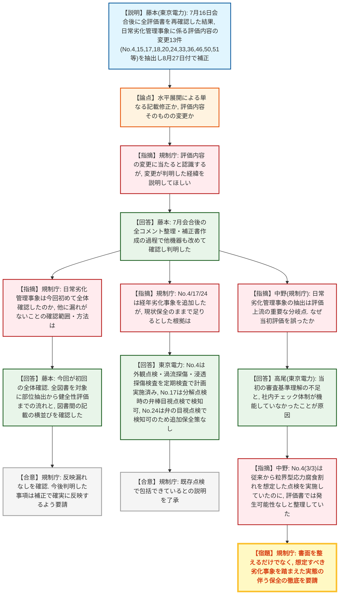
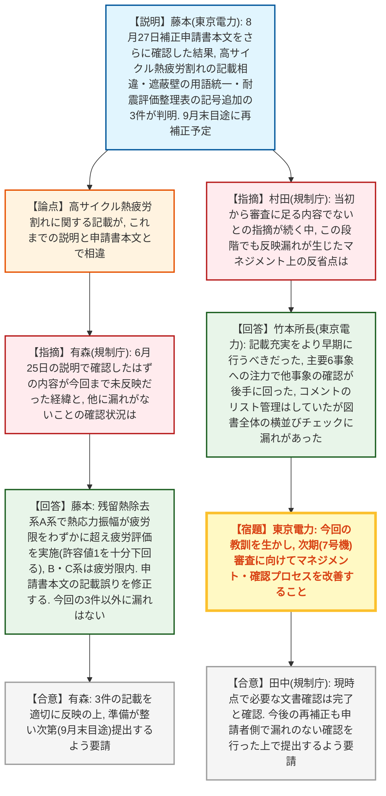

# 第35回実用発電用原子炉の長期施設管理計画等に係る審査会合（令和8年9月24日）
> 出典 : https://youtube.com/live/3XGqOp_NBjo?si=ZoGp1rl4ctM-CQOy

## 会合の概要
* **7月16日会合後の全図書再点検により日常劣化管理事象の評価内容変更13件が判明**
  東京電力は、柏崎刈羽6号炉の長期施設管理計画について、前回(7月16日)の審査会合後に指摘事項の水平展開を目的として全評価書を再確認した結果、主要6事象以外の日常劣化管理事象に係る評価内容の変更が13件見つかり、2026年8月27日付の補正申請に反映したことを説明した。
* **追加保全策は不要、既存点検で健全性確認済みと説明**
  13件はいずれも部位展開や評価文の記載不備(材質の誤記、劣化事象の抽出漏れ等)の是正であり、既存の外観点検・探傷検査・目視点検等の保全内容で健全性を確認できているため、新たな追加保全策は生じないと説明された。
* **8月27日補正申請書本文そのものにも反映漏れ3件が判明、9月末を目途に再補正予定**
  高サイクル熱疲労割れに関する記載相違、用語(遮蔽壁名称)の統一、耐震安全性評価整理表の記号追加の3件について、これまでヒアリング等で「補正で反映する」と説明していたにもかかわらず8月27日の補正に未反映であったことが判明し、9月末を目途に再補正申請する予定であると説明された。
* **規制庁は審査基準理解・社内チェック体制の不備を問題視、再発防止を要請**
  規制庁(中野・村田ほか)は、日常劣化管理事象の評価が申請の当初段階から本来作り込まれるべき重要なプロセスであるにもかかわらず、審査終盤になって繰り返し反映漏れが判明している点を問題視し、書面の整備にとどまらず実態に即した保全の徹底と、次期審査(7号炉)を見据えたマネジメント改善を求めた。
* **東京電力は理解不足・チェック体制不備を反省点として説明**
  東京電力(竹本所長)は、主要6事象(耐震・耐津波等)への注力により他事象の確認が後手に回ったこと、ヒアリング・審査会合のコメント管理はしていたが図書全体の横並びチェックに漏れがあったことを反省点として挙げ、審査プロセスの改善を図る考えを示した。

---

## 議題ごとの詳細整理

### 【議題1】東京電力ホールディングス（株）柏崎刈羽原子力発電所６号炉の長期施設管理計画認可申請に係る審査について

* **議論の背景と論点:**
  柏崎刈羽6号炉の長期施設管理計画については、これまでの審査会合で主要6事象に係る技術評価及びABWRの特徴を踏まえた内容が概ね了承されており、新たな論点が生じた場合には必要に応じて審査会合を開催するとされていた。本会合は、2026年8月27日付で提出された補正申請書について、規制庁が(1)日常劣化管理事象に係る評価内容の変更、(2)これまで「補正で反映する」と説明されていたが今回の補正に未反映の内容、の2点を確認する必要があると判断して開催されたもの。

* **質疑応答（詳細）:**

  **＜1. 日常劣化管理事象に係る評価内容の変更（13件）＞**
  * 【説明者側】藤本ほか（東京電力）
    2025年12月24日付の当初申請、2026年3月27日付の記載不備に係る補正を経て、7月16日の審査会合後、これまでの指摘事項を他の個別機器評価へ水平展開できないか全評価書を改めて確認した結果、部位展開・劣化事象抽出の漏れや評価文との整合不備など13件の変更箇所を抽出し、2026年8月27日付で再度補正申請した。代表例として、No.4(排ガス予熱器・復水器・給水加熱器の伝熱管について、ステンレス鋼で100℃以上の環境にある部位への粒界型応力腐食割れの評価対象記載漏れ、および運転温度の誤認による評価未実施)、No.15(逆止弁アームの材質誤記による腐食抽出の削除)、No.17(バタフライ弁弁棒の海水接液構造の見落としによる孔食・すきま腐食の追加)、No.18・20(ケーブル接続部の同軸コネクタに係るOリング絶縁低下の記載不備の是正)、No.24(電動弁駆動部の低合金鋼に対する全面腐食評価の追加)、No.33(非常用ディーゼル発電設備の燃料移送ポンプの逃がし弁に係るスプリングのへたりの追加抽出)、No.36(蒸気式空気抽出器中間冷却器の伝熱管について、溶接部がなく残留応力が生じないことを確認し応力腐食割れ評価を削除)等を説明した。いずれも現状の施設管理で実施している保全内容自体に変更はないとした。
  * 【規制側】規制庁（芦田ほか）
    今回の変更は水平展開による単なる記載修正というより評価内容そのものの変更に当たると認識している。変更が生じることを確認した時点など、経緯を説明してほしい。
  * 【説明者側】藤本（東京電力）
    7月16日の審査会合後、審査会合を含む全てのコメントを取りまとめて補正書を作成する過程で、他の機器についても改めてチェック・確認した結果、判明したものである。
  * 【規制側】規制庁
    日常劣化管理事象に係る部分は、今回初めて全体を通して確認したという理解でよいか。また、今回の補正内容以外に漏れがないことをどのように確認したか、範囲・方法を説明してほしい。
  * 【説明者側】藤本（東京電力）
    今回の確認は初めてである。対象は申請に係る全ての図書とし、評価書内で部位抽出から健全性評価に至る一連の流れの再確認、及び技術評価書・補正書を含めた記載の横並びチェックを全図書について実施した。
  * 【規制側】規制庁
    申請書への反映漏れがないことを確認した旨了解した。今後、確認の結果として申請書への反映が必要なものが見つかった場合は、今後の補正で確実に反映してほしい。
  * 【説明者側】東京電力
    了解した。
  * 【規制側】規制庁（芦田）
    説明された13件のうちNo.4・No.17・No.24について、昨年12月の申請時には必要な経年劣化事象が抽出されておらず評価できていなかったが、今回補正で事象を抽出し評価・劣化管理を追加したと理解している。それでも現状の保全内容に変更がないとした根拠について、それぞれ説明してほしい。
  * 【説明者側】大西・菅井（東京電力）
    No.4(給水加熱器)は、外観点検・渦流探傷検査・浸透探傷検査を1997年の運転開始以降、定期検査の中で計画的に実施しており、既に健全性を確認済みである。No.17(バタフライ弁弁棒の孔食・すきま腐食)は、もともと分解点検時に弁棒の目視点検を実施しており、これにより検知可能であるため、現状保全の中で包絡されている。No.24(電動弁駆動部の低合金鋼)についても、弁の点検時の目視点検で当該部位を網羅しており、腐食の検知が可能であるため、いずれも新たな追加保全策は不要と判断している。
  * 【規制側】規制庁（芦田）
    新たな追加保全策なく、新しく見つかった劣化事象は全て既存点検で包括できているという説明として承知した。
  * 【規制側】規制庁（中野）
    日常劣化管理事象の抽出手順は、技術評価書作成の中でも上流側に位置し、着目すべき経年劣化事象を抽出する重要な分岐点である。今回改めて変更したとのことだが、そもそもなぜ当初このような評価になってしまったのか、原因を説明してほしい。
  * 【説明者側】高尾（東京電力）
    日常劣化管理事象については当初申請の段階できちんと作り込むべきものと認識していたが、当初申請時点で審査基準の理解が不足していたことと、社内のチェック体制が十分に機能していなかったことが原因である。7月の審査会合以降に全ての評価書を見直した結果、整合が取れていない・抽出できていないといった不備が判明した。
  * 【規制側】規制庁（中野）
    例えばNo.4(3/3)では、当初申請では発生可能性が小さいとして評価を落としていたが、実際には従来から浸透探傷検査・渦流探傷検査など粒界型応力腐食割れの発生を想定した点検を実施していた。評価書作成の過程でこれに気づかなかったのではないか。書面を整えるだけでなく、どのような劣化事象を想定して保全していくかというプロセスを重視し、実態の伴った保全をしてほしい。
  * 【座長】
    高尾の説明のとおり、長期施設管理計画の制度は結果よりもそこに至る過程を重視して計画に書き込むものであり、今回のような不備は制度理解・確認の不足が今回まとめて確認した結果として表れたものと考えられる。今後も同様の事項があれば確実に修正するよう求める。

  **＜2. 8月27日付補正申請書本文への未反映内容の修正（再補正予定、3件）＞**
  * 【説明者側】藤本ほか（東京電力）
    8月27日の補正申請書本文についてさらに確認した結果、以下3件の記載修正が必要であることが判明した。(1)高サイクル熱疲労割れについて、残留熱除去系熱交換器出口配管とバイパスラインの合流部(A・B系)に関し、申請書本文には「熱応力振幅が疲労限を超えないため高サイクル熱疲労割れは発生しない」と記載されていたが、実際にはA系で熱応力振幅が疲労限をわずかに超えるため疲労評価を実施しており(許容値1を十分に下回り耐震安全性に影響なし)、B系及びC系は疲労限を超えていないことをヒアリングで説明済みであった。この内容と申請書本文の記載に誤りがあったため修正する(配管の技術評価書上の評価結果への影響はない)。(2)RCCV(原子炉格納容器)の部位展開に関するヒアリングで「ガンマ線遮蔽壁」から「原子炉遮蔽壁」へ名称を統一したが、申請書本文の一部に旧称が残っていたため統一する。(3)耐震安全性上考慮すべき劣化事象の整理表のうち、配管の流れ加速型腐食(減肉評価)の欄について、応力評価実施を示す記号(A2)のみが記載されていたが、評価ケースの一つで応力評価後に疲労評価も実施していたため、応力評価・疲労評価をそれぞれ示す記号(A1・A2)を追記する(耐震安全性評価の実施内容自体に変更はなく整理表の記載変更にとどまる)。これら3件を含め、9月末を目途に再補正申請する予定である。
  * 【規制側】有森（規制庁）
    高サイクル熱疲労割れについては、2026年6月25日の耐震安全性評価に係る技術評価の説明で制御盤案内管に対する発生可能性は小さいとされていたが、それ以外の部位についても発生可能性の有無をヒアリング・事実確認で確認し、今回申請書本文への反映が説明されたものと理解している。これまでの審査会合で「補正する」と説明された内容は8月27日の補正で反映されていると考えていたが、今回は3件いずれも東京電力が改めて確認した結果、反映が必要とされたものが反映されていなかったという点だと理解している。このような漏れがないことについて、確認状況と今後の予定を説明してほしい。
  * 【説明者側】藤本（東京電力）
    今回説明した3件以外に補正が必要な内容は確認しておらず、漏れはないと考えている。
  * 【規制側】有森（規制庁）
    3件を含め、申請書に適切な内容が記載されていることを確認した上で、準備ができた段階(9月末目途)で提出するようお願いしたい。
  * 【説明者側】東京電力
    3件を含め、他にどういうものがないか確認した結果を踏まえ、9月末を目途に申請することを検討していく。
  * 【規制側】村田（規制庁）
    個別事象そのものについて意見はない。ただし、この審査会合を通じて同様の話が何度も出てきており、当初から審査に足る内容ではないとの指摘から始まり中身の充実を求めてきた中で、この段階になっても同じような反映漏れが生じていることについて、全体をどう仕切り見ているかというマネジメントの観点で、今の時点での反省点があれば聞かせてほしい。
  * 【説明者側】竹本所長（東京電力）
    大きな反省点として、まず13項目については本来春の補正の段階で記載を充実させて出し切るべきであった。審査を通じて他の部分にも記載のおかしい点があると気づいた場合、その都度ヒアリングの場等で早めに共有すべきであったが、当初は耐震・耐津波など収録事象に力点を置いてしまい、他の部分の指摘が後手に回った。ヒアリング・審査会合のコメントはリストで管理し漏れがないか確認してきたが、図書全体の最後の横並びチェックの仕方が悪く、整合性確認に漏れが生じ、それが今回の3件につながった。次の7号機審査を控える中で、この教訓をプロセスに生かしていきたい。
  * 【規制側】村田（規制庁）
    日常劣化管理事象の評価は、現場で実施されている保全が申請書に適切に反映されているかを確認する重要な要素であり、最初の見直し指示の段階でもっと全体を見直すよう伝えるべきだったかもしれない。審査のやり直しにより双方の時間が費やされている点を認識してほしい。長期施設管理計画は、将来の対策だけでなく現状の評価・保全の妥当性も示す申請であり、6・7号機固有の事象だけでなく日常管理の評価も重要であるため、日常管理だから後回しということではないはずだ。7号機以降の審査も続く中、今回の反省を生かし、現場でのマネジメント体制づくりに努めてほしい。
  * 【座長】
    村田のコメントは他の事業者も踏まえた上での東京電力への指摘であり、しっかり対応してほしい。
  * 【規制側】田中（規制庁）
    全体を通じて、現在申請されている内容については、本日の審査会合で説明のあったとおり、現時点で評価や措置を変更する必要がある内容は必要な文書を全て確認した上で説明されたことを確認した。今後さらに再補正を予定しているとのことなので、申請者として申請書の内容に漏れがないことを適切に確認した上で、改めて補正を提出してほしい。
  * 【説明者側】谷口（東京電力）
    承知した。9月末を目途にとしているが、社内で必要な確認を行い、自信を持てる内容として補正申請するという対応を行う。チェック体制についても、竹本らと話をしており、社内できちんと必要な確認をするステップを踏んだ上で補正申請する。
  * 【座長】
    審査対象となるのはそちらから提出される申請書であるので、しっかりと抜けのない申請書を次回は出してほしい。

* **結論と宿題事項（アクションアイテム）:**
  * **決定事項:** 日常劣化管理事象に係る評価内容の変更13件について、いずれも既存の保全内容(点検・検査)で健全性が確認できており追加保全策は不要であることが確認され、了承された。
  * **決定事項:** 現時点で評価・措置の変更が必要な内容については、本日の会合で必要な文書が全て確認された上で説明されたことが確認された。
  * **宿題事項:**
    1. 東京電力は、申請書本文の反映漏れ3件(高サイクル熱疲労割れに関する記載修正、遮蔽壁の名称統一、耐震評価整理表への記号追加)について、社内確認の上、9月末を目途に再補正申請を提出すること。
    2. 東京電力は、今後の確認により申請書への反映が必要な事項が判明した場合、都度確実に補正へ反映すること。
    3. 東京電力は、今回の反省(審査基準理解不足、社内チェック体制の不備、主要事象への注力による他事象確認の後手対応)を踏まえ、次期審査(7号機)に向けてマネジメント・確認プロセスを改善すること。

---

## 論理構造の可視化（Mermaid）

### 1. 日常劣化管理事象に係る評価内容の変更（13件）

### 2. 申請書本文への未反映内容の修正（再補正予定、3件）

