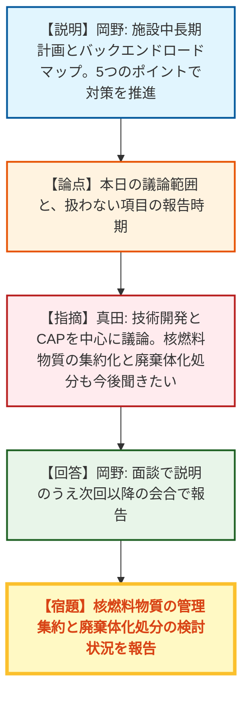
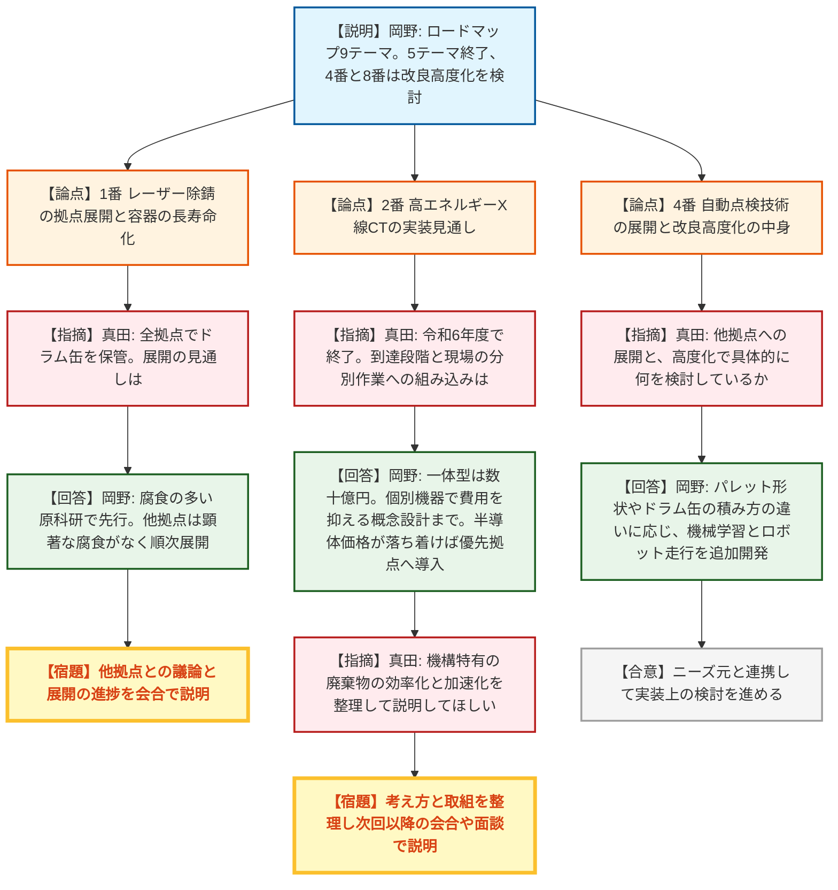
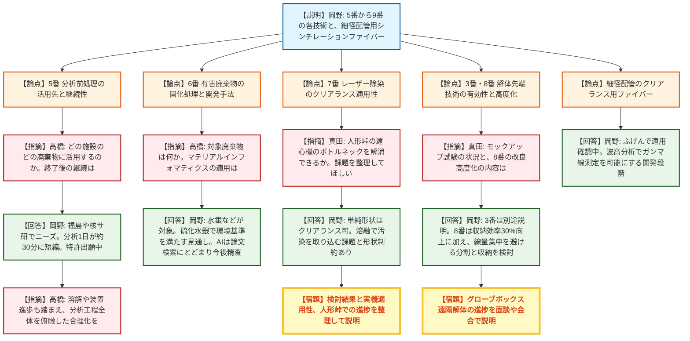
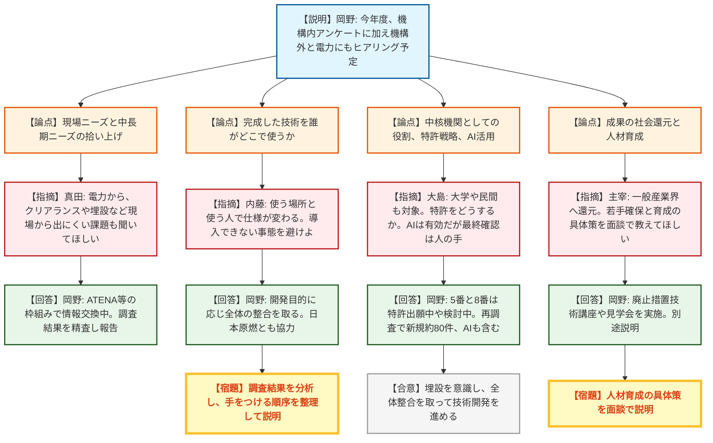
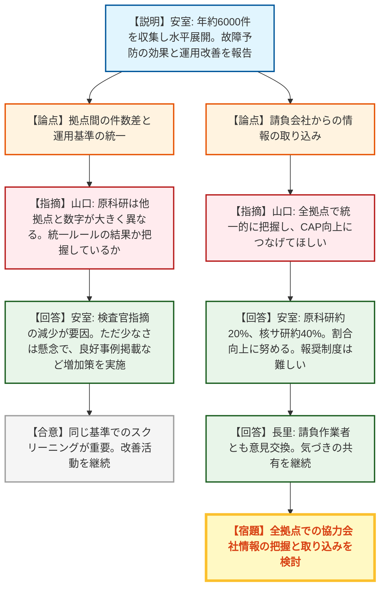
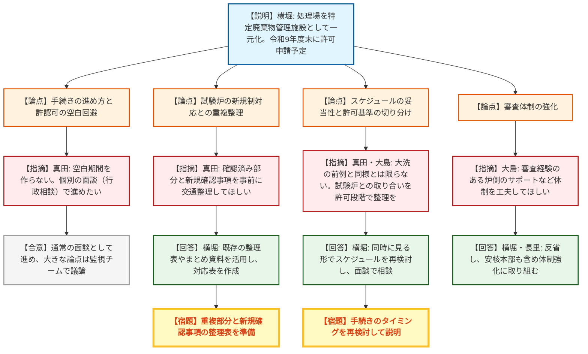

# 第13回原子力機構バックエンド対策監視チーム会合（令和8年9月28日）
> 出典 : https://youtube.com/live/YKZW7vH3LYw?si=Yo9g_m1ZVSqSgPvt

## 会合の概要
* **技術開発は「開発」から「現場実装」へ軸足を移すよう規制側が強く要請**
  バックエンド技術開発戦略ロードマップの9テーマ（うち5テーマは終了）の進捗が報告された。規制庁は個別技術の出来栄えよりも「どこで・何に・誰が使うのか」まで見据えた仕様設計と、各拠点への展開計画を求めた。
* **有害物の分別・レーザー除染など、現場課題とのつながりに宿題が集中**
  高エネルギーX線CT（有害物の非破壊分別）は装置が数十億円規模で一律導入が難しい点、レーザー除染は溶融による汚染の取り込みでクリアランスのハードルが上がる点が指摘された。機構特有の廃棄物の効率化・加速化については、改めて整理して説明することとなった。
* **電力・民間・大学を含む「中核機関」としての役割と、特許・AI活用への期待**
  規制部長から、埋設という最終形まで見据えて電力、大学、民間を巻き込む中核機関になること、特許戦略、AIの積極活用が求められた。機構は分析前処理技術などで特許出願中であり、今年度のニーズ・シーズ再調査で約80件の新規候補が出ていると回答した。
* **前回会合の宿題であるCAP（是正処置プログラム）の運用状況を初報告**
  年間約6000件の情報を収集し水平展開につなげる運用が示された。規制庁は、原科研の件数が他拠点より少ない点と、請負（協力）会社からの情報が2〜4割にとどまる点を懸念し、同一基準でのスクリーニングと請負会社の取り込みを求めた。
* **原科研の放射性廃棄物処理場を「廃棄物管理事業」へ移行する計画が始動**
  令和9年度末の申請を目指す方針が示され、規制側は許認可の空白期間を作らないことと、試験炉の新規制基準対応で確認済みの内容を重複審査しない整理を求めた。大洗の前例踏襲にとどまらない手続き設計と、審査体制の強化も要請された。

---

## 議題ごとの詳細整理

### 【議題（１）】原子力機構のバックエンド対策の現状と課題
（資料1：全体概要、資料2：技術開発の取組、資料3：CAPシステムの運用状況、資料4：原科研の放射性廃棄物処理場における廃棄物管理事業の取得）

#### ＜資料1：バックエンド対策の全体概要＞
* **議論の背景と論点:**
  施設中長期計画（5か年）とバックエンドロードマップ（70年）の位置づけが説明された。今回取り上げない核燃料物質の集約化・管理、廃棄体化・処分の検討状況を、今後の会合でどう報告するかが確認された。
* **質疑応答（詳細）:**
    * 【説明者側】長里（機構：理事）
      日頃の安全規制上のご指導に謝意を示したうえで、本日は全体概要、技術開発、CAPの運用状況、原科研処理場の管理事業化の4点を報告すると挨拶した。
    * 【説明者側】岡野（機構：バックエンド推進室長）
      長期方針はバックエンドロードマップ、短期の施設計画は施設中長期計画で示している。施設中長期計画は施設の集約化・重点化、安全確保、バックエンド対策を三位一体とした計画で、89施設を分類している。バックエンド対策は廃止措置、廃棄物の処理・保管、核燃料物質の管理集約、廃棄体化処分、技術開発の5つのポイントで進めている。
    * 【規制側】真田（規制庁）
      本日は資料1の3ページ中央の技術開発項目と、前回会合で求めたCAPシステムの状況を中心に議論したい。一方、核燃料物質の集約化・管理と廃棄体化・処分についても、今後の会合で検討状況を聞きたい。
    * 【説明者側】岡野（機構）
      核燃料物質の管理集約と廃棄体化処分は進捗に差があるが、面談で説明したうえで次回以降の会合で報告する。
* **結論と宿題事項（アクションアイテム）:**
  * 核燃料物質の管理集約・廃棄体化処分の検討状況を、面談を経て次回以降の会合で報告する（機構）。

#### ＜資料2：バックエンド対策に係る技術開発の取組＞
* **議論の背景と論点:**
  第4期中長期計画に基づき、福島第一原発と互いに役立て合うこと、低コスト化、廃棄物発生抑制を目的に、シーズ部署を核としてニーズ部署が協力する横断体制で技術開発を進めている。令和5年8月公表のバックエンド技術開発戦略ロードマップ（令和5〜10年度）は、令和4年度のアンケートでニーズとシーズをマッチングさせ、「共通課題」かつ「費用削減効果が見込める」ものとして9テーマに絞り込んだ。うち5テーマは終了済みで、4番（自動点検）と8番（デジタル）は外部ニーズが高く改良・高度化を検討中である。
  質疑では、レーザー除錆の拠点展開、高エネルギーX線CTの実装見通し、自動点検の展開上の課題、分析前処理・固化処理・レーザー除染・解体先端技術の各論に加え、技術を「誰が使うか」まで見据えた開発姿勢が論点となった。
* **質疑応答（詳細）:**
  **＜1番：レーザーによる保管廃棄物容器の補修（除錆・防錆）技術＞**
    * 【説明者側】岡野（機構）
      レーザーでドラム缶表面の錆を除去し、同時に防錆も行う技術で、500本以上に適用し、従来のサンダーやグラインダー作業の約1.5倍の速度を確認した。開発元の原科研で長期保管していたドラム缶に適用し、現在は大洗研にも展開している。
    * 【規制側】真田（規制庁）
      ドラム缶は全拠点で保管されており、長期保管が続けば腐食の問題は他拠点でも顕在化する。容器の長寿命化への対応と、多拠点への展開見通しを確認したい。
    * 【説明者側】岡野（機構）
      ドラム缶は仕様が共通で展開しやすく、各拠点のニーズも高い。ただし腐食が多かった原科研で先行実施したもので、他拠点の点検では顕著な腐食は見つかっていないため、順次展開していく。
    * 【規制側】真田（規制庁）
      原科研の保管廃棄施設の議論でも錆が取り上げられた。他拠点とよく議論し、展開の進捗があれば会合でも説明してほしい。

  **＜2番：高エネルギーX線CTによる保管容器内廃棄物の確認技術＞**
    * 【規制側】真田（規制庁）
      鉛や水銀等の有害物質の分別を効率化・加速化することは、第1回会合から議論してきた重要課題である。本技術は令和6年度で終了とされているため、到達段階と成果、現場の分別作業との関係での位置づけ、実装の見通しを確認したい。
    * 【説明者側】岡野（機構）
      分別手順が定まっていない昭和の時代の廃棄物では、ドラム缶の1割程度に有害物が混入していると考えている。本装置は高感度だが一体型だと数十億円規模で各拠点への導入は難しいため、個別機器を組み合わせて費用を抑える概念設計までを実施した。半導体価格の上昇もあり一律導入は難しい状況だが、価格が落ち着けば課題のある拠点から優先的に導入したい。
    * 【規制側】真田（規制庁）
      費用対効果の検討に入っているのは了解した。分別処理の合理化は、技術開発と評価（ガス発生試験による含有可燃物量の設定等）の両面で進められてきたが、しばらく聞いていない。機構特有の廃棄物の効率化・加速化について、どこかで整理して説明してほしい。
    * 【説明者側】岡野（機構）
      機構には原子力の黎明期から積み重ねた廃棄物が多く、どのような考え方と取組で対処しているかを整理し、次回以降の会合や面談で説明する。

  **＜4番：保管廃棄物の自動点検技術＞**
    * 【規制側】真田（規制庁）
      各拠点に共通する課題であり、核サ研への導入検討のほか、他拠点への展開の動きを確認したい。あわせて、4番が改良・高度化の対象となっているが、具体的に何を検討しているか説明してほしい。
    * 【説明者側】岡野（機構）
      先々月に核サ研を含む茨城地区の拠点とWeb会議を開き、ニーズの取り込みを進めている。拠点ごとにドラム缶の積み方やパレット形状が異なるため、画像診断の機械学習を追加で積み重ねる必要がある。また、カメラ付きロボットがパレット上や隙間を走行できるか、途中で止まった場合の対処などを含め、実装に近い技術開発を進めている。
    * 【規制側】真田（規制庁）
      実装に近づいていると理解した。ニーズ元とよく連携し、実装に向けて必要な検討を議論して進めてほしい。

  **＜5番：分析前処理の合理化技術＞**
    * 【規制側】高橋（規制庁）
      ネプツニウムの分析で、酸化状態の制御と固相抽出クロマト分離を自動・オンラインで行ってICP-MSで測定する例の説明があった。具体的にどの施設のどの廃棄物の分析に活用する計画か。
    * 【説明者側】岡野（機構）
      福島（大熊分析・研究センター）が注目しており、核サ研でもプルトニウムの派生核種として分析ニーズがある。従来は1日程度かかった分析が約30分で終わり、固相抽出材を替えれば他の元素にも使える。分析メーカーも関心を示しており、特許出願中である。
    * 【規制側】高橋（規制庁）
      令和6年度で終了とされているが、大熊の分析センターでも類似の手法を開発している。今後も継続されると理解してよいか。
    * 【説明者側】岡野（機構）
      大熊ではALPS処理水など多核種の分析に長時間を要しており、品質保証の観点で分析法として確立できれば採用されて合理化につながる。バックエンド分野で開発した技術が福島にも還元され、互いに役立つことを期待している。
    * 【規制側】高橋（規制庁）
      固体試料では溶解技術の検討が必要で、最新のICP-MS/MSなら分離せずに測れる場合もあり、レーザーアブレーション直接測定も開発されている。分析対象に合わせ、工程全体を俯瞰した合理化技術を検討してほしい。
    * 【説明者側】岡野（機構）
      固体は液体よりやや感度が劣るが装置の高度化が日進月歩で進んでおり、導入を期待している。1Fだけでなく、処分に向けた廃棄物の素性分析にも展開できるよう、多くの用途を想定して開発している。

  **＜6番：有害廃棄物の安定化（固化）処理技術＞**
    * 【規制側】高橋（規制庁）
      ニーズ元に原科研、大洗研、敦賀が挙がっているが、具体的にどの施設のどのような廃棄物に活用する予定か。
    * 【説明者側】岡野（機構）
      例えば水銀は、原科研の古い分析法（クーロメトリー等）で使われたものに由来する廃棄物と考えている。硫化水銀であれば環境規制基準を満たす程度に固化できる見通しで試験データも積み上がっているが、検討途中でさらなるデータ収集が必要である。
    * 【規制側】高橋（規制庁）
      元素が多様な環境有害物質の固化剤選定を、経験や勘に頼る材料開発で行うと多大なコストを要する。実験データや論文をAIで解析して条件を予測するマテリアルインフォマティクスの適用状況を知りたい。
    * 【説明者側】岡野（機構）
      現時点では論文検索による情報収集にとどまっているが、今後内容を精査し、適用できる技術は取り入れる。水銀、ホウ素、フッ素は産業廃棄物にも共通する課題なので、一般的な技術も取り込みつつ進める。
    * 【規制側】高橋（規制庁）
      継続課題であり、進捗があればこの場で説明してほしい。

  **＜7番：レーザー除染技術＞**
    * 【規制側】真田（規制庁）
      ニーズ元は人形峠で、遠心機の除染とクリアランスが廃止措置の作業時間のボトルネックである。湿式除染は廃液処理による二次廃棄物や工程の長さが課題なので、将来の加工施設の除染・クリアランスの効率化にも寄与し得る。実機に適用できるか、どのような課題があるかを整理して説明してほしい。
    * 【説明者側】岡野（機構）
      平面で単純形状の一般的な材料であればクリアランスレベルまで除染できる。一方、レーザーで材料を溶かすため、汚染物質を取り込んで埋め込んでしまうことがあり、遠心機のような複雑形状では角部で焦点が定まらないなどの課題もあり、適用できる材料・形状は限られている。人形峠での進捗は会合や面談で報告する。
    * 【規制側】真田（規制庁）
      廃棄物として処分するなら問題ないが、クリアランスでは表面汚染を検出して判断するため、内部に取り込まれると難度が上がる。検討結果を整理し、実際の現場に適用できるのか改めて説明してほしい。

  **＜解体先端技術（3番：高線量グローブボックスの遠隔解体、8番：デジタル、9番：ロボット）＞**
    * 【規制側】真田（規制庁）
      3番は核サ研のプルトニウム燃料技術開発センター（現MOX燃料技術開発部）を想定した取組で、エアラインスーツ作業の負担と被ばくリスクの低減が期待できる。モックアップ試験の状況と有効性、適用性をどこかで確認したい。
    * 【説明者側】岡野（機構）
      3番の進捗は、別途面談や監視チーム会合で説明する。
    * 【規制側】真田（規制庁）
      8番のデジタルは電力からのニーズが高く、改良・高度化を進めるとのことだが、具体的に何を想定しているか。
    * 【説明者側】岡野（機構）
      1基のタンクの切断方法と収納容器への詰め方の最適化は、収納効率を30%ほど上げられる実績があり、一時保管スペースの有効活用が見込める。さらに先として、タンク底面に沈殿物が溜まり線量の高い部位が特定の容器に集中しないよう、被ばく線量も考慮した切断・収納方法を検討している。
    * 【規制側】真田（規制庁）
      被ばくの観点が分かりにくいので、もう一度説明してほしい。
    * 【説明者側】岡野（機構）
      底面の沈殿物や付着物で除染しきれない部分は線量が高く、1つの容器に集中すると運搬、管理区域内の移動、保管で作業員の被ばくに配慮が必要になる。遮蔽能力はあるものの、タンクの形状や性質によってはこうした配慮が必要となるため、検討している。
    * 【規制側】真田（規制庁）
      十分理解できた。

  **＜参考：プラスチックシンチレーションファイバーによる細径配管のクリアランス＞**
    * 【説明者側】岡野（機構）
      ふげんで適用確認を行っている段階で、実装には至っていない。ベータ線に高感度でガンマ線には感度が劣るが、波高分析器（MCA）を追加すればガンマ線を分別測定できる可能性がある。細径配管は半割して内面を測る従来手法が難しくクリアランスを避けてきたため、十分な感度が得られれば適用できる。

  **＜今後のニーズ調査と技術の使われ方＞**
    * 【規制側】真田（規制庁）
      今年度のニーズアンケートに加え、電力会社へのヒアリングも行うとのことで、現場のニーズを拾い、実際の廃止措置に適用できるよう計画的に進めてほしい。クリアランスや埋設のように現場から課題が上がりにくい中長期のニーズも、実務を担う電力から聞いてほしい。
    * 【説明者側】岡野（機構）
      電力会社とはATENA等の枠組みや協定を通じて、すでに廃止措置の情報交換を進めている。商用炉は廃止措置が先行している部分もあり、知見を取り入れながら、機構独自の技術は電力や他の研究機関にも展開する。調査は一通り終わって精査中で、進捗は面談や監視チーム会合で報告する。
    * 【規制側】内藤（規制庁：管理官）
      議論すべきは、できた技術をどう使ってバックエンドを安全かつ効果的に進めるかである。どこで、何に対して、誰が使うか（一般作業者か専門技術者か）で完成形の仕様は変わるため、その点を念頭に開発しないと、現場に導入できない事態になりかねない。電力も含めた調査結果を分析し、どこから手をつければ効果的かを整理して説明してほしい。
    * 【説明者側】岡野（機構）
      廃止措置は既存技術で解体を進めたほうが合理的な場合もあり、廃棄体化は安定な処理をじっくり考える必要があるなど、開発目的に応じて全体の整合を取る。日本原燃など再処理施設・MOX燃料加工施設を持つ事業者とも協力し、技術開発の進捗は会合や面談で説明する。
    * 【規制側】大島（規制庁：原子力規制部長）
      埋設という最終形を考えると、電力のみならず大学や民間の廃棄物も対象となり、機構には中核機関としての役割が求められる。メーカーが実装していくうえで特許をどう扱うのか、また制御・分析・評価でのAI活用についてどう考えているかを教えてほしい。AIは特にドラム缶の確認で有効だが、最終確認は人の手が必要で、その取り合いは規制活動にも関わるため意識してほしい。
    * 【説明者側】岡野（機構）
      5番（分析前処理）は分析メーカーの要望もあり特許出願中で、8番（デジタル）も商業化を見据えて特許取得を検討している。今回の技術開発はAIが普及していない令和4年の調査に基づくが、今回の再調査で新規のニーズ・シーズが約80件出ており、AI技術も含まれていると考えている。AIを活用しつつ、トレーサブルで品質の取れた対応を検討する。
    * 【説明者側】長里（機構：理事）
      埋設を意識した取組が重要であり、大学や民間のニーズも踏まえ、全体の整合を取りながら技術開発を進める。
    * 【規制側】会合主宰（規制側）
      原子力業界内で閉じず、優れた成果は一般産業界にもフィードバックし、PRや情報公開を積極的に進めてほしい。あわせて、若手の確保と育成について、面談で具体的な取組を教えてほしい。
    * 【説明者側】岡野（機構）
      人材育成は別途説明する。バックエンド分野では廃止措置技術講座（2日間の施設見学・意見交換・講義）を新設し、拠点ごとの見学会や意見交換会、動画のアーカイブ化や手順書公開も進めている。コロナ禍以降縮小していた学会・国際機関での発表も盛り返し、国際的なプレゼンスを高めたい。
* **結論と宿題事項（アクションアイテム）:**
  * **機構特有の廃棄物の効率化・加速化:** 高エネルギーX線CTを含む考え方と取組を整理し、次回以降の会合・面談で説明する（機構）。
  * **レーザー除染:** 溶融による汚染の取り込みを含む課題、実機適用性、人形峠での進捗を整理して説明する（機構）。
  * **レーザー除錆・自動点検:** 他拠点への展開状況と課題を、ニーズ元と連携しつつ会合で報告する（機構）。
  * **高線量グローブボックスの遠隔解体:** モックアップ試験の状況と有効性を別途説明する（機構）。
  * **ニーズ・シーズ再調査（電力へのヒアリング含む）:** 結果の分析結果と、技術をどこで誰が使うかを踏まえた開発の優先順位を整理して説明する（機構）。
  * **人材育成の具体策:** 面談またはヒアリングで説明する（機構）。
  * 条件付きの了承等はなく、継続課題として進捗を随時報告することが確認された。

#### ＜資料3：CAPシステムの運用状況について＞
* **議論の背景と論点:**
  前回会合で規制側が求めた、機構のCAP（是正処置プログラム）の運用状況の初報告である。不適合に加えてヒヤリハット等の事象を幅広く収集して改善につなげる活動で、拠点間で件数に大きな差があること、請負会社からの情報の取り込みが論点となった。
* **質疑応答（詳細）:**
    * 【説明者側】安室（機構：安全・核セキュリティ統括本部（安核本部）安全品質保証課長）
      CAP活動は、炉規法の対象となる青森、本部、原科研、核サ研、大洗研、人形峠、敦賀の各拠点で品質保証活動として実施している。機構共通ガイドの下に各拠点が要領を定め、情報を課・部・拠点の各レベルで収集・スクリーニングし、年1回有効性を評価する。
    * 【説明者側】安室（機構）
      情報は年間約6000件で、令和3〜7年度を通じて大きな変動はない。内訳は不適合約200件、気づき約1300件、保守管理上の不備約800件、外部からの指摘約700件、外部情報約3500件で、外部情報は重複を除くと約1600件になる。
    * 【説明者側】安室（機構）
      水平展開が最大の効果で、安核本部が拠点の情報を精査して指示文書の原案まで作成し、会議で審議して各拠点に展開する。直近の事例は、核サ研でのJANSIピアレビュー結果を踏まえた継続的改善で、教育資料を付けて展開した。
    * 【説明者側】安室（機構）
      令和7年度は機器故障・経年劣化に係る情報が約4割で、故障起因で通報連絡に至ったものは6件にとどまった。点検時の気づきを対策につなげたことで予防できていると評価している。課題として、CAPに上げる基準の迷い、情報の使いにくさ、他拠点情報の検索性が挙がり、事例集の追加、情報の加工・注意事項の付記、データベースの整備で改善した。AIによる分析と対策立案は実施途中である。
    * 【規制側】山口（規制庁）
      原科研は、ヒヤリハット（②）や外部情報（⑤）の件数が核サ研や大洗研と比べて大きく異なる。統一的なルールと運用の結果なのか、機構全体として把握しているのか心配であり、説明してほしい。理事長のマネジメントや不適合管理へのインプットとして重要な数字である。
    * 【説明者側】安室（機構）
      原科研は令和5年度まで④（機構内外からの要望・指示、主に検査官の指摘）が多く、対応した結果、その後減少したと考えている。ただし他拠点より件数が少ないことは安核本部も原科研も懸念しており、良好事例のホームページ掲載など、件数を増やす施策を始めている。
    * 【規制側】山口（規制庁）
      件数の多寡の良し悪しではなく、同じ基準でスクリーニングされることが大事なので、改善活動を続けてほしい。
    * 【規制側】山口（規制庁）
      請負（協力）会社からの件数は、数字が示されているのは原科研と核サ研だけで、割合の良し悪しはともかく、外部の目は改善に重要である。全拠点で統一的に把握し、CAP活動の向上につなげてほしい。
    * 【説明者側】安室（機構）
      協力会社からの割合は原科研で約20%、核サ研で約40%だった。機構の作業の大部分は請負作業なので、もっと上がってよいと考えている。他社では報奨制度を設けた例を聞いたが、機構では難しく、別の手を検討している。
    * 【説明者側】長里（機構：理事）
      安全・核セキュリティ統括本部長として、請負作業の方々とも意見交換している。CAPが上がるかどうかは職員とのコミュニケーションの良否に左右されるため、「いつもと違う」という気づきの共有を求め続けており、徐々に浸透していると考えている。
* **結論と宿題事項（アクションアイテム）:**
  * 規制側は、拠点間で同一基準によるスクリーニングが行われるよう、原科研の件数増加施策を継続することを求めた。
  * 全拠点での協力会社からの情報の把握と、その取り込みによるCAP活動の向上を、今後の検討事項として求めた。
  * 運用状況は説明を受けたとして了承されたが、期限付きの宿題は設定されていない。

#### ＜資料4：原科研の放射性廃棄物処理場における廃棄物管理事業の取得について＞
* **議論の背景と論点:**
  原科研の放射性廃棄物処理場は、試験炉、核燃料物質使用施設、RI施設など複数の許可区分で管理されている。これを3.7テラベクレル以上の核燃料物質等を扱う特定廃棄物管理施設として「廃棄物管理事業」の許可に一元化する計画で、手続き、試験炉の新規制対応との重複整理、審査体制が論点となった。
* **質疑応答（詳細）:**
    * 【説明者側】横堀（機構：原子力科学研究所バックエンド技術部）
      複数の許可区分を一元化して廃棄物管理を合理化する。許可申請は令和9年度末を目標とし、許可取得後に設工認、検査、保安規定の申請を経て使用前確認を受ける。並行して試験炉・使用施設の許可や保安規定から処理場を除外し、RIは廃止の届出や委託手続きを行う。スケジュールは大洗の前例を参考にした案で、適切な形は面談等で相談する。
    * 【規制側】真田（規制庁）
      廃棄物を現に貯蔵しているため、許認可の空白期間を作ってはならない。手続きは複数に及ぶので、管理事業化に向けた個別の面談（行政相談）で進めたい。大きな論点があれば監視チーム会合で議論する。
    * 【規制側】真田（規制庁）
      処理場は新規制基準対応（耐震補強、漏えい警報設備、ライニング、保安規定の認可等）を試験炉の枠組みで終えており、ゼロから確認し直すのは非効率である。インベントリが変わるため確認が必要な事項もあり、重複する部分と新たに確認が必要な部分を事前に整理してほしい。
    * 【規制側】真田（規制庁）
      スケジュール案は大洗の前例を踏襲したものと思われるが、同様とは限らない。どの手続きをどのタイミングで行うのが処理場にとって適切か、改めて説明してほしい。
    * 【説明者側】横堀（機構）
      空白期間を作らずに準備を進める。試験炉の審査済み部分との重複を合理化するため、既存の整理表やまとめ資料を活用して対応表のような整理表を作り、スケジュールも今後の面談で相談する。
    * 【規制側】大島（規制庁：原子力規制部長）
      機構全体として事業者の技術的能力は問題にならず、申請書と体制の整理が中心になる。問題は事業許可基準の切り分けで、既存の試験炉の設置許可との取り合い（どこまでを試験炉・使用施設で見て、どこから管理事業とするか）を許可段階で早期かつ全体として整理しないと手戻りになる。グレーデッドアプローチにより試験炉以上のことは求めない整理のはずだが、規制側にも経験が少なく、必要なら基準上の整理を相談したい。
    * 【規制側】大島（規制庁：原子力規制部長）
      バックエンド側は審査に慣れておらず、管理事業の審査には時間がかかっている。審査経験のある炉側からのサポートなど、体制を工夫してほしい。
    * 【説明者側】横堀（機構）
      同時に見ていく形でスケジュールを再検討する。新規制対応に時間を要したことを反省し、炉側の協力を得て早めに準備を進め、改善も図る。
    * 【説明者側】長里（機構：理事）
      機構は多くの案件を同時並行で進めており、中身を共有しながら進めることが重要である。安核本部も含めた体制強化に取り組む。
* **結論と宿題事項（アクションアイテム）:**
  * 管理事業化に向けた手続きは、個別の面談（行政相談）で進めることが確認された（規制庁・機構）。
  * 試験炉の新規制対応で確認済みの内容との重複部分と、新たに確認が必要な事項を事前に整理する（機構）。
  * 複数の許認可手続きのタイミングを、大洗の前例にとらわれず処理場に適した形で再検討し、改めて説明する（機構）。
  * 事業許可基準の切り分けを、許可段階で試験炉の設置許可と合わせて全体整理する。審査体制（炉側のサポート等）の強化も機構が検討する。

#### ＜会合のまとめ＞
* 規制側は、技術開発を着実に進めることと、廃棄物管理事業の手続きを計画的に進めることを求め、閉会した。

---

## 論理構造の可視化（Mermaid）

### 【資料1】全体概要

### 【資料2】技術開発の取組（1〜4番）

### 【資料2】技術開発の取組（5〜9番・参考）

### 【資料2】ニーズ調査・使い手視点・特許とAI

### 【資料3】CAPシステムの運用状況

### 【資料4】廃棄物管理事業の取得

