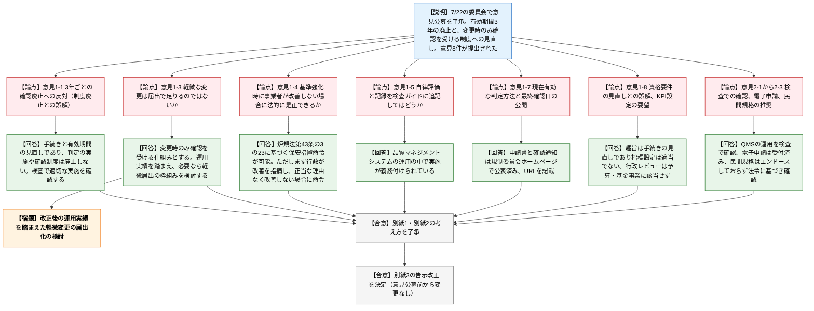
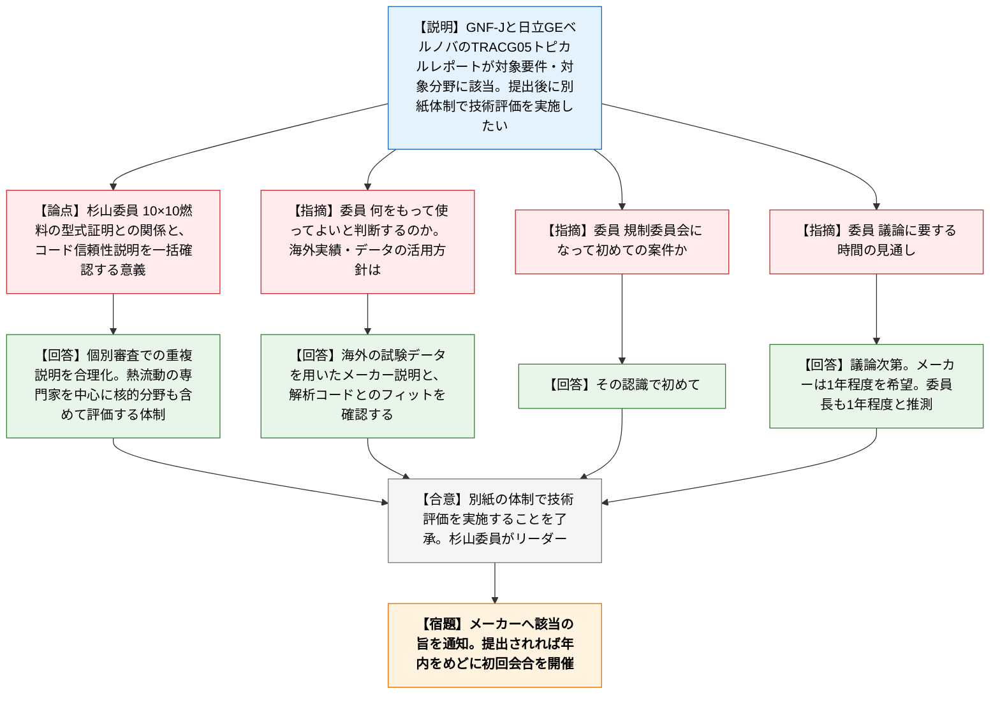
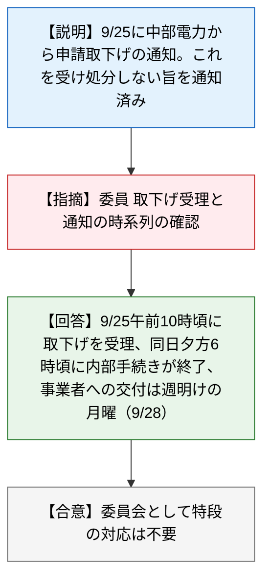

# 第33回原子力規制委員会（令和8年9月30日）
> 出典 : https://youtube.com/live/nhNWwcNxLcI?si=J6__rItOnHoWy1YS

## 会合の概要
* **運転責任者の判定方法に係る「確認の3年有効期間」の廃止を決定**
  7月22日に了承された意見公募の結果、8件の意見が寄せられた。「制度そのものを廃止するのか」という誤解に基づく反対意見も含め、規制庁は「手続き（有効期間）の見直しであり、判定の実施・確認制度自体は残る」と整理した。委員会は意見に対する考え方と告示改正案（意見公募前から変更なし）を異論なく了承・決定した。
* **規制委員会発足後初となるトピカルレポート技術評価（TRACG05）の実施を了承**
  GNF-JおよびHitachi GEベルノバから提出予定の3次元核熱結合動特性解析コードTRACG05のトピカルレポートについて、杉山委員をリーダーとする評価体制で技術評価を行うことを了承した。事業者は1年程度での完了を希望しているが、初の試みのため所要期間は議論次第とされた。
* **評価の主役は熱流動の専門家**
  杉山委員は、燃料設計の型式証明に対し本件は「解析コードの信頼性」を一括して確認し、個別審査での重複説明を合理化する仕組みだと整理した。熱流動分野の第一人者である外部有識者にも協力を依頼している。
* **中部電力浜岡原子力発電所の申請取下げを報告**
  設置変更許可申請等の取下げ（9月25日午前10時頃受理）と、規制庁が「処分を行わない旨」を通知した経緯が報告された。委員が時系列を確認したが、委員会として特段の対応は不要とされた。
* **冒頭で規制委ホームページの資料掲載不具合を謝罪・報告**
  会合開始時点で資料が閲覧できない状態だったが、議題1の説明中に復旧が報告された。

---

## 議題ごとの詳細整理

### 【議題1】運転責任者に係る基準等に関する規程の改正案に対する意見公募の結果及び告示の改正（決定・了承）
* **議論の背景と論点:**
  令和8年7月22日の第22回原子力規制委員会で意見公募の実施が了承された、運転責任者の判定方法に関する確認制度の見直しが対象。現行制度では判定方法の確認に3年の有効期間があり、変更がなくても3年ごとに申請が行われ、形式的な確認にとどまっていた。改正は、有効期間を廃止し、設置者が確認を受けた事項を変更しようとする場合に限って変更の確認を受ける形にするもの。意見公募では8件の意見が提出され、「制度の廃止ではないか」との誤解、軽微変更の届出化、保安措置命令の可否、検査での確認方法などが論点となった。

* **質疑応答（詳細）:**
    * 【説明者側】志間（原子力規制部検査グループ安全規制管理官（実用炉監視担当））・意見1-1（3年ごとの確認廃止への反対）
      運転責任者の判定方法の確認制度自体をなくすという誤解に基づく意見と整理した。見直すのは規制委員会による確認の手続きと有効期間であり、設置者による判定の実施や判定方法の確認を廃止するものではないと回答した。3年ごとの確認は形式的な変更確認に留まり意義が薄れていること、設置者による判定が適切かは原子力規制検査で確認していることも付記した。
    * 【説明者側】志間・意見1-3（軽微な変更は届出で足りるのではないか）
      今回の改正は手続きの見直しであり、設置者が確認を受けた事項を変更する場合に限り変更の確認を求める仕組みにするものと回答した。改正後の運用実績を踏まえ、必要なら軽微変更を届出とする枠組みの検討も考えるとした。
    * 【説明者側】志間・意見1-4（将来、基準を強化した際に事業者が判定方法を改善しない場合に、法的に是正させられるか）
      原子炉等規制法第43条の3の23に基づき、実用炉規則第87条に違反していると認めるときは、運転の方法の指定その他保安のために必要な措置を命ずることができる。第87条第4号は判定方法についてあらかじめ規制委員会の確認を受けることを求めており、保安措置命令の対象になり得ると説明した。ただし、改善しないからといって即座に命令するのではなく、まず行政から改善を指摘し、正当な理由なく改善しない場合に命令で措置する運用を想定している。
    * 【説明者側】志間・意見1-5（事業者による実施体制の妥当性の自律評価・記録を検査ガイドに追記してはどうか）
      そのような自己評価・確認は、設置者の品質マネジメントシステムの運用の中で実施することが義務付けられていると回答した。
    * 【説明者側】志間・意見1-7（確認の有効期限がなくなるため、現在有効な判定方法と最終確認日を公開してほしい）
      現在有効な判定方法は、申請書と規制委員会が確認を行った通知を、すでに原子力規制委員会のホームページで公表している。資料7ページにそのURLを記載したと回答した。
    * 【説明者側】志間・意見1-8（改正は資格要件・教育訓練・配置基準を最新の安全要件に見直すものと理解する。KPIや効果検証指標を設定すべき）
      今回は確認手続きの見直しであり、資格要件等の見直しではないと回答し、理解の食い違いを指摘した。指標設定は適当と考えないが、判定方法の実施内容の妥当性確認には検査で参考になる部分があると記載した。行政レビューについては、予算や基金を用いる事業に該当しないため効果検証指標を設定していないと理由を明記した。
    * 【説明者側】志間・その他意見2-1、2-2、2-3（別紙2）
      2-1（法令・ガイド改正や他プラントの運転経験の反映を基本検査で確認すべき）は、反映自体を設置者の品質マネジメントシステムで義務付けており、その運用を検査で確認していると回答した。2-2（遵守状況を基本検査で厳格に確認すること、申請のデジタル化の徹底）は、検査でしっかり実施しており、電子申請もすでに受付可能と回答した。この意見には他省庁のモデルとなる改正との評価もあったが、モデルとするか否かは他省庁が判断することとした。2-3（民間規格を利用している実態があるなら、その使用を推奨すべき）は、判定方法の実態としてJEAC等の民間規格の導入がほとんどである。ただし規制委員会は当該民間規格をエンドースしていないため、その事実関係を記載し、法令に基づき適切に確認していくと回答した。
    * 【規制側】山中委員長
      意見公募の考え方について質問・コメントを求めたが、内容の議論は7月に行っているため特段の発言はなかった。

* **結論と宿題事項（アクションアイテム）:**
  * **決定事項:** 提出意見に対する考え方（別紙1・別紙2）を了承し、告示の改正（別紙3）を決定した。告示案は7月22日提示の案から、意見公募を踏まえても変更はなしである。
  * **宿題・今後の課題:** 改正後の運用実績を踏まえ、必要に応じて軽微変更の届出の枠組みを検討する（意見1-3への対応）。
  * 条件付きの了承ではなく、委員から異論は出なかった。

---

### 【議題2】特定の共通事項に係る技術文書に関する技術評価の実施（3次元核熱結合動特性解析コードTRACG05）（了承）
* **議論の背景と論点:**
  グローバル・ニュークリア・フュエル・ジャパン（GNF-J）と日立GEベルノバ ニュークリア エナジーが提出を予定している、TRACG05（運転時の異常な過渡変化の事象解析等に用いるコード）のトピカルレポートについて、技術評価を実施することの了承を求める議題。令和5年度第35回原子力規制委員会でトピカルレポートに係る規程が制定され、杉山委員が担当、プラント審査担当審議官を担当職とし、実用炉審査部門を中心に技術基盤グループの職員も参画する体制が了承されている。令和8年8月31日にメーカーから提出前の要件等確認の申し出があり、9月14日の面談で、対象要件と対象分野に該当すると確認した（BWRの10×10燃料の導入にあたり、複数の設置変更許可等で参考文献として用いる予定）。

* **質疑応答（詳細）:**
    * 【説明者側】秋本（実用炉審査部門上席安全審査官）
      TRACG05は運転時の異常な過渡変化の解析等を扱い、10×10燃料導入の複数の設置変更許可等で参考文献に用いられる予定のため、規程5.1に基づき対象要件・対象分野に該当すると認めた。メーカーへは面談で通知する。トピカルレポート提出後は受理し、別紙の体制で会合を開催して技術評価を行いたい。提出時期は不明だが、速やかに提出されれば年内をめどに初回会合を開きたい。
    * 【規制側】杉山委員（補足説明）
      先に型式証明を受けた10×10型BWR燃料は燃料設計に関するもので、導入プラントの個別審査では設計部分の説明を省略できる。一方、燃料を使った際の安全解析で用いるTRACG05の信頼性の説明は、個別審査のたびに必要になる。そこでコードそのものの確認をトピカルレポートで済ませ、認可後は各プラントで引用する形にして合理化する。炉心の燃料解析に使うため、燃料の知識を持つ人が判断する必要があり、熱流動現象が主で、これに連動する核的な部分（原子炉物理）の専門家も集めて評価する。主役は熱流動の専門家であり、その分野の第一人者にも協力を依頼している。
    * 【規制側】委員（質問）
      10×10燃料は日本では今後の導入だが、世界的には長年使われている。欧米などでの実績やデータをもって実証していく方向なのか、どのような流れで最終的に使ってよいと判断できるようにするのか。
    * 【説明者側】秋本
      基本的には海外の試験データなどを用いてメーカーが説明してくると考えられる。規制側は、その試験データと解析コードがフィットしているかなどを確認していくことになる。
    * 【規制側】委員（確認）
      トピカルレポート制度自体は保安院時代からあるが、規制委員会になって初めての案件という認識でよいか。
    * 【説明者側】秋本
      その認識で初めてである。
    * 【規制側】委員（質問）
      この議論に大雑把にどのくらいの時間がかかるか。
    * 【説明者側】秋本
      議論してみないと分からず、規制委員会になって初めての試みでもある。メーカーとしては1年程度をめどに終わらせたい意向のようだが、議論次第としている。
    * 【規制側】山中委員長
      熱流動の専門家である有識者の方々にしっかり議論してもらいたい。議論の進め方は民間規格の技術評価に類似すると推測する。物量もあり1年程度はかかるのではないかと私も推測する。初めてのことなので、杉山委員にリーダーとなって丁寧に審査してほしい。

* **結論と宿題事項（アクションアイテム）:**
  * **決定事項:** TRACG05のトピカルレポートに関する技術評価を、別紙の体制で実施することを了承した。
  * **今後の予定:** メーカーへ対象要件・対象分野に該当する旨を面談で通知する。トピカルレポートが速やかに提出されれば、年内をめどに初回会合を開催する。所要期間は1年程度と推測されている。
  * **留意事項:** 規制委員会発足後初の案件のため、杉山委員がリーダーとなり丁寧に審査すること。審査の中心は、海外試験データと解析コードの整合の確認と、熱流動分野の専門家の知見を活用した評価となる。

---

### 【報告事項（配布資料）】中部電力浜岡原子力発電所の設置変更許可申請等の取下げ
* **議論の背景と論点:**
  令和8年9月25日に中部電力から設置変更許可申請等の取下げの通知があり、規制庁が当該申請に対して処分を行わない旨を通知したことが共有された。委員から取下げ受理と通知の時系列が確認された。

* **質疑応答（詳細）:**
    * 【説明者側】渡辺（実用炉審査部門補佐）
      9月25日に中部電力から申請を取り下げる旨の通知があった。これを受け、処分を行わない旨の通知をしており、参考として資料に添付している。
    * 【規制側】委員（質問）
      いつ取下げ申請があり、いつ処分しない旨を通告したのか、時系列を教えてほしい。
    * 【説明者側】渡辺
      取下げの受理は9月25日の確かに10時頃。処分しない旨の通知は同日中に内部手続きを進め、夕方6時頃に終了した。起案書類等の事務手続きがあるため、事業者へ渡したのは週明けの月曜日（9月28日）だったと認識している。
    * 【規制側】山中委員長
      取下げの申し出を受けて処分しない旨を連絡したということで、委員会として特段の対応は不要と思うが、よいかと確認し、異論はなかった。

* **結論と宿題事項（アクションアイテム）:**
  * **決定事項:** 報告のみ。委員会として特段の対応は行わない。
  * **宿題事項:** なし。

---

## 論理構造の可視化（Mermaid）

### 【議題1】運転責任者に係る基準等に関する規程の改正案に対する意見公募の結果及び告示の改正

### 【議題2】特定の共通事項に係る技術文書に関する技術評価の実施（TRACG05）

### 【報告事項】中部電力浜岡原子力発電所の設置変更許可申請等の取下げ

