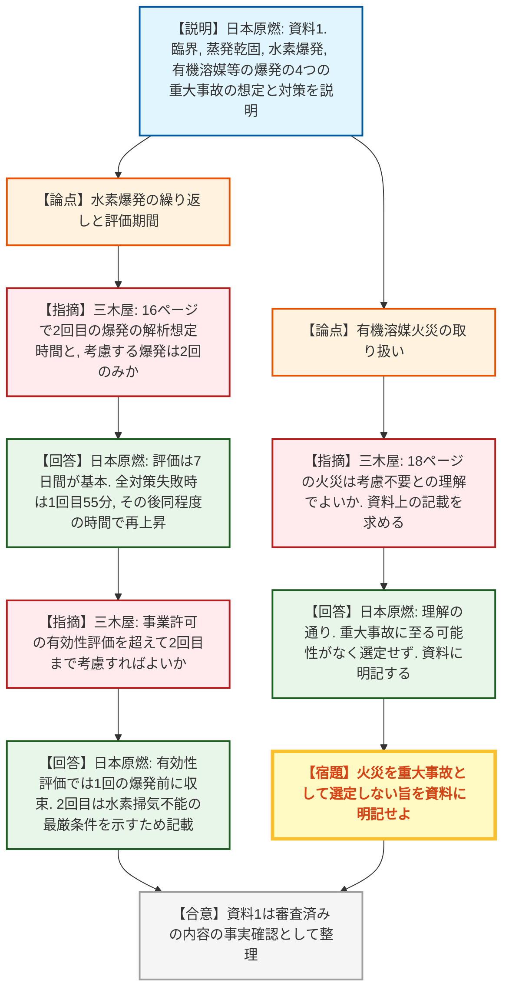
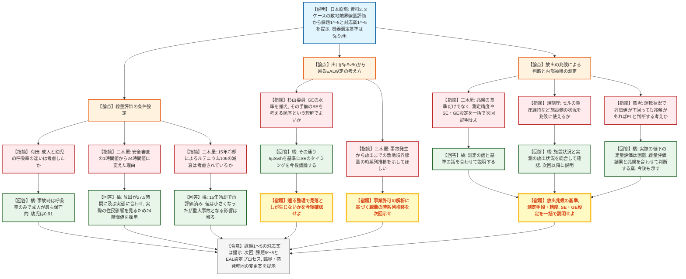

# 第19回緊急時活動レベルの見直し等への対応に係る会合（再処理施設）（令和8年10月1日）
> 出典 : https://youtube.com/live/WDLDG_wQag0?si=b-dCRKuCMm_nGq-r

## 会合の概要
* **再処理施設のEAL見直しの第2回会合として、日本原燃が「重大事故の概要」と「事故事象進展整理から抽出した課題1〜5とその対応案」を提示**
  前回（第17回）の要望を受け、資料1で六ヶ所再処理施設の概要と重大事故対策（臨界、蒸発乾固、水素爆発、有機溶媒等の火災・爆発）を深掘りして説明し、資料2で前回示した8課題のうち事故事象進展整理に由来する課題1〜5（線量差を踏まえた対象機器の選定、内部被曝基準、測定手段、評価の保守性、蒸発乾固時のルテニウム）への対応案を示した。課題6〜8は次回に持ち越された。
* **「住民への過度な負担の防止」と「内部被曝の影響の考慮」の2つの方向性に沿って、敷地境界5μSv/h（原災法第10条通報基準）を機器選定の基準とする案が示された**
  事故事象進展整理では、蒸発乾固は対策失敗時（ケース2）に対象53機器中2機、全ての対策が失敗し経路外放出となるケース3でも22機のみが5μSv/h以上となるなど、機器・対策の整備状況による線量差が大きいことが確認された。これを根拠に、一律ではなく線量に応じて機器を選定するEAL判断基準を設ける案が示された。
* **内部被曝の評価に時間がかかるため、「放出の兆候」（排気・環境モニタリングによる線量上昇の検知）を併用してEALを判断する案に対し、規制側は基準の設定方法を一括で説明するよう求めた**
  内部被曝線量はプルトニウム等のα線放出核種の化学分析が必要で迅速性に欠ける一方、評価値には安全審査由来の保守性が含まれ実際の線量は不確実である。三木屋氏は、放出兆候の基準だけを切り分けず、測定精度やSE・GEのタイミング設定と併せてパッケージで次回説明するよう求め、日本原燃も了承した。
* **杉山委員が「出口（住民防護の目標線量）から遡って手前のSEを考える」という整理の合理性を確認**
  GEは最終的に5μSv/hを目標とし、その手前のSEのタイミングを今後議論するという事業者の考え方に対し、杉山委員は高レベル廃液貯槽とプルトニウム溶液貯槽が同じ120℃という判断でも帰結が全く異なる点を挙げて合理的としつつ、遡る形で何か見落としが生じないかも今後確認すべきと述べた。
* **審査時と異なる評価条件（24時間値の採用等）や15年冷却の反映状況など、事業許可時の評価との差を事実確認する質疑が中心**
  1時間値から24時間値への変更は、放出が27.5時間に及ぶ実態に合わせたものであること、ルテニウム106は15年冷却で減衰を見込んだ上でなお重大事故となることなどが確認された。

---

## 議題ごとの詳細整理

### 【議題】再処理施設に係るEALの見直し

* **議論の背景と論点:**
  前回会合で日本原燃は、再処理施設のEAL見直しに向けて8つの課題を提示した。今回は、そのうち事故事象の進展整理（重大事故が進展した際の敷地外への経時的な放射線影響の整理）から得られた課題1〜5について、検討の根拠となる重大事故の内容（資料1）と、線量評価の結果および対応案（資料2）が説明された。論点は、①重大事故の想定方法（事故ごとの設計基準と重大事故対策の関係、7日間評価、火災を除外した理由）、②安全審査と今回の線量評価の条件の違い（24時間値の採用、成人・幼児の呼吸率、15年冷却）、③EAL判断において機器・対策の整備状況による線量差と内部被曝をどう反映するか、④内部被曝の測定の迅速性と評価の保守性をどう補う「放出の兆候」を設定するか、の4点である。

* **質疑応答（詳細）:**
    * 【説明者側】高田・石原（日本原燃）
      資料1は、これまでの設置変更許可審査で説明してきた内容を整理した六ヶ所再処理施設の概要と重大事故対策である。重大事故は、設計基準の安全機能が設計基準を超える地震や動的機器の多重故障等で失われたと仮定して選定しており、臨界（臨界事故の発生を仮定する機器に、可溶性中性子吸収剤の自動供給・水素掃気・廃ガス貯留槽への貯留）、蒸発乾固（安全冷却水系の全ポンプ停止を前提に、内部ループへの通水、機器への直接注水、コイルへの通水、凝縮器による凝縮・管理放出）、水素爆発（安全圧縮空気系の全台停止を前提に、常設の自動空気供給ユニット等）、有機溶媒等の爆発（プルトニウム濃縮缶でのTBP等の錯体の急激な分解反応に対し、供給停止・加熱停止・廃ガス貯留）の事故ごとに特徴と対策を示した。
    * 【規制側】三木屋（緊急事案対策室）
      資料1は事業許可の安全審査で議論済みの内容であり、本日は事実確認が中心であるとした上で、資料1の16ページの水素爆発について、2回目の爆発の解析上の想定時間と、事象収束までに考慮するのは2回の爆発のみかを質問した。
    * 【説明者側】石原・橘（日本原燃）
      重大事故の影響評価は規則・解釈に従い7日間を基本に考えており、7日間に起こる爆発の回数を想定して影響を評価している。橘氏は、プルトニウム溶液の場合、対策が全て失敗すると1回目は55分で爆発し、爆発で一旦下がった水素濃度が再び上昇して同程度の時間で2回目に達するとした。ただし、有効性評価では対策が成功し1回の爆発前に収束するため2回目は起こらず、図の2回目は、水素掃気ができない最も厳しい場合に爆発が繰り返されることを示すために記載したものである。
    * 【規制側】三木屋
      18ページのTBP等の事故について、資料名は「火災または爆発」だが、口頭では火災は考慮不要との説明であったため、その理解でよいか確認し、資料上にも火災を考慮不要とした旨の記載を求めた。
    * 【説明者側】日本原燃
      理解の通りで、有機溶媒火災は重大事故に至る可能性がなく選定していない。資料にもその旨を明記する。
    * 【説明者側】橘（日本原燃）
      資料2として、事故事象進展整理の目的と方法を説明した。安全審査の評価は対策の有効性と緊急時対策所の居住性の確認が目的で、事象進展時の敷地外への経時的な放射線影響や最過酷時の影響は確認できていない。そこで、ケース1（対策成功）、ケース2（対策失敗で主排気筒等から放出）、ケース3（全ての対策が失敗し経路外放出、地震起因事象のみ）の3ケースについて、機器ごとに敷地境界の預託実効線量を評価した。
    * 【説明者側】橘
      線量評価の結果、臨界はケース2で全対象機器が5μSv/h以上となり外部被曝が支配的であった。蒸発乾固はケース2で53機器中2機（第1・第2高レベル濃縮廃液貯槽）、ケース3で22機が5μSv/h以上となり、120℃以上で発生する揮発性ルテニウムの影響で高レベル廃液内包機器の線量が大きく、内部被曝が外部被曝より約3桁大きい。水素爆発はケース3で全対象機器が5μSv/h以上、TBP等の分解反応はケース2でも5μSv/hを超えなかった。
    * 【規制側】有田
      30ページの線量評価で用いた成人活動時の呼吸率について、成人と幼児で値が異なるが、その違いは考慮されているか質問した。
    * 【説明者側】橘
      安全審査では、平常時の評価では食物摂取等を含めると幼児が1.1と成人より大きいが、事故時は短期間のため呼吸率のみで評価し、幼児は成人の0.91と低い。呼吸率に関しては成人が最も保守的であり、成人の値を採用している。
    * 【規制委員会委員】杉山
      資料1と2を併せて考えると、事故の上流から順に何かが起きたらSE・GEとするのではなく、5μSv/hに達してしまうGEの水準を事故シナリオ・機器・施設ごとに揃え、その手前のSEを考える、という順序で考えていく整理に聞こえたが、その理解でよいか確認した。
    * 【説明者側】橘
      その通りである。最終的に住民防護の目標となる5μSv/hを基準に、その手前のSEのタイミングをどうするかを今後議論したい。
    * 【規制委員会委員】杉山
      高レベル廃液貯槽とプルトニウム溶液貯槽が同じ120℃という判断でも、その先の帰結や放出されるものが全く異なるため、出口側から遡る考え方は合理的と思う。一方で、そうすることで見落としや問題が生じないかも、今後確認しながら進める必要がある。
    * 【規制側】三木屋
      31ページの臨界のパラメータで、安全審査の1時間値から24時間値に変更した理由と、保守性を排除する趣旨かを質問した。
    * 【説明者側】橘
      安全審査は厳しい条件で評価しても施設が一定のレベルに至らないことを示すものだが、今回は実際の住民への影響を見るものである。1時間値は風向が変わらない局所的で厳しい条件であり、放出が27.5時間に及ぶ今回のケースでは、実際には拡散して緩やかな放出になるため、24時間値を採用した。
    * 【規制側】三木屋
      審査時とEALでは放出の見込み方が変わるという理解を示した上で、ルテニウム106の半減期は約1年であり、使用済燃料は発電所で15年冷却されてから搬入されるため大きな減衰が見込まれるはずだが、その冷却が評価に考慮されているか質問した。
    * 【説明者側】橘
      冷却期間を4年から15年に変更した際に放出量を評価し直しており、15年の減衰を見込んで値は小さくなったが、それでも重大事故となる影響があるため、重大事故として評価している。
    * 【規制側】三木屋
      次回の議論に向け、事業許可で解析されている事故発生から放出に至る敷地境界の預託実効線量の推移があれば、時間を横軸にしたグラフとして示してほしい。防護措置との時系列での関係が分かると、住民防護の観点から対策を議論しやすくなる。
    * 【規制側】三木屋
      課題3・4に関して、放出の兆候の基準だけを切り分けず、内部被曝の測定精度やSE・GEの設定など住民防護をどう進めるかを含め、一連のパッケージとして次回説明してほしいと要望した。
    * 【説明者側】橘
      切り分けて説明すると理解が難しいため、測定の話と基準の話を合わせて説明する。
    * 【規制側】規制庁（氏名不明）
      56ページに排気モニタリングや環境モニターの活用とあるが、その前の段階で、例えばセルの負圧維持の可否などを放出の兆候として参照することは技術的に可能か質問した。
    * 【説明者側】橘
      放出の兆候は、施設側の状況や実測した放射線の放出状況などを総合して確認するものと考えており、次回以降にあわせて説明する。
    * 【規制側】蔦沢
      48ページの整理検討事項に関し、同じ機器でも運転状況で大きく変わるため5μSv/hを超える評価値も変動するのか、運転状況によって評価値を下回る場合でも兆候があればEALと判断すべきという考えか確認した。
    * 【説明者側】橘
      今回は濃度・液量とも最大の最も厳しい条件で評価しており、液量が半分程度になれば放出量は下がる傾向にある。ただし、その時点のプラント状態で実際にどの程度下がるかの定量評価は難しいため、線量評価の結果を基に、放出の兆候と合わせて判断するのが事業者の案である。今後も示す。

* **結論と宿題事項（アクションアイテム）:**
  * **決定事項・確認事項:** 課題1〜5への対応案（①機器種類・対策整備による線量差を踏まえ、敷地境界5μSv/h〈原災法第10条通報基準〉を基準に対象機器を選定、②内部被曝が支配的な事故は内部被曝線量に基づく判断基準を設定、③排気・環境モニタリング設備による迅速な検知の活用、④余裕のある評価値の代わりに実際の放出の兆候を確認してEALを判断、⑤蒸発乾固は高レベル廃液内包機器とそれ以外でEAL判断基準を分ける）が提示された。本日は事実確認が中心であり、対応案そのものの了承はなく、規制側からは放出の兆候の設定について引き続き具体化を求める意見が出された。また、GEは5μSv/hを目標とし、その手前のSEのタイミングを今後議論する整理の方向性は、杉山委員が合理的と評価した。
  * **宿題事項:**
    1. 資料1（18ページ等）に、有機溶媒火災は重大事故に至る可能性がないため選定していない旨を明記すること。
    2. 次回、課題6〜8の検討結果に加え、課題1〜5の検討を踏まえたEAL設定の基本的な考え方と設定プロセス、および臨界（外部被曝）・蒸発乾固（内部被曝）を代表例としたEAL設定変更案を示すこと。
    3. 設定プロセスの中で、事故事象を時系列で整理し、住民防護措置が必要となるSE・GEの発信タイミングの妥当性を説明すること。
    4. 放出の兆候の基準について、測定手段・精度（課題3）、セルの負圧維持など施設側の状況の活用可否、SE・GE設定の考え方を一括して説明すること。
    5. 事業許可で解析した事故発生から敷地境界の預託実効線量に至る時系列の推移を、グラフ等で示すこと（三木屋氏の要望）。
    6. 出口側（5μSv/h）から遡ってSEを設定する整理で見落としが生じないかを、今後の検討で確認すること（杉山委員）。

---

## 論理構造の可視化（Mermaid）

### 【議題】再処理施設に係るEALの見直し（資料1：重大事故の概要に関する事実確認）

### 【議題】再処理施設に係るEALの見直し（資料2：事故事象進展整理の結果と課題1〜5の対応案）

