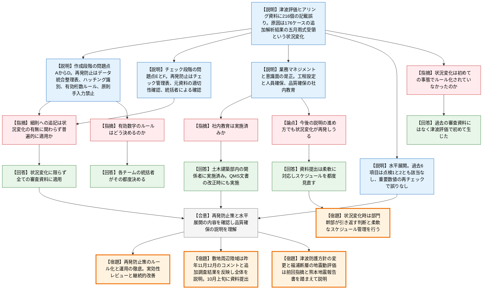

# 第1437回原子力発電所の新規制基準適合性に係る審査会合（令和8年10月2日）
> 出典 : https://youtube.com/live/JBd4FbwFWwQ?si=TPQLCM2jvby6bC9i

## 会合の概要
* **志賀2号炉の審査資料216か所の記載誤りについて、原因究明・再発防止策・水平展開の結果を北陸電力が報告**
  6月12日の第1414回審査会合で明らかになった津波評価ヒアリング資料の記載誤り(216個)について、北陸電力が不適合管理・是正措置・水平展開の結果を説明した。規制側は、説明内容と再発防止策の方向性は理解できたとしつつ、ルール化と運用の徹底を繰り返し求めた。
* **誤りの根本には「状況変化」(176ケースの追加解析結果の五月雨式受領)があった**
  能登半島地震後の新知見等を踏まえた海域断層評価の見直しで、当初計画を急遽変更し、連動評価の波源等に関する176ケースもの追加解析結果を順次受領する状況になった。北陸電力は、作成段階・チェック段階ともに複雑な作業となり、業務プロセス・業務マネジメント・意識面の3点で不備が生じたと整理した。
* **規制側の関心は「状況変化が再び起きたときの管理」に集中**
  管理官は、資料1-2の「方針提示の直後に結果を出す」進め方では再び状況変化が生じうると注意喚起し、スケジュールの柔軟な見直しを要請した。主宰者も、部門幹部は「勇気を持って引き返す」判断をするよう求め、ヒアリング延期等は柔軟に対応できると伝えた。
* **水平展開では過去の審査資料に同様の誤りは確認されず**
  過去6つの審査項目の最終会合資料を点検した結果、類似の状況変化・複雑な作業は認められず、評価に影響する重要な数値を再チェックしても記載誤りはなかった。規制側はこの点検結果を確認した。
* **今後の説明の進め方(資料1-2)**
  次は敷地周辺陸域(国土地理院の活断層の追加調査結果を含む全体説明、10月上旬に資料提出予定)、津波防護方針の変更、福浦断層の地震動評価の順に進める。昨年11・12月会合のコメントや熊本地震に関する地震本部の最終報告を踏まえた説明が求められた。

---

## 議題ごとの詳細整理

### 【議題1】北陸電力（株）志賀原子力発電所2号炉の審査資料作成における品質保証等について
* **議論の背景と論点:**
  本年5月21日の津波評価に係る第1回ヒアリング資料(当該審査資料)で、パラメーターや津波高さ評価値等に216個の記載誤りが見つかった。北陸電力は不適合管理を行い、是正措置(原因究明・再発防止策の策定)と水平展開を実施した。本会合の論点は、(1)原因分析と再発防止策の妥当性、(2)過去の審査資料への水平展開の十分性、(3)今後の説明の進め方(資料1-2)に状況変化への備えがあるか、の3点である。なお、前回までの資料で「誤植」と表現していたものを、本資料から「記載誤り」に改めている。

* **質疑応答（詳細）:**
  **＜資料1-1の説明の要点＞**
    * 【説明者側】北陸電力
      誤りは、作成段階の4つの問題点と、チェック段階の2つの問題点に整理された。作成段階は、(A)記載内容の取り違い(委託報告書の旧版数値の誤転記等、最多)、(B)解析結果の入力漏れ、(C)有効桁数の不統一、(D)手入力時の単純な入力誤りである。いずれも、データが未整理のまま作業したことなどが原因とされた。
    * 【説明者側】北陸電力
      チェック段階は、(E)チェック漏れ(文章・数値単位まで細分化した分担で認識のズレが生じた)と、(F)チェック元資料の誤り(作成者から渡された古い解析結果を正しいエビデンスと思い込んだ)である。両者に共通する原因は、統括者によるチェック状況の確認が不十分だったことである。
    * 【説明者側】北陸電力
      再発防止策として、(A)にはデータ統合整理表の作成と転記、(B)には未完成箇所のハッチング識別、(C)には有効桁数が混在する場合のルール設定、(D)には原則手入力を行わないことを定め、(E)にはチェック管理表の使用、(F)にはチェック者による元資料の適切性の確認、(E・F)共通として統括者によるチェック状況の確認を定めた。これらは審査資料作成細則に反映する。
    * 【説明者側】北陸電力
      業務マネジメントでは、部門幹部が状況変化に応じた人員確保や作成・チェック方法の改善指導を十分に行わなかった点を問題とし、工程設定・人員確保・業務プロセスの課題把握を行うこととした。意識面では、「初回ヒアリングなので重要部分以外の誤りは次回までに直せばよい」という慎重さの欠如と、マネジメント意識の欠如が挙げられ、品質確保に関する社内教育を充実させるとした。
    * 【説明者側】北陸電力
      水平展開では、過去の審査資料について、状況変化に伴う複雑な転記作業(点検1)と複雑なチェック作業(点検2)の有無を確認した。対象は、これまでに概ね妥当と評価された敷地内断層、敷地近傍断層、敷地周辺海域断層、火山、地下構造、震源を特定せず策定する地震動の6項目の最終会合資料である。

  **＜資料1-1に関する質疑＞**
    * 【規制側】海田（規制庁）
      改善措置活動は、今回の審査会合での説明までの過程(21ページの点線まで)がすべて完了していると理解してよいか。
    * 【説明者側】北陸電力
      21ページの点線の位置までは完了している。
    * 【規制側】海田（規制庁）
      24ページの状況変化(追加解析結果の五月雨式受領)は、これまでにない特別な状況であり、そのため従来はルール化されていなかったという理解でよいか。
    * 【説明者側】北陸電力
      これまでの審査資料ではこのような状況変化はなく、今回の津波評価で初めて生じた事情である。
    * 【規制側】海田（規制庁）
      作成段階(30・31ページ)とチェック段階(33・34ページ)の問題点・原因・再発防止策の対応関係は確認できた。QMS文書へのルール追記と、ルール化後の運用の徹底を求める(回答は不要)。
    * 【規制側】海田（規制庁）
      業務マネジメントの是正措置(35ページ)と意識面の是正措置(36ページ)も確認した。今後は初回のヒアリング資料でも、重要な内容はきちんと作成して提出するよう求める。再発防止策の社内教育は実施済みか。
    * 【説明者側】北陸電力
      土木建築部内の審査関係者を対象に教育を実施済みである。今後のQMS文書の改正の際にも、改めて教育を行う。
    * 【規制側】海田（規制庁）
      水平展開の点検方針(42・43ページ)は、216個の誤りの主因が状況変化にあるとの分析に沿ったものであり理解できる。点検結果(45ページ)も、点検1・2ともに該当なしで、重要な数値を再チェックしても誤りがなかったことを確認した。審査資料の品質確保については理解できたので、今後はこれに沿って適正な資料を提出してほしい。
    * 【規制側】名倉（規制庁、地震・津波審査担当管理官）
      今回の是正措置は、状況変化への対応不備に対するものと理解している。一方、37ページの審査資料作成細則への追記事項は状況変化を条件としていない。状況変化の有無に関わらず普遍的に適用するという理解でよいか。
    * 【説明者側】北陸電力
      ご理解の通り、状況変化に限らず、すべての審査資料に対して適用する。
    * 【規制側】名倉（規制庁）
      注意喚起を1点行う。連動等のケースを審議したのは昨年12月であり、その後に解析ケースが増えたことが今回の状況変化の要因である。資料1-2では、方針・方法・条件を示した次の会合で結果を示すとしているが、コメントによって条件が追加され、解析ケースが増える可能性がある。状況変化が生じた場合はスケジュールを柔軟に変更し、複数の審査項目を組み合わせて間隔を空けるなど、管理を行ってほしい。
    * 【説明者側】濱田（北陸電力）
      今回の事象を踏まえ、資料提出は柔軟に対応し、その都度スケジュールを見直したうえで説明する。
    * 【規制側】主宰者（規制委員会側）
      有効数字のルール設定について、何桁にするかは資料作成者の考え方を尊重しつつ、今後検討するということでよいか。
    * 【説明者側】北陸電力
      資料作成者やデータがその都度異なるため、各チームの統括者が、その時々に決めていく。
    * 【規制側】主宰者（規制委員会側）
      資料中で有効数字の扱いが説明できていれば対応できると考える。感想として、忙しい中で業務を行っていたことは想像できるが、部門幹部は引き返すタイミングを見極め、必要なときは勇気を持って引き返してほしい。資料提出後でも一言連絡があれば、ヒアリングの延期など柔軟に対応できる。

  **＜資料1-2（今後の説明の進め方）に関する質疑＞**
    * 【説明者側】濱田（北陸電力）
      品質確保対応(No.36〜46)の次に、国土地理院の断層を含む敷地・陸域の評価(No.8〜17)を取りまとめて提出する。その後、津波防護方針の変更を説明したうえで津波評価を項目ごとに説明し、地震動(No.18以降)も並行して資料を取りまとめ、項目ごとに説明する。
    * 【規制側】海田（規制庁）
      敷地周辺陸域は10月上旬の資料提出とされているが、準備状況はどうか。
    * 【説明者側】濱田（北陸電力）
      資料は概ね取りまとめ済みで、品質確保のためのチェックを実施したうえで提出する。
    * 【規制側】海田（規制庁）
      内容は、昨年11月・12月の審査会合でのコメントを踏まえ、追加調査結果も反映して、敷地周辺陸域全体として説明してほしい。
    * 【説明者側】濱田（北陸電力）
      これまでに説明したすべての断層に加え、国土地理院の断層の追加調査も実施したので、その結果を含めた評価結果を説明する。
    * 【規制側】海田（規制庁）
      基準津波の策定のうち、津波防護方針の変更に関する説明(No.65)は、6月12日の前回審査会合での指摘を踏まえて的確に説明してほしい。
    * 【説明者側】濱田（北陸電力）
      津波防護方針を今回変更したので、その内容と課題について説明する。
    * 【規制側】海田（規制庁）
      福浦断層の地震動評価(No.22・23付近)のうち、地震が敷地に極めて近い場合への妥当性の整理については、地震本部が公表した2016年熊本地震に関する報告書(中間報告・最終報告)も反映して説明してほしい。
    * 【説明者側】濱田（北陸電力）
      熊本地震の最終報告の内容は確認済みであり、それを踏まえて説明する。
    * 【規制側】海田（規制庁）
      今後の説明の進め方は審査の進捗で随時変わるので、適宜変更したうえで、次回以降も最新版を示して説明してほしい。

* **結論と宿題事項（アクションアイテム）:**
  * **決定事項:** 規制側は、原因究明・再発防止策(作成段階・チェック段階・業務マネジメント・意識面)と水平展開(点検1・2とも該当なし、重要な数値の再チェックで誤りなし)の内容を確認し、審査資料の品質確保に関する事業者の説明を理解したと表明した。ただし、これは再発防止策が実際に機能することを前提としたもので、今後の資料で実効性が問われる。
  * **宿題事項(規制側から事業者への要請):**
    * 再発防止策を審査資料作成細則・QMS文書に適切にルール化し、確実に運用すること。実効性のレビューを行い、効果を確認して継続的に改善すること。
    * 状況変化が再び起こりうることを前提に、部門幹部が工程管理・人員管理を行い、必要なら資料提出後でも引き返してヒアリングを延期するなど、柔軟にスケジュールを見直すこと。
    * 敷地周辺陸域は、昨年11・12月会合のコメントと追加調査結果を反映し、陸域全体の説明とすること。津波は防護方針の変更について前回(6月12日)の指摘を踏まえて説明すること。福浦断層の地震動評価は熊本地震の報告書を反映して整理すること。
  * **今後の予定:** 敷地周辺陸域の資料は10月上旬に提出予定である。

### 【議題2】その他
* **議論の背景と論点:** 事務連絡のみで、技術的な議論はなかった。
* **質疑応答（詳細）:** なし。
* **結論と宿題事項（アクションアイテム）:**
  * 原子力発電所の地震等に関する会合は、来週の開催はない。次回会合は事業者の準備状況等を踏まえて設定する。

---

## 論理構造の可視化（Mermaid）

### 【議題1】志賀2号炉 審査資料の品質確保

