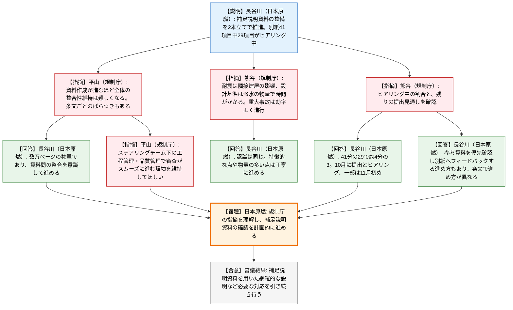
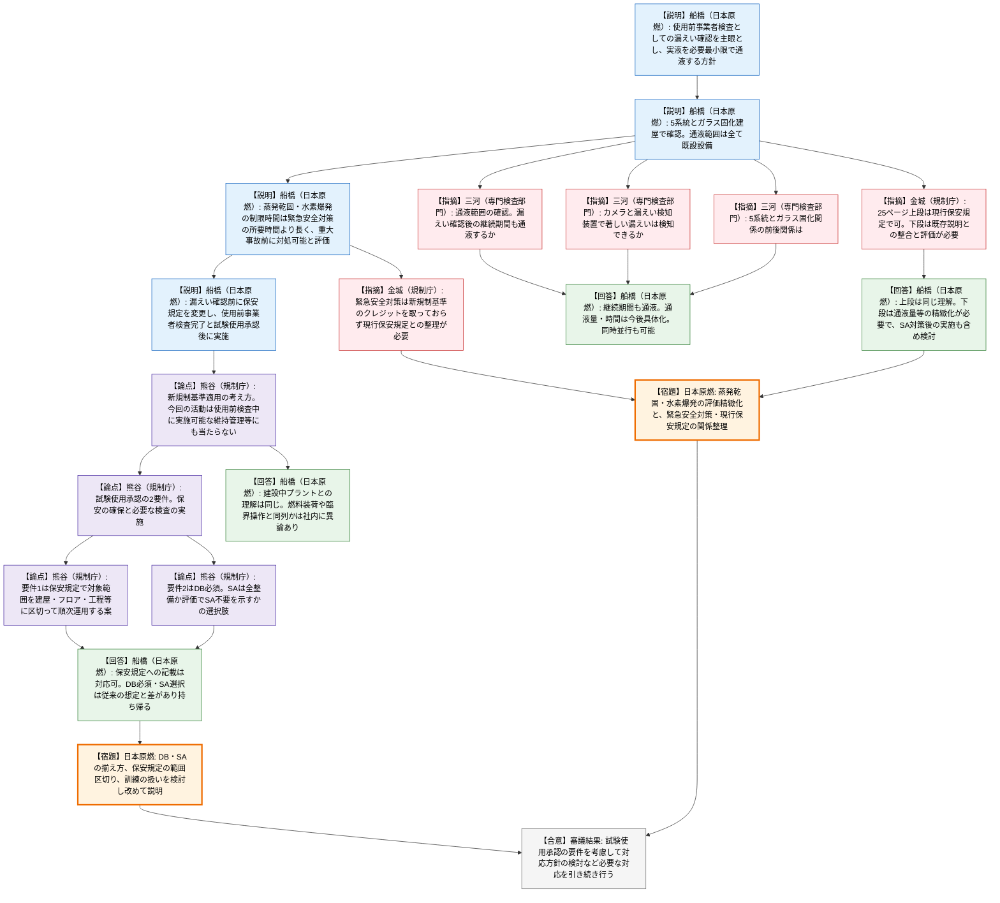

# 第596回核燃料施設等の新規制基準適合性に係る審査会合（令和8年10月2日）
> 出典 : https://youtube.com/live/a_oQ9HzyFMQ?si=oH-tQnp7crvCO6rN

## 会合の概要
* **日本原燃が再処理施設の「漏えい確認」を使用前事業者検査として実液で実施する方針を提示**
  日本原燃は、従来の自主的な確認運転を主眼とする整理から、使用前事業者検査としての漏えい確認を主眼とする方針へ転換した。系統内に現在保有している溶液・廃液を用い、通液は漏えい確認に必要な範囲・量に限定し、通液中に設備の健全性確認やガラス溶融炉の処理能力確認を自主的に行う。実施時期は、設備が長期停止していることを踏まえ、不具合の早期発見のためできる限り早期とする方針が示された。
* **規制庁が試験使用承認の要件を詳細に提示し、事業者の想定との間にギャップが顕在化**
  規制庁は、運用ガイドに基づく試験使用承認の要件（保安の確保上支障がないこと、必要な検査が適切に実施・終了していること）を提示した。設計基準（DB）の設備は揃える必要がある一方、重大事故（SA）対策については「全て整備する」か「評価でSA不要を示す」かの選択肢がある旨を示した。日本原燃は、DB必須・SA選択という整理は自社の想定と差があるとして持ち帰り検討とした。
* **蒸発乾固・水素爆発の制限時間評価は「概念整理」にとどまり、精緻化を要求される構図**
  日本原燃は、漏えい確認時の液量・崩壊熱密度等を踏まえた制限時間が、既整備の緊急安全対策の所要時間（蒸発乾固は8時間以内、水素爆発は0.8時間以内）より長く、重大事故に至る前に対処可能と評価した。規制庁は、緊急安全対策は新規制基準上のクレジットを取っていない措置であり、現行保安規定との関係整理が必要と指摘した。日本原燃も、通液量等を含めた精緻化が必要との認識を示した。
* **設工認の補正に向けた補足説明資料は全41項目中29項目がヒアリング中**
  補正書の準備に直結する補足説明資料の別紙は約4分の3がヒアリング段階にあり、10月に資料提出とヒアリングを進め、一部は11月初めにかかる見込み。規制庁は、数万ページ規模の資料全体の整合性確保と、ステアリングチーム下での工程管理・品質管理を求めた。

---

## 議題ごとの詳細整理

### 【議題1】日本原燃株式会社再処理事業所再処理施設及び廃棄物管理施設の設計及び工事の計画の認可申請について
会合では、(A) 設工認の補正に向けた取組状況、(B) 再処理施設の漏えい確認（使用前事業者検査）の方針と試験使用承認の要件、の2つを順に扱った。

#### (A) 設工認の補正に向けた取組状況（資料1）
* **議論の背景と論点:**
  設計ルールに基づく補足説明資料の整備（技術的根拠の整理と、補正書に示すべき事項の条文単位での整理）が進む中、物量が膨大な資料全体の整合性確保、条文ごとの進捗のばらつき、残る資料の提出見通しが論点となった。

* **質疑応答（詳細）:**
    * 【説明者側】長谷川（日本原燃）
      補正に向け、①審査会合で議論した設計ルールの技術的根拠・詳細を個別の補足説明資料に整理すること、②補正書に示すべき事項を条文単位で整理することの2つを進めている。重大事故関係では通信連絡設備等の条文について新たに確認を受けた。補足説明資料の別紙は全41項目で、うち29項目がヒアリング中である。
    * 【規制側】平山（規制庁）
      一定の進捗はあるが、ヒアリングに至らない部分もあるとの認識で、こちらの認識と食い違いはない。審査では、設計ルールや結果の検討プロセスまで丁寧に確認する。資料作成が進むほど全体の整合性を保つ難易度は高まり、条文ごとの進捗のばらつきも見られるため、ステアリングチーム下での工程管理・品質管理を求める。
    * 【説明者側】長谷川（日本原燃）
      補足説明資料は全体で数万ページに及ぶ物量であり、資料間の整合を意識して進める。
    * 【規制側】熊谷（規制庁）
      5ページの認識を確認したい。耐震関係は、1つの敷地に複数の建屋があるという再処理施設特有の事情から、隣接建屋の振動が評価対象の応答に影響し、確認に時間がかかっている。設計基準関係では溢水が改めて出てきており、耐震設計や強度計算など物量が多い。一方、重大事故関係は効率よく進んでおり、このまま続けてほしい。
    * 【説明者側】長谷川（日本原燃）
      認識は同じである。特徴的な点や物量の多い点は、説明資料の作成も含め時間をかけて丁寧に進めている。
    * 【規制側】熊谷（規制庁）
      別紙のうち、資料ができてヒアリング中のものは全体の何割か。
    * 【説明者側】長谷川（日本原燃）
      6・7ページの別紙の欄で丸を付けた41項目のうち、提出済みでヒアリング中が29項目で、約4分の3である。
    * 【規制側】熊谷（規制庁）
      残りは内容的に困難なものなのか、それともこのペースで提出される計画なのか。
    * 【説明者側】長谷川（日本原燃）
      10月に資料を提出してヒアリングを行い、一部は11月初めにかかる目標で進めている。条文によっては、別紙の右側の列にある参考資料を優先的に確認してもらい、別紙へフィードバックする進め方も取っており、進め方に違いがある。
    * 【規制側】熊谷（規制庁）
      日本原燃とのコミュニケーションを通じ、後戻りのない審査を行いたい。

* **結論と宿題事項（アクションアイテム）:**
  * 日本原燃は、規制庁がヒアリング等で指摘した内容を十分に理解した上で、補足説明資料の確認が計画的に進むよう対応する。
  * 審議結果として「補正申請に向けた取組状況については、補足説明資料を用いた網羅的な説明など必要な対応を引き続き行うこと」と整理された。日本原燃は、事前のヒアリング対応を踏まえ、指摘に従って対応すると回答した。

#### (B) 再処理施設の漏えい確認（使用前事業者検査）について（資料1・資料2）
* **議論の背景と論点:**
  日本原燃は、これまでの「廃液・溶液の処理を目的とした自主的な確認運転」から、「使用前事業者検査としての漏えい確認」を主眼とする方針に切り替えた。論点は、(1) 新規制基準適合確認中の施設で、竣工前に実液を使用する検査を行う際の試験使用承認の要件、(2) 設計基準（DB）設備と重大事故（SA）対策をどこまで揃える必要があるか、(3) 漏えい確認で生じる蒸発乾固・水素爆発リスクの評価の妥当性、であった。

* **質疑応答（詳細）:**
    * 【説明者側】船橋（日本原燃）— 方針
      これまでの議論で、廃液処理の早期実施や、漏えい確認を実検査として行えないかの検討を求められた。前回会合では確認運転を主眼としたが、技術基準適合の観点から使用前事業者検査が優先する活動であることを考慮し、漏えい確認を主眼とする。適合確認の信頼性を高めるため、過去の検査記録に加え、できる限り実液を用いる。通液は必要な範囲・通液量に限定し、その間に設備の健全性確認とガラス溶融炉の処理能力確認を自主的に行う。
    * 【説明者側】船橋（日本原燃）— 実施内容
      系統内に保有する溶液・廃液を用い、①溶媒再生処理系統、②ウラン精製系統、③プルトニウム精製系統、④溶解・清澄・分離・分配系統、⑤脱硝系統の順に確認する。高レベル廃液ガラス固化建屋では、ガラス溶融炉は模擬廃液、廃液の移送系統は高レベル濃縮廃液等を用いる。通液範囲は全て既設設備で、新規制基準対応で新設した設備は使わない。
    * 【説明者側】船橋（日本原燃）— 安全確保とSA・DBの評価
      使用済み燃料のせん断は行わず、系統内の溶液・廃液を使うため施設全体の放射能量は増えない。使用済み燃料の損傷や臨界は、燃料を扱わず、臨界を想定する槽への液移送もしないため発生しない。有機溶媒等による火災・爆発は、多重の安全対策と予兆検知・運転停止措置で重大事故前に対処できる。蒸発乾固と水素爆発は、漏えい確認時の条件で制限時間を算出し、緊急安全対策の所要時間（蒸発乾固は8時間以内、水素爆発は0.8時間以内）と比較して、いずれも重大事故に至る前に対処可能と評価した。
    * 【説明者側】船橋（日本原燃）— 保安規定
      現行の保安規定（令和3年に認可を受けた新規制基準対応の第一段階）の運用措置による施設の停止措置と、第29条の2に基づく緊急安全対策により、安全は確保できると考える。漏えい確認の開始までに保安規定を変更し、安全確保を最優先とする取組方針や高レベル濃縮廃液等の保有量管理に係る運用を追加する。DB・SAに関する第2段階の保安規定は竣工までに反映する。材料寸法検査等の必要な使用前事業者検査を終え、試験使用承認を得た後に漏えい確認を行う。
    * 【規制側】三河（専門検査部門）
      通液するのは、27ページの工程のうち漏えい確認の間だけか、その後の継続期間も含むのか。
    * 【説明者側】船橋（日本原燃）
      漏えい確認の後の継続期間も通液を続ける計画である。
    * 【規制側】三河（専門検査部門）
      漏えい確認は、接近困難な場所はカメラ、カメラに映らない部分はセルに設置された漏えい検知装置で行い、検知に要する時間を考慮して確認時間を設定すれば、著しい漏えいは検知できるという理解でよいか。
    * 【説明者側】船橋（日本原燃）
      その通りである。漏えい確認には一定量・一定時間が必要と考えており、通液量・通液時間は設備の使用状態や条件を踏まえて今後具体的に検討する。
    * 【規制側】三河（専門検査部門）
      27ページの順序（①〜⑤）と、28ページの高レベル廃液・ガラス固化関係の前後関係はどうなっているか。
    * 【説明者側】船橋（日本原燃）
      現在の検討では、同時並行で行うことも可能と考えている。
    * 【規制側】熊谷（規制庁）— 新規制基準の適用の考え方
      前回、新規制基準を審査中の施設で実液を用いた試験を行うことには相当慎重な対応が必要と伝えた。その意味を説明する。平成25年の新規制基準の策定時に、再処理施設は対象施設に含まれ、建設中の施設と同様の要件を適用することが委員会で整理された。適合確認は、所要の審査を経て使用前検査の合格をもって完了する。使用前検査の準備、機器の確認・調整、施設の維持管理（通常の排液処理など）は使用前検査中も実施可能とされたが、今回の活動はこれにも当たらないというのが規制庁の認識である。
    * 【説明者側】船橋（日本原燃）
      建設中のプラントに当たるという理解は同じである。ただしアクティブ試験の経緯で核燃料物質が系統内にあるため、供用期間中の施設に近い状態でもあると一部では読んでいた。
    * 【規制側】熊谷（規制庁）— 試験使用承認の要件
      運用ガイドでは、核燃料物質を使って試験を行う試験使用承認の条件として、①保安の確保上支障がないこと、②必要な検査が適切に実施され終了していること、の2つを満たす必要がある（資料の「原子炉本体」は核燃料施設向けに読み替える）。今回の漏えい確認もこれに照らして運用したい。
    * 【説明者側】船橋（日本原燃）
      必要な検査が必要であることは同意する。ただし、原子炉の燃料装荷や臨界操作と、長期間残っている液を漏えい検査に使う行為が同じかについては、社内でも意見があった。
    * 【規制側】熊谷（規制庁）— 要件①（保安の確保）
      保安規定で、漏えい確認を行う対象範囲を定めて運用することが条件になる。発電炉は原子炉建屋にリスクが集中するため施設一括で承認を取ってきたが、再処理施設は施設が分散している。そのため、建屋・フロア・工程ごとに範囲を区切って保安規定を定め、準備できたものから順次運用するやり方もあり得る。最終的に使用前確認の終了時には全てを揃える必要がある。
    * 【規制側】熊谷（規制庁）— 要件②（必要な検査）
      ガイド上は基本設計基準と重大事故設備の全てが揃うことが求められるが、工夫の余地はある。設計基準はベースなので揃える必要がある。重大事故対策は、今回が本格運転ではなく検査であり実液も少量であることから、2つの選択肢があると考える。(a) 新規制基準の原則通り、重大事故対策を全て整備する。(b) 評価により重大事故が不要であることを示し、規制庁が確認する。どちらが合理的かを持ち帰って検討してほしい。訓練の扱い（先行実施が必要か、別途実施か）も検討したい。
    * 【説明者側】船橋（日本原燃）
      当社の考えは、新たなせん断を行わずに長年保有してきた廃液を漏えい検査として流しながら、確認したいことも確認し、SA・DBが全て揃わない状態で安全に行えるかを早期に実施するというものだった。保安規定に対象範囲を書くことは申請予定なので対応できるが、DBは必須でSAは選択という点は従来の考えとギャップがある。持ち帰って再検討し、考えをまとめて改めて説明する。
    * 【規制側】金城（規制庁）— 資料29ページ・41ページの整理
      29ページは概念整理として理解した。「運用措置」は新規制基準で認められた部分的な保安規定による範囲であり、事業者の言う現行保安規定がこれを指すなら、新規制基準対応済みの範囲といえる。一方で、緊急安全対策は新規制基準のクレジットを取っているものではないため、現行保安規定との間でどう整理されているか、何を想定し何で対応するのかを議論する必要がある。概念整理の原則に従えば、SAまで揃えることが必要である。ただし再処理施設はリスクが分散し、設計上もアイソレートして独立に扱えるため、設備全体ではなく、工程などの単位で整理できる可能性がある。41ページの対策の整理も同様に、全てを揃えるのが原則だが、設備全体でなくてよいという前提で整理し直して示してほしい。
    * 【規制側】金城（規制庁）— 25ページの確認
      25ページの上段（ウラン脱硝系統）は、SA事象が発生せず既設のDB設備で足りるため、現行（第一段階）の保安規定で対処できる範囲という理解でよいか。下段（ウラン・プルトニウム混合脱硝系統）は重大事故の発生リスクがあり、これまでの議論でリスクと対処が説明できていればよいが、それと異なるものになる場合はしっかり評価する必要がある。事業指定や設工認でこれまで説明したことと整合させて説明してほしい。その上で組み合わせをどうするかは、現場とも相談して持ち帰る宿題である。
    * 【説明者側】船橋（日本原燃）
      上段の工程は、試験使用承認は必要だが現行の対応で間違いなく実施できるという点は同じ理解である。下段は、蒸発乾固・水素爆発のリスクがある機器を使うため制限時間を評価したが、どれだけの量をどのくらい流してこの結果になるのかは今日の資料では分からず、精緻化しないと規制庁の理解は得られないという指摘と受け止めている。SA対策の完了後に実施する案も含めて持ち帰って検討し、改めてこの場で回答する。その間に質問や議論はさせてほしい。
    * 【規制側】議事進行（規制庁）
      今回、日本原燃は廃液・溶液の処理を目的とした活動を、使用前事業者検査に基づく漏えい確認に変更した。これに対し規制庁は、新規制基準に基づく対応としての考え方を説明した。社内でよく議論し、規制庁ともコミュニケーションを取って、お互いが理解して進めてほしい。使用する廃液量が極少量であるという説明も、実態と再処理の特徴を踏まえ、合理的な規制を進めたい。

* **結論と宿題事項（アクションアイテム）:**
  * **宿題（日本原燃）:** 規制庁が示した試験使用承認の要件を踏まえ、①DB設備を揃えた上で、SA対策を全て整備するか、評価でSA不要を示すかのどちらが合理的か、②保安規定で対象範囲を建屋・フロア・工程などに区切って運用する場合の組み合わせ、③訓練の取扱い（先行実施の要否）を検討し、改めて説明する。
  * **宿題（日本原燃）:** 通液量・通液時間を含め、蒸発乾固・水素爆発の制限時間評価を精緻化する。緊急安全対策と現行保安規定の関係を、新規制基準上のクレジットの有無も含めて整理し、事業指定や設工認での説明との整合を示す。
  * **今後の進め方:** 説明の前に、ヒアリング等で事実関係を確認し、議論しながら整理する。
  * 審議結果として「再処理施設の漏えい確認について、竣工前に実液を用いた使用前事業者検査を実施するにあたり、新規制基準適合確認中である状況を踏まえ、本日伝えた試験使用承認にあたっての要件を考慮の上、対応方針の検討など必要な対応を引き続き行うこと」と整理された。日本原燃は、コミュニケーションを取りながら進めるとして、コメントはないと回答した。

---

## 論理構造の可視化（Mermaid）

### 【議題1-(A)】設工認の補正に向けた取組状況

### 【議題1-(B)】再処理施設の漏えい確認（使用前事業者検査）

